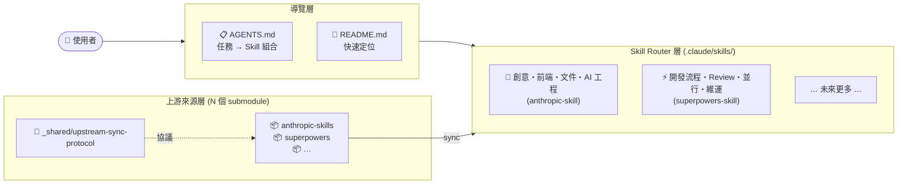
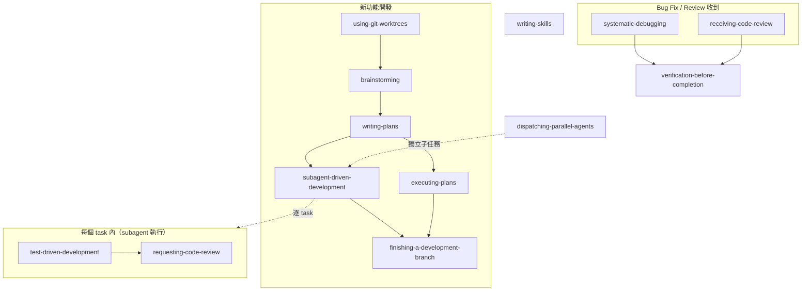

# ai-research

> AI 工具研究 × Skills 知識庫：彙整 Claude Code、GitHub Copilot 等 AI 工具的使用方式，並沉澱為可重複使用的 Skills。



**你現在想做什麼？** → 看 [AGENTS.md](AGENTS.md) 找 skill 組合，一秒定位。

首次初始化 submodule：

```powershell
git submodule update --init --recursive
```

同步上游更新：

[GitHub Dependabot](.github/dependabot.yml) 每日自動偵測上游 submodule 變更並開 PR。收到通知 email 後，`sync-all` 一個 skill 即完成全部同步：

> Dependabot 開 PR → email 通知 → invoke `sync-all` → pull + AI 摘要 + commit + push + 關閉 PR

---

## 快速導覽

- [Skills 系統](#skills-系統)
  - [anthropic-skills](#anthropic-skills)
  - [superpowers](#superpowers)
- [AI 工具文件](#ai-工具文件)
- [腳本文件](#腳本文件)
- [個人自製 Skills](#個人自製-skills)
- [目錄結構](#目錄結構)

---


## Skills 系統

本 repo 維護四個層次的 skills：

| 目錄 | 來源 | 用途 |
|------|------|------|
| `anthropic-skills/` | [Anthropic 上游](https://github.com/anthropics/skills) | 創意設計、前端工程、AI 工程、Office 文件、技術寫作 |
| `superpowers/` | [superpowers 上游](https://github.com/obra/superpowers) | 開發流程、Code Review、並行協作、Git 工作流、維運 |
| `.agents/skills/` | 本地 project-specific custom skills | 專案內部治理、客製 workflow 與只在本 repo 使用的 skills，例如 [`skills-governance`](.agents/skills/skills-governance/SKILL.md) |
| `aery-marketplace/` | 本地自製 plugin | `aery-skills`：工作踩坑實戰邏輯，可安裝的 self-contained plugin / marketplace root（[README](aery-marketplace/README.md)） |

### Skill Routers（第一層入口）

| Router | 涵蓋範疇 |
|--------|---------|
| [`.claude/skills/anthropic-skill/`](.claude/skills/anthropic-skill/SKILL.md) | 創意設計・前端工程・AI 工程・Office 文件・技術寫作 |
| [`.claude/skills/superpowers-skill/`](.claude/skills/superpowers-skill/SKILL.md) | 開發流程・Code Review・並行協作・Git 工作流・維運 |

### 共用基礎設施

[`.claude/skills/_shared/upstream-sync-protocol.md`](.claude/skills/_shared/upstream-sync-protocol.md) — 各 upstream sync skill 共用的通用 sync 流程協議。新增第三、四個 submodule 時，sync skill 只需引用這份文件 + 填入庫設定。

### anthropic-skills

**安裝方法：**

```
/plugin marketplace add anthropics/skills
/plugin install example-skills@anthropic-agent-skills
/plugin install document-skills@anthropic-agent-skills
```

以 plugin 為單位組織，目前共三個 plugin，可依需求選擇性安裝：

| Plugin | 包含 Skills | 適用場景 |
|--------|------------|---------|
| **document-skills** | `xlsx`, `docx`, `pptx`, `pdf` | 各類 Office 文件與 PDF |
| **example-skills** | `algorithmic-art`, `brand-guidelines`, `canvas-design`, `doc-coauthoring`, `frontend-design`, `internal-comms`, `mcp-builder`, `skill-creator`, `slack-gif-creator`, `theme-factory`, `web-artifacts-builder`, `webapp-testing` | 創意設計、前端工程、AI 工程、文字寫作 |
| **claude-api** | `claude-api` | Claude API / Anthropic SDK 應用 |

詳細設定見 [`anthropic-skills/.claude-plugin/marketplace.json`](anthropic-skills/.claude-plugin/marketplace.json)。

> **已知 bug**：若同一批 skills 同時由 project top-level entries 與 plugin namespace 暴露，context 與 slash command picker 仍可能重複。當前結構設計就是為了避免這個情況。相關 issue：[anthropics/claude-code#29520](https://github.com/anthropics/claude-code/issues/29520)、[anthropics/skills#189](https://github.com/anthropics/skills/issues/189)

### superpowers

**安裝方法：**

```
# 官方 marketplace（推薦）
/plugin install superpowers@claude-plugins-official

# 或透過 obra's marketplace
/plugin marketplace add obra/superpowers-marketplace
/plugin install superpowers@superpowers-marketplace
```

為單一 plugin，涵蓋開發流程全套 skills：

| Plugin | 包含 Skills | 適用場景 |
|--------|------------|---------|
| **superpowers** | `brainstorming`, `writing-plans`, `subagent-driven-development`, `executing-plans`, `test-driven-development`, `systematic-debugging`, `requesting-code-review`, `receiving-code-review`, `finishing-a-development-branch`, `using-git-worktrees`, `dispatching-parallel-agents`, `verification-before-completion`, `writing-skills`, `using-superpowers` | 開發流程、Code Review、並行協作、Git 工作流、維運 |

`using-superpowers` 是元技能（meta-skill），不參與任何具體工作流程，但它是所有流程的前提條件：收到任何任務前，哪怕只有 1% 機率有 skill 可用，就必須先呼叫 Skill tool 確認，再執行任何動作。

典型開發流程：



[返回開頭](#快速導覽)

---

## AI 工具文件

| 工具 | 文件 | 說明 |
|------|------|------|
| **Claude Code** | [`claude-code/cc-cli.md`](claude-code/cc-cli.md) | CLI 參數、slash commands、快捷鍵 |
| **GitHub Copilot** | [`github-copilot/gc-cli.md`](github-copilot/gc-cli.md) | CLI 參數、slash commands、custom instructions |

其他工具操作文件索引：[`tool/README.md`](tool/README.md)

[返回開頭](#快速導覽)

---

## 腳本文件

Repo 維護與自動化腳本的總索引在 [`scripts/README.md`](scripts/README.md)。

目前已收錄：

- [`scripts/remove-local-git-user.ps1`](scripts/remove-local-git-user.ps1)：遞迴掃描指定路徑下的 Git repository / worktree，移除 local Git config 的 `[user]` section

之後若 `scripts/` 目錄新增腳本，也應同步補充到 [`scripts/README.md`](scripts/README.md)。

[返回開頭](#快速導覽)

---

## 個人自製 Skills

本 repo 的自製 skills 分成兩條線維護：

| 位置 | 定位 |
|------|------|
| [`.agents/skills/`](.agents/skills/skills-governance/SKILL.md) | 專案內部 custom skills；只放治理規則、維護政策與 repo 專用 workflow。首個 skill 為 [`skills-governance`](.agents/skills/skills-governance/SKILL.md)。 |
| [`aery-marketplace/aery-skills/`](aery-marketplace/README.md) | 可安裝、可共享的 reusable skills，打包為 **`aery-skills`** plugin，供 GitHub Copilot 與 Claude Code 共用。 |

[`aery-marketplace/`](./aery-marketplace/README.md) 是一個可安裝的本地 self-contained plugin / marketplace root，詳細安裝說明見 [`aery-marketplace/README.md`](aery-marketplace/README.md)。

**GitHub Copilot 安裝：**

```bash
# 本地路徑
copilot plugin install ./aery-marketplace

# 從 GitHub repo subdirectory
copilot plugin install OWNER/REPO:aery-marketplace
# 例（本 repo）
copilot plugin install Aery9527/ai-research:aery-marketplace
```

**Claude Code 安裝：**

```
/plugin marketplace add ./aery-marketplace
/plugin install aery-skills@aery-plugins
```

> **注意**：`./aery-marketplace` 採本地路徑安裝，clone 此 repo 後即可直接使用。Claude Code 目前不支援 `owner/repo:subdir` 格式的遠端 marketplace add，無法直接從遠端子目錄安裝 marketplace。

包含 Skills：

| Skill | 解決的問題 |
|-------|-----------|
| **mongo-guidelines** | MongoDB 查詢、aggregation pipeline、Go driver、JS shell 型別陷阱 |
| **windows-script** | `.bat`/`.cmd`/`.ps1` 語法陷阱、errorlevel、delayed expansion |
| **write-md** | Markdown 文件撰寫，含 frontmatter 規則、YAML 安全與 Mermaid 圖表決策 |

[返回開頭](#快速導覽)

---

## 目錄結構

```
ai-research/
├── anthropic-skills/         # Anthropic 上游 skills submodule
├── superpowers/              # superpowers 上游 skills submodule
├── claude-code/              # Claude Code CLI 參考
│   └── .claude/              # 使用者級別設定範本（複製到 ~/.claude/ 生效）
├── github-copilot/           # GitHub Copilot CLI + custom instructions
│   └── .copilot/             # 使用者級別設定範本（複製到 ~/.copilot/ 生效）
├── other/                    # 其他語言 / 框架指引
│   └── java-guidelines.md
├── scripts/                  # 維護與自動化腳本文件
│   ├── README.md
│   └── remove-local-git-user.ps1
├── .agents/skills/           # repo 專用 custom skills（skills-governance, ...）
├── .claude/skills/           # Claude Code project skills
│   ├── _shared/              # 共用協議（upstream-sync-protocol）
│   ├── anthropic-skill/      # Anthropic router（categories + skills）
│   ├── anthropic-skills-sync/ # Anthropic sync 維運 skill
│   ├── superpowers-skill/    # Superpowers router（categories + skills）
│   ├── superpowers-skills-sync/ # Superpowers sync 維運 skill
│   ├── cli-doc-sync/         # CLI 文件同步工具
│   └── sync-all/             # 統一 orchestrator：Dependabot PR → invoke 各 sync skill
├── .github/
│   └── dependabot.yml        # 每日自動偵測所有 submodule 上游變更
├── aery-marketplace/         # aery-skills plugin / local marketplace root
│   ├── plugin.json           # GitHub Copilot plugin manifest
│   ├── .claude-plugin/       # Claude Code plugin / marketplace metadata
│   ├── aery-skills/          # skill 定義目錄（mongo-guidelines, windows-script, write-md）
│   └── README.md             # 安裝與維護說明
├── AGENTS.md                 # Skill 組合查表（任務導向）
├── CLAUDE.md                 # Claude Code project instructions
├── tool/                     # 工具操作文件
│   ├── README.md
│   ├── claude_desktop_ahk.md
│   ├── ps_func.md
│   └── wsl-claude-code-env-setup.md
└── docs/
    └── superpowers/
        ├── specs/            # 設計文件
        └── plans/            # 實作計畫
```

[返回開頭](#快速導覽)

