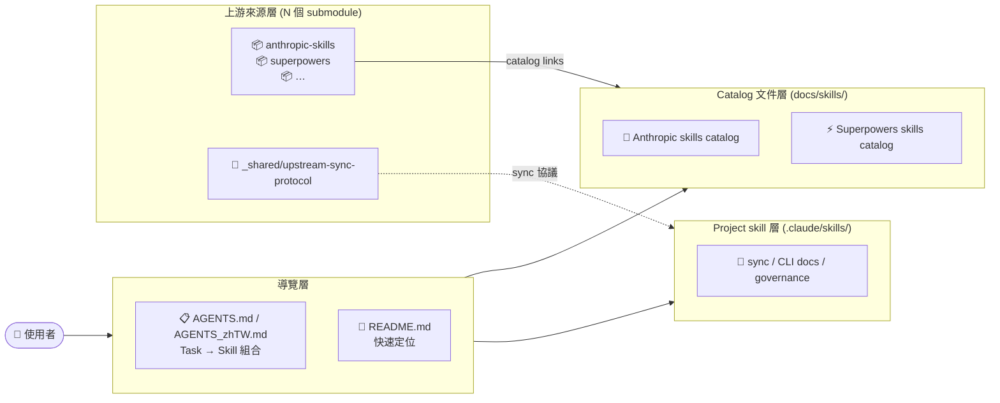
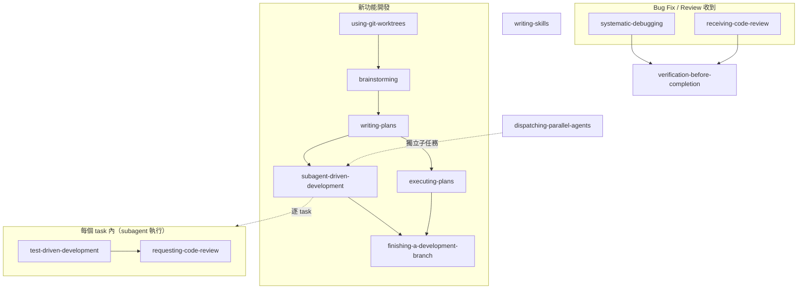

# ai-research

> AI 工具研究 × Skills 知識庫：彙整 Claude Code、GitHub Copilot、Codex 等 AI 工具的使用方式，並沉澱為可重複使用的 Skills。


```mermaid
flowchart LR
    U(["👤 使用者"])

    subgraph nav ["導覽層"]
        A["📋 AGENTS.md / AGENTS_zhTW.md\nTask → Skill 組合"]
        B["📖 README.md\n快速定位"]
    end

    subgraph refs ["Catalog 文件層 (docs/skills/)"]
        direction TB
        R1["🎨 Anthropic skills catalog"]
        R2["⚡ Superpowers skills catalog"]
    end

    subgraph runtime ["Project skill 層 (.claude/skills/)"]
        C1["🔄 sync / CLI docs / governance"]
    end

    subgraph upstream ["上游來源層 (N 個 submodule)"]
        S["📦 anthropic-skills\n📦 superpowers\n📦 …"]
        P["🔄 _shared/upstream-sync-protocol"]
    end

    U --> nav --> refs
    nav --> runtime
    S -->|"catalog links"| refs
    P -.->|"sync 協議"| runtime
```

## Quick Navigation

- [首次初始化 submodule](#首次初始化-submodule)
- [同步上游更新](#同步上游更新)
- [Skills 系統](#skills-系統)
  - [.claude-plugin 檔案說明](#claude-plugin-檔案說明)
  - [anthropic-skills](#anthropic-skills)
  - [superpowers](#superpowers)
- [AI 工具文件](#ai-工具文件)
- [Agent 與 Skill 差異](#agent-與-skill-差異)
- [腳本文件](#腳本文件)
- [Project Skills](#project-skills)
- [目錄結構](#目錄結構)

[Back to top](#quick-navigation)

---

## 首次初始化 submodule

```powershell
git submodule update --init --recursive
```

[Back to top](#quick-navigation)

---

## 同步上游更新

[GitHub Dependabot](.github/dependabot.yml) 每日自動偵測上游 submodule 變更並開 PR。收到通知 email 後，`sync-all` 一個 skill 即完成全部同步：

> Dependabot 開 PR → email 通知 → invoke `sync-all` → pull + AI 摘要 + commit + push + 關閉 PR

[Back to top](#quick-navigation)

---

## Skills 系統

本 repo 維護 upstream skills、catalog 文件，以及本 repo 處理任務時使用的 project skills：

| 目錄 | 來源 | 用途 |
|------|------|------|
| `anthropic-skills/` | [Anthropic 上游](https://github.com/anthropics/skills) | 創意設計、前端工程、AI 工程、Office 文件、技術寫作 |
| `superpowers/` | [superpowers 上游](https://github.com/obra/superpowers) | 開發流程、Code Review、並行協作、Git 工作流、維運 |
| `docs/skills/` | 本地文件 | 回答「該用哪個 upstream skill」時使用的 catalog；不是可執行 skill |
| `.claude/skills/` | 本地 project skills | 同步上游、同步 CLI 文件、治理 workflow、共用維運協議 |

### Skill Catalogs（問題回答用參考）

| Catalog | 涵蓋範疇 |
|---------|---------|
| [`docs/skills/anthropic-skills-catalog.md`](docs/skills/anthropic-skills-catalog.md) | 創意設計・前端工程・AI 工程・Office 文件・技術寫作 |
| [`docs/skills/superpowers-skills-catalog.md`](docs/skills/superpowers-skills-catalog.md) | 開發流程・Code Review・並行協作・Git 工作流・維運 |

Catalog 文件只用於回答「該選哪個 skill」或建立任務心智模型。真正執行時，應使用已安裝的 upstream skill，或讀取 [`anthropic-skills/skills/`](anthropic-skills/skills/) / [`superpowers/skills/`](superpowers/skills/) 下的原始 `SKILL.md`。

### 共用基礎設施

[`.claude/skills/_shared/upstream-sync-protocol.md`](.claude/skills/_shared/upstream-sync-protocol.md) — 各 upstream sync skill 共用的通用 sync 流程協議。新增第三、四個 submodule 時，sync skill 只需引用這份文件 + 填入庫設定。

### .claude-plugin 檔案說明

Claude Code plugin 系統在 `.claude-plugin/` 目錄下有兩種設定檔，職責不同：

| 檔案 | 層次 | 定義的是什麼 |
|------|------|------------|
| `marketplace.json` | Marketplace 層 | 一個目錄清單：列出要發行哪些 plugins、各自來源與設定 |
| `plugin.json` | Plugin 層 | 單個 plugin 的身份：`name`, `version`, `author`, `keywords`… |

**為什麼 `superpowers/` 同時有兩個？**

`superpowers` 身兼兩種角色：它本身是一個可安裝的 plugin（需要 `plugin.json` 聲明身份），同時也透過 `marketplace.json`（名為 `superpowers-dev`）作為 marketplace 發行自己。

**為什麼 `anthropic-skills/` 只有 `marketplace.json`？**

`anthropic-skills` 純粹是一個 **marketplace**，打包了 `document-skills`、`example-skills`、`claude-api` 等多個 plugin。它的 `marketplace.json` 對每個 plugin 都設了 `"strict": false`，意思是由 marketplace 完全控制 plugin 配置，各 plugin 不需要自己的 `plugin.json`。

> `strict: false` = marketplace entry 是完整定義，plugin 內不需要自備 `plugin.json`。  
> 預設 `strict: true` = plugin 自己的 `plugin.json` 才是權威來源。

---

### anthropic-skills

目前 `anthropic-skills` 主要透過 Claude Code / GitHub Copilot CLI 的 plugin marketplace 使用；本 repo 尚未替它提供 Codex marketplace 或 `.codex-plugin` 封裝。

| 維度 | Claude Code | GitHub Copilot CLI | Codex |
|------|------|------|------|
| 說明 | 使用 `anthropics/skills` 作為 marketplace source，marketplace 名稱是 `anthropic-agent-skills`。 | 使用同一份 `.claude-plugin/marketplace.json`，透過 `copilot plugin` 註冊 marketplace 並安裝 plugin。 | 目前不適用；`anthropic-skills/` 沒有 Codex 用的 `.agents/plugins/marketplace.json` 或 `.codex-plugin/plugin.json`。 |
| 安裝 | `/plugin marketplace add anthropics/skills`<br>`/plugin install document-skills@anthropic-agent-skills`<br>`/plugin install example-skills@anthropic-agent-skills`<br>`/plugin install claude-api@anthropic-agent-skills`<br>`/reload-plugins` | `copilot plugin marketplace add anthropics/skills`<br>`copilot plugin install document-skills@anthropic-agent-skills`<br>`copilot plugin install example-skills@anthropic-agent-skills`<br>`copilot plugin install claude-api@anthropic-agent-skills`<br>`copilot plugin list` | 需先另建 Codex 封裝後才能安裝。 |
| 更新 | `/plugin marketplace update anthropic-agent-skills`<br>`/reload-plugins`<br>或在 `/plugin` 的 Marketplaces tab 對 `anthropic-agent-skills` 啟用 auto-update。 | `copilot plugin update document-skills@anthropic-agent-skills`<br>`copilot plugin update example-skills@anthropic-agent-skills`<br>`copilot plugin update claude-api@anthropic-agent-skills` | 不適用。 |
| 移除 | `/plugin uninstall document-skills@anthropic-agent-skills`<br>`/plugin uninstall example-skills@anthropic-agent-skills`<br>`/plugin uninstall claude-api@anthropic-agent-skills`<br>`/plugin marketplace remove anthropic-agent-skills` | `copilot plugin uninstall document-skills@anthropic-agent-skills`<br>`copilot plugin uninstall example-skills@anthropic-agent-skills`<br>`copilot plugin uninstall claude-api@anthropic-agent-skills`<br>`copilot plugin marketplace remove anthropic-agent-skills` | 不適用。 |

詳細設定見 [`anthropic-skills/.claude-plugin/marketplace.json`](anthropic-skills/.claude-plugin/marketplace.json)。

> **已知 bug**：若同一批 skills 同時由 project top-level entries 與 plugin namespace 暴露，context 與 slash command picker 仍可能重複。當前結構設計就是為了避免這個情況。相關 issue：[anthropics/claude-code#29520](https://github.com/anthropics/claude-code/issues/29520)、[anthropics/skills#189](https://github.com/anthropics/skills/issues/189)

### superpowers

`superpowers` 同時提供 Claude Code / GitHub Copilot CLI 的 plugin marketplace 入口，也提供 Codex 可用的 plugin / native skill discovery 安裝方式。

| 維度 | Claude Code | GitHub Copilot CLI | Codex |
|------|------|------|------|
| 說明 | 可直接從官方 marketplace 安裝；若要使用 obra marketplace，marketplace source 是 `obra/superpowers-marketplace`。 | 使用 `obra/superpowers-marketplace` 註冊 marketplace，plugin 名稱是 `superpowers`。 | 可在 Codex 使用 `/plugins superpowers` 搜尋並安裝；若要本機 native skill discovery，依 [`superpowers/.codex/INSTALL.md`](superpowers/.codex/INSTALL.md) 使用 clone + junction。 |
| 安裝 | `/plugin install superpowers@claude-plugins-official`<br>或：<br>`/plugin marketplace add obra/superpowers-marketplace`<br>`/plugin install superpowers@superpowers-marketplace`<br>`/reload-plugins` | `copilot plugin marketplace add obra/superpowers-marketplace`<br>`copilot plugin install superpowers@superpowers-marketplace`<br>`copilot plugin list` | `codex`<br>`/plugins superpowers`<br>選擇 `Install Plugin`<br>本機 discovery：<br>`git clone https://github.com/obra/superpowers.git "$env:USERPROFILE\.codex\superpowers"`<br>`New-Item -ItemType Directory -Force -Path "$env:USERPROFILE\.agents\skills"`<br>`New-Item -ItemType Junction -Path "$env:USERPROFILE\.agents\skills\superpowers" -Target "$env:USERPROFILE\.codex\superpowers\skills"` |
| 更新 | 官方 marketplace 可透過 `/plugin` 的 Marketplaces tab 或 auto-update 管理。若使用 obra marketplace：<br>`/plugin marketplace update superpowers-marketplace`<br>`/reload-plugins` | `copilot plugin update superpowers@superpowers-marketplace` | `/plugins` 內管理已安裝 plugin。若使用本機 discovery：<br>`git -C "$env:USERPROFILE\.codex\superpowers" pull` |
| 移除 | `/plugin uninstall superpowers@claude-plugins-official`<br>或：<br>`/plugin uninstall superpowers@superpowers-marketplace`<br>`/plugin marketplace remove superpowers-marketplace` | `copilot plugin uninstall superpowers@superpowers-marketplace`<br>`copilot plugin marketplace remove superpowers-marketplace` | `/plugins` 內停用或移除 plugin。若使用本機 discovery：<br>`Remove-Item -Force "$env:USERPROFILE\.agents\skills\superpowers"`<br>可選：`Remove-Item -Recurse -Force "$env:USERPROFILE\.codex\superpowers"` |

`using-superpowers` 是元技能（meta-skill），不參與任何具體工作流程，但它是所有流程的前提條件：收到任何任務前，哪怕只有 1% 機率有 skill 可用，就必須先呼叫 Skill tool 確認，再執行任何動作。

典型開發流程：


```mermaid
flowchart TD
    subgraph feature ["新功能開發"]
        direction LR
        wgw["using-git-worktrees"] --> bs["brainstorming"]
        bs --> wp["writing-plans"]
        wp --> sad["subagent-driven-development"]
        wp --> ep["executing-plans"]
        sad --> fdb["finishing-a-development-branch"]
        ep --> fdb
    end

    subgraph per_task ["每個 task 內（subagent 執行）"]
        direction LR
        tdd["test-driven-development"] --> rcr["requesting-code-review"]
    end
    sad -.->|"逐 task"| per_task

    dpa["dispatching-parallel-agents"] -.->|"獨立子任務"| sad

    subgraph fix ["Bug Fix / Review 收到"]
        direction LR
        sd["systematic-debugging"]
        rcvr["receiving-code-review"]
    end
    sd --> vbc["verification-before-completion"]
    rcvr --> vbc

    ws["writing-skills"]
```

[Back to top](#quick-navigation)

---

## AI 工具文件

| 工具 | CLI 參考 | Agent 使用指南 | 說明 |
|------|---------|----------------|------|
| **Shared Rules** | [`cli-agents/rules.md`](cli-agents/rules.md) / [`cli-agents/rules_zhTW.md`](cli-agents/rules_zhTW.md) | - | 可作為 Claude Code、GitHub Copilot、Codex 等 AI 工具共用的基本守則，包含語言偏好、工作態度與禁止行為 |
| **Cross-Tool Hooks** | [`cli-agents/hooks-cross-tool.md`](cli-agents/hooks-cross-tool.md) | - | 比較 Claude Code、GitHub Copilot CLI、Codex CLI 的 hook 核心差異，並整理共用 plugin skill + hook 的封裝策略 |
| **Claude Code** | [`cli-agents/claude-code/cc-cli.md`](cli-agents/claude-code/cc-cli.md) | [`docs/claude-code-agents.md`](docs/claude-code-agents.md) | CLI 參數、slash commands、快捷鍵，以及 built-in / custom agent 用法 |
| **GitHub Copilot** | [`cli-agents/github-copilot/gc-cli.md`](cli-agents/github-copilot/gc-cli.md) | [`docs/github-copilot-agents.md`](docs/github-copilot-agents.md) | CLI 參數、slash commands、custom instructions，以及 built-in / custom agent 用法 |
| **Codex CLI** | [`cli-agents/codex/cx-cli.md`](cli-agents/codex/cx-cli.md) | [`docs/codex-agents.md`](docs/codex-agents.md) | 安裝、登入、approval / sandbox、`codex exec`、subagents、`AGENTS.md`、slash commands、config，以及 TUI 快捷操作 |

其他工具操作文件索引：[`tool/README.md`](tool/README.md)

[Back to top](#quick-navigation)

---

## Agent 與 Skill 差異

這一節整理目前 repo 內對 **Claude Code** 與 **GitHub Copilot CLI** 的 agent / skill 研究結論。若要查各工具的完整建立方式與實際用法，請先看 [Claude Code Agent 使用指南](docs/claude-code-agents.md)、[GitHub Copilot CLI Agent 使用指南](docs/github-copilot-agents.md) 與 [Codex Agent 使用指南](docs/codex-agents.md)。

### 核心區分

**一句話：`agent` 是「誰來做」；`skill` 是「怎麼做」。**

| 面向 | Agent | Skill |
|------|-------|-------|
| 本質 | 專家角色 / 執行者 | SOP / 任務知識包 |
| 系統實際做的事 | 啟動一個專門 agent 或 subagent 去做 | 把對應的 [`SKILL.md`](.claude/skills/skills-governance/SKILL.md) 與附帶資源注入目前 agent 的 context |
| Context | 常有獨立 context，適合隔離探索、測試、review | 多半沿用目前對話 context，屬 just-in-time 指南 |
| 主要關注 | 角色、工具權限、模型、隔離、背景執行、可否委派 | 步驟、模板、範例、腳本、輸出格式 |
| 適合場景 | `security-auditor`、`code-reviewer`、`test-runner` | `skills-governance`、release note / deploy SOP |

### 兩者如何搭配

| 層次 | 用途 |
|------|------|
| custom instructions | 所有任務都應遵守的 repo 慣例與溝通方式 |
| skill | 某一類任務才需要的知識、步驟與模板 |
| agent | 負責執行任務的角色與 runtime 邊界 |
| tool / MCP | 實際能力來源，例如讀檔、改檔、查 GitHub、操作外部服務 |

實務上比較穩的設計通常是：**把知識與流程放 skill，把角色、權限與執行邊界放 agent**。  
例如 [`.claude/skills/`](.claude/skills/skills-governance/SKILL.md) 目前收的就是 repo 專用 skills，不是 agents。

### Claude Code 與 GitHub Copilot 的差異

| 項目 | Claude Code | GitHub Copilot CLI |
|------|-------------|--------------------|
| Agent 定位 | 比較像可編排的 subagent runtime | 比較像 specialist persona + tool profile |
| Skill 定位 | skills 除知識外，還能設定 `allowed-tools`、`context: fork`、`hooks` 等行為 | skills 是 task-specific instructions，可附 scripts / resources，偏 just-in-time workflow |
| Agent 與 Skill 搭配 | custom agent 可透過 `skills` 欄位預載 skills 內容 | custom agent 與 skills 都能共存，但 custom agent 主要負責角色與工具邊界 |
| Agent 裡能否再叫 Agent | 被派出去的 subagent 不能再 spawn subagent；若整個 session 以 `claude --agent` 啟動，主執行緒仍可再派 | custom agent `tools` 支援 `agent` alias，可再叫其他 custom agent，但不建議做太深巢狀 |

### Marketplace / Plugin 能不能放 Agent

可以，但精準說法是：**marketplace 是分發 plugin 的地方；真正承載 agent 的是 plugin。**

| 平台 | marketplace / plugin 能否包含 agent | 典型位置 | 補充 |
|------|-----------------------------------|----------|------|
| Claude Code | 可以 | plugin root 的 `agents/` | plugin 可包含 `skills`、`agents`、`hooks`、`MCP`、`LSP` |
| GitHub Copilot CLI | 可以 | plugin root 的 `agents/`，檔名 `*.agent.md` | plugin 可包含 `agents`、`skills`、`hooks`、`MCP` 等元件 |

不過 **agent 不像 skill 那樣容易跨 cc / gc 共用同一份定義**。兩邊都能透過 plugin / marketplace 發佈 agent，但 frontmatter、檔名格式、可用欄位與 tool naming 都不同：

1. **Claude Code plugin agents** 支援 `skills`、`memory`、`background`、`isolation` 等欄位，但 plugin-shipped agents 不支援 `hooks`、`mcpServers`、`permissionMode`。
2. **GitHub Copilot CLI plugin agents** 使用 `.agent.md` 格式，欄位與 tool aliases 也和 Claude Code 不同。
3. 如果要讓同一個 marketplace root 同時服務 cc 與 gc，**可以共用同一個 plugin root 概念，但 agent 通常仍要各自包 wrapper**；skill 才比較適合共用同一套內容。

### 這個 repo 目前怎麼看

1. [`.claude/skills/`](.claude/skills/sync-all/SKILL.md) 是本 repo 的 **project skill 生態**，只放本 repo 執行維護任務時需要的 workflow。
2. [Claude Code Agent 使用指南](docs/claude-code-agents.md) 與 [GitHub Copilot CLI Agent 使用指南](docs/github-copilot-agents.md) 則是整理 **agent 建立、使用與能力邊界**。
3. 如果未來要新增可分發的 plugin / marketplace，cc 與 gc 都做得到，但不應假設一份 agent 定義可直接跨兩邊共用。
4. 如果你在設計新能力時猶豫該做 agent 還是 skill，先問自己一句：**我要的是專家，還是手冊？** 要專家就做 agent；要手冊就做 skill。

[Back to top](#quick-navigation)

---

## 腳本文件

Repo 維護與自動化腳本的總索引在 [`scripts/README.md`](scripts/README.md)。

目前已收錄：

- [`scripts/remove-local-git-user.ps1`](scripts/remove-local-git-user.ps1)：遞迴掃描指定路徑下的 Git repository / worktree，移除 local Git config 的 `[user]` section

之後若 `scripts/` 目錄新增腳本，也應同步補充到 [`scripts/README.md`](scripts/README.md)。

[Back to top](#quick-navigation)

---

## Project Skills

目前 repo 內自製 project skills 維護在 [`.claude/skills/`](.claude/skills/skills-governance/SKILL.md)：

| 位置 | 定位 |
|------|------|
| [`.claude/skills/`](.claude/skills/skills-governance/SKILL.md) | 專案內部 project skills；只放治理規則、維護政策與 repo 專用 workflow，例如 [`skills-governance`](.claude/skills/skills-governance/SKILL.md)。 |

這些 skills 的用途是讓本 repo 的維護規則可以被 AI 工具即時載入，而不是對外發佈成可安裝 plugin。

[Back to top](#quick-navigation)

---

## 目錄結構

```
ai-research/
├── anthropic-skills/         # Anthropic 上游 skills submodule
├── superpowers/              # superpowers 上游 skills submodule
├── cli-agents/               # 各 CLI agent 的參考文件與使用者級別設定範本
│   ├── claude-code/          # Claude Code CLI 參考
│   │   └── .claude/          # 使用者級別設定範本（複製到 ~/.claude/ 生效）
│   ├── github-copilot/       # GitHub Copilot CLI + custom instructions
│   │   └── .copilot/         # 使用者級別設定範本（複製到 ~/.copilot/ 生效）
│   └── codex/                # Codex CLI 參考
│       └── cx-cli.md
├── other/                    # 其他語言 / 框架指引
│   └── java-guidelines.md
├── scripts/                  # 維護與自動化腳本文件
│   ├── README.md
│   └── remove-local-git-user.ps1
├── docs/skills/              # upstream skill catalog 文件（回答問題用，不是 executable skills）
├── .claude/skills/           # repo 專用 project skills
│   ├── _shared/              # 共用協議（upstream-sync-protocol）
│   ├── skills-governance/    # project skill 治理規則
│   ├── anthropic-skills-sync/ # Anthropic sync 維運 skill
│   ├── superpowers-skills-sync/ # Superpowers sync 維運 skill
│   ├── cli-doc-sync/         # CLI 文件同步工具
│   └── sync-all/             # 統一 orchestrator：Dependabot PR → invoke 各 sync skill
├── .github/
│   └── dependabot.yml        # 每日自動偵測所有 submodule 上游變更
├── AGENTS.md                 # English skill lookup and repo guidance
├── AGENTS_zhTW.md            # 繁中對照版 skill lookup and repo guidance
├── CLAUDE.md                 # Claude Code project instructions
├── tool/                     # 工具操作文件
│   ├── README.md
│   ├── claude_desktop_ahk.md
│   ├── ps_func.md
│   └── wsl-claude-code-env-setup.md
└── docs/
    ├── claude-code-agents.md
    ├── codex-agents.md
    ├── github-copilot-agents.md
    └── superpowers/
        ├── specs/            # 設計文件
        └── plans/            # 實作計畫
```

[Back to top](#quick-navigation)

