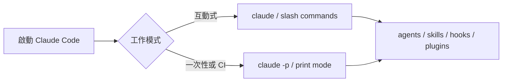

# Claude Code CLI

## Quick Navigation

- [更新時間與差異總結](#更新時間與差異總結)
- [常用 CLI 參數](#常用-cli-參數)
- [CLI 內建指令](#cli-內建指令)
- [互動式 slash commands](#互動式-slash-commands)
- [Hook 機制](#hook-機制)
- [內建 Skills](#內建-skills)
- [常見 plugin](#常見-plugin)
- [互動式特殊功能](#互動式特殊功能)

[Back to top](#quick-navigation)

---

- 安裝：`npm install -g @anthropic-ai/claude-code`
- 更新：`claude update`；若為 npm 全域安裝，也可用 `npm update -g @anthropic-ai/claude-code`，或重新執行 `npm install -g @anthropic-ai/claude-code`
- 移除：`npm uninstall -g @anthropic-ai/claude-code`
- 來源：
  - [CLI Reference](https://code.claude.com/docs/en/cli-reference)
  - [Commands](https://code.claude.com/docs/en/commands)
  - [Interactive Mode](https://code.claude.com/docs/en/interactive-mode)
  - [Hooks reference](https://code.claude.com/docs/en/hooks)
  - [Skills](https://code.claude.com/docs/en/skills)
- 在 prompt 中加入 `ultrathink`（或 `think`、`think hard`、`think harder`）可觸發不同深度的推理模式。也可使用 `Alt+T` 直接切換。
- 普遍 allow 的 tool 啟動指令 `claude --allowedTools "Bash(find:*)" "Bash(cd:*)" "Bash(powershell:*)"`



---

## 更新時間與差異總結

- 更新時間：`2026-05-13 10:09 UTC`
- 比較基準：上一版本地文件（補 `Hook 機制` 前）
- 差異摘要：
  - 新增「Hook 機制」章節，整理 Claude Code lifecycle hooks、設定位置、官方完整事件清單與風險邊界。

[Back to top](#quick-navigation)

## 常用 CLI 參數

> 下面先整理最常用、最容易直接影響工作流的 `CLI flags`。完整參數仍以 `claude --help` 與官方文件為準。
>
> 官方旗標已比早期版本多出不少 browser、web session、auto mode 與 automation 相關選項；這裡優先保留高影響、日常最常碰到的組合。

### Session 與對話

| flag | example | 說明 | scope / risk | notes |
|---|---|---|---|---|
| `-c`, `--continue` | `claude -c` | 載入目前目錄最近一次的對話並繼續。 | 低 | 快速接回上次工作。 |
| `-r`, `--resume[=SESSION]` | `claude -r "auth-refactor"` | 以 ID 或名稱恢復特定 session，或開啟互動選擇器。 | 低 | 長任務中斷後續跑很實用。 |
| `--fork-session` | `claude -r abc123 --fork-session` | 恢復時建立新 session ID，不覆蓋原本紀錄。 | 低 | 要在舊 session 分叉時使用。 |
| `-n`, `--name=NAME` | `claude -n "my-feature"` | 為本次 session 設定顯示名稱。 | 低 | 會顯示在 `/resume` 清單與 terminal 標題。 |
| `--session-id=UUID` | `claude --session-id "550e8400-e29b-41d4-a716-446655440000"` | 指定本次對話的 session ID。 | 中 | 適合外部系統或自動化流程對接。 |
| `--from-pr=PR` | `claude --from-pr 123` | 恢復與特定 GitHub PR 關聯的 session。 | 低 | 和 `gh pr create` 工作流搭配很方便。 |
| `--no-session-persistence` | `claude -p --no-session-persistence "query"` | 停用 session 持久化（僅 print 模式）。 | 低 | 一次性腳本常用。 |

### 模型與輸出

| flag | example | 說明 | scope / risk | notes |
|---|---|---|---|---|
| `--model=MODEL` | `claude --model claude-sonnet-4-6` | 指定模型，可用 alias（`sonnet`、`opus`）或完整名稱。 | 低 | 可取代互動模式內的 `/model`。 |
| `--effort=LEVEL` | `claude --effort high` | 設定推理強度：`low`、`medium`、`high`、`max`（僅 Opus 4.6）。 | 低 | `max` 僅限本次 session。 |
| `-p`, `--print` | `claude -p "query"` | Print 模式：執行後直接退出，不進入互動介面。 | 中 | 適合腳本化或 CI 整合。 |
| `--output-format=FORMAT` | `claude -p "query" --output-format=json` | 控制輸出格式：`text`、`json`、`stream-json`（僅 print 模式）。 | 中 | `json` 會輸出 JSONL。 |
| `--input-format=FORMAT` | `claude -p --output-format json --input-format stream-json` | 指定 print 模式輸入格式。 | 中 | 處理串流輸入時很有用。 |
| `--json-schema=SCHEMA` | `claude -p --json-schema '{"type":"object"}' "query"` | 要求輸出符合指定 JSON Schema。 | 中 | 結構化輸出整合很實用。 |
| `--verbose` | `claude --verbose` | 啟用詳細日誌，逐 turn 顯示完整輸出。 | 低 | 除錯時實用。 |
| `--max-turns=N` | `claude -p --max-turns 3 "query"` | 限制 agentic turns 數量（print 模式），超過時以錯誤退出。 | 中 | 防止無限迴圈。 |
| `--max-budget-usd=N` | `claude -p --max-budget-usd 5.00 "query"` | 設定最高 API 費用上限（print 模式）。 | 中 | 成本控管。 |
| `--fallback-model=MODEL` | `claude -p --fallback-model sonnet "query"` | 預設模型過載時自動切換備援（print 模式）。 | 低 | 高可用場景實用。 |
| `--betas` | `claude --betas interleaved-thinking` | 在 API 請求中加入 beta headers（僅限 API key 使用者）。 | 低 | 例如 `interleaved-thinking` 等實驗功能。 |
| `--include-partial-messages` | `claude -p --include-partial-messages --output-format stream-json "query"` | 在 stream-json 輸出中包含部分 streaming events。 | 中 | 須配合 `--print` 與 `--output-format=stream-json`。 |
| `--include-hook-events` | `claude -p --output-format stream-json --include-hook-events "query"` | 在輸出串流中包含所有 hook lifecycle events。 | 中 | 需搭配 `--output-format=stream-json`。 |
| `--replay-user-messages` | `claude -p --input-format stream-json --output-format stream-json --replay-user-messages` | 將 stdin 的 user messages 原樣回送到 stdout 以便外部系統確認。 | 中 | 需同時使用 `--input-format=stream-json` 與 `--output-format=stream-json`。 |

### System Prompt

| flag | 說明 | notes |
|---|---|---|
| `--system-prompt=TEXT` | 以自訂文字完全取代預設 system prompt。 | 與 `--system-prompt-file` 互斥。 |
| `--system-prompt-file=PATH` | 從檔案讀取，完全取代預設 system prompt。 | 與 `--system-prompt` 互斥。 |
| `--append-system-prompt=TEXT` | 在預設 system prompt 後附加自訂文字。 | 可與取代旗標並用。 |
| `--append-system-prompt-file=PATH` | 從檔案讀取並附加到 system prompt 末端。 | 可與取代旗標並用。 |
| `--exclude-dynamic-system-prompt-sections` | 將 system prompt 中依機器而變的區塊（工作目錄、環境資訊、memory paths、git 狀態）移到第一則 user message。 | 只在預設 system prompt 下生效；常搭配 `-p` 做多使用者 scripted workflow，以提高 prompt cache 重用率。 |

### Tools 與權限

| flag | example | 說明 | scope / risk | notes |
|---|---|---|---|---|
| `--tools=LIST` | `claude --tools "Bash,Edit,Read"` | 限制可用的內建 tools。`""` 停用全部，`"default"` 開啟全部。 | 高 | 精確控制工具範圍。 |
| `--allowedTools=LIST` | `claude --allowedTools "Bash(git log *)"` | 指定可自動執行（不逐次詢問）的 tools。 | 高 | 支援 permission rule 語法。 |
| `--disallowedTools=LIST` | `claude --disallowedTools "Edit"` | 從 model context 完全移除指定 tools。 | 中 | 建立安全護欄。 |
| `--permission-mode=MODE` | `claude --permission-mode plan` | 以指定 permission mode 啟動。 | 中 | 常用值包含 `plan`，也可與 auto / bypass 類模式搭配。 |
| `--allow-dangerously-skip-permissions` | `claude --permission-mode plan --allow-dangerously-skip-permissions` | 啟用「可切到 bypass」的能力，但不會立刻跳過權限。 | **高** | 適合搭配 permission mode 控制流程。 |
| `--dangerously-skip-permissions` | `claude --dangerously-skip-permissions` | 直接跳過權限提示。 | **極高** | 極度謹慎使用。 |
| `--bare` | `claude --bare -p "query"` | Minimal mode：停用 skills、hooks、plugins、MCP auto-discovery 等自動載入。 | 中 | 腳本化呼叫能更快、更乾淨。 |
| `--disable-slash-commands` | `claude --disable-slash-commands` | 停用本次 session 的所有 slash commands 與 skills。 | 中 | 做基線測試或限制能力時實用。 |
| `--enable-auto-mode` | `claude --enable-auto-mode` | **已於 v2.1.111 移除**；auto mode 現在預設就在 `Shift+Tab` 的模式循環中。 | 低 | 若要一開始就進 auto mode，改用 `--permission-mode auto`。 |
| `--permission-prompt-tool` | `claude -p --permission-prompt-tool mcp__my-mcp__prompt "query"` | 指定一個 MCP tool 來處理非互動模式的權限提示。 | 中 | 適合全自動 pipeline 搭配自訂審核邏輯。 |

### Workspace / Browser

| flag | example | 說明 | scope / risk | notes |
|---|---|---|---|---|
| `--add-dir=PATH` | `claude --add-dir ../apps ../lib` | 新增 Claude 可存取的額外工作目錄（會驗證路徑是否存在）。 | 低 | 跨目錄作業時實用。 |
| `-w`, `--worktree[=NAME]` | `claude -w feature-auth` | 在 `<repo>/.claude/worktrees/<name>` 建立隔離的 git worktree session。 | 中 | 省略名稱時自動生成。 |
| `--chrome` | `claude --chrome` | 啟用 Chrome browser integration。 | 中 | Web automation / testing workflow 常用。 |
| `--no-chrome` | `claude --no-chrome` | 明確停用本次 session 的 Chrome integration。 | 低 | 排查問題或保持純 CLI 流程時使用。 |
| `--ide` | `claude --ide` | 啟動時若只找到一個可用 IDE，就自動連線。 | 低 | 常用於已綁定 IDE 的工作流。 |

### MCP 與 Plugin

| flag | example | 說明 | scope / risk | notes |
|---|---|---|---|---|
| `--mcp-config=PATH` | `claude --mcp-config ./mcp.json` | 從 JSON 檔或字串載入 MCP servers（空白分隔可多個）。 | 低 | 快速掛載外部工具。 |
| `--strict-mcp-config` | `claude --strict-mcp-config --mcp-config ./mcp.json` | 只使用 `--mcp-config` 指定的 MCP，忽略其他設定。 | 中 | 乾淨的隔離環境。 |
| `--plugin-dir=PATH` | `claude --plugin-dir ./my-plugins` | 僅本次 session 從指定目錄載入 plugins。可重複使用多個路徑。 | 低 | 臨時試驗 plugin 時方便。 |
| `--settings` | `claude --settings ./settings.json` | 從 JSON 檔或 JSON 字串載入額外設定。 | 低 | 可與既有設定合併使用。 |
| `--setting-sources` | `claude --setting-sources user,project` | 逗號分隔的設定來源清單（`user`、`project`、`local`）。 | 低 | 限制載入哪些層級的設定。 |
| `--channels` | `claude --channels notifications` | （Research preview）指定 Claude 應監聽的 MCP servers channel 通知。 | 中 | 尚在研究預覽階段。 |
| `--dangerously-load-development-channels` | `claude --dangerously-load-development-channels server:webhook` | 允許載入不在核准 allowlist 中的 development channels，供本機開發與測試使用。 | 中 | 接受 `plugin:<name>@<marketplace>` 與 `server:<name>`，且會要求確認。 |

### Remote / Automation / Other

| flag | example | 說明 | scope / risk |
|---|---|---|---|
| `--agent=AGENT` | `claude --agent my-agent` | 指定本次 session 使用的 agent（覆蓋 `agent` 設定）。 | 低 |
| `--agents=JSON` | `claude --agents '{"reviewer":{"description":"Reviews code","prompt":"You are a code reviewer"}}'` | 以 JSON 動態定義 custom subagents。 | 中 |
| `--debug` | `claude --debug "api,mcp"` | 啟用 debug 模式，並可選擇性過濾類別（例如 `api,hooks` 或 `!statsig,!file`）。 | 低 |
| `--debug-file=PATH` | `claude --debug-file /tmp/claude-debug.log` | 將 debug logs 寫到指定檔案路徑，且會隱式啟用 debug mode。 | 低 |
| `--remote` | `claude --remote "Fix the login bug"` | 在 claude.ai 建立新的 web session。 | 中 |
| `--remote-control`, `--rc` | `claude --remote-control "My Project"` | 啟動可由 claude.ai / Claude app 遠端控制的互動 session。 | 中 |
| `--remote-control-session-name-prefix=PREFIX` | `claude remote-control --remote-control-session-name-prefix dev-box` | 為未顯式命名的 Remote Control session 指定自動名稱前綴。 | 低 |
| `--teleport` | `claude --teleport` | 將 web session 拉回本機 terminal。 | 中 |
| `--teammate-mode` | `claude --teammate-mode in-process` | 設定 agent team teammates 的顯示模式。 | 低 |
| `--tmux` | `claude -w feature-auth --tmux` | 為 worktree session 建立 tmux / panes 工作區。 | 中 |
| `-v`, `--version` | `claude --version` | 顯示版本號。 | 低 |
| `--help` | `claude --help` | 顯示說明。 | 低 |
| `--init` | `claude --init` | 執行初始化 hooks 後進入互動模式。 | 低 |
| `--init-only` | `claude --init-only` | 執行初始化 hooks 後直接退出（不啟動互動 session）。 | 低 |
| `--maintenance` | `claude --maintenance` | 執行 maintenance hooks 後退出。 | 低 |

[Back to top](#quick-navigation)

## CLI 內建指令

| command | example | 說明 | 備註 |
|---|---|---|---|
| `claude` | `claude` | 啟動互動式 CLI。 | 預設進入對話式工作流。 |
| `claude "query"` | `claude "explain this repo"` | 帶初始 prompt 啟動互動 session。 | 適合快速帶著脈絡進場。 |
| `claude -p "query"` | `claude -p "summarize this file"` | Print 模式，回應後退出。 | 腳本化與 CI 整合常用。 |
| `cat file | claude -p "query"` | `Get-Content .\logs.txt | claude -p "explain"` | 處理 pipe 進來的內容。 | 適合把外部輸出直接交給 Claude 分析。 |
| `claude -c` | `claude -c` | 繼續目前目錄最近一次對話。 | 快速接回原任務。 |
| `claude -c -p "query"` | `claude -c -p "Check for type errors"` | 以 print 模式繼續最近一次對話。 | 腳本化接續既有上下文。 |
| `claude -r "<session>" "query"` | `claude -r "auth-refactor" "Finish this PR"` | 以名稱或 ID 恢復指定 session 並繼續工作。 | 長任務追蹤很好用。 |
| `claude update` | `claude update` | 更新 CLI 到最新版本。 | 若為 npm 全域安裝，也可用 `npm update -g @anthropic-ai/claude-code`；重新執行 `npm install -g @anthropic-ai/claude-code` 也可達到相同效果。 |
| `claude install [version]` | `claude install stable` | 安裝或重新安裝 native binary。 | 可指定 `stable`、`latest` 或特定版本號。 |
| `claude auth login` | `claude auth login --console` | 登入 Anthropic 帳號。 | 支援 `--email`、`--sso`、`--console`。 |
| `claude auth logout` | `claude auth logout` | 登出並移除本機憑證。 | 切換帳號或清理環境。 |
| `claude auth status` | `claude auth status --text` | 顯示認證狀態。 | 預設輸出 JSON；`--text` 為人類可讀格式。 |
| `claude setup-token` | `claude setup-token` | 產生給 CI / scripts 使用的 long-lived OAuth token。 | 會直接印到 terminal，不會自動保存；需有 Claude subscription。 |
| `claude project purge [path]` | `claude project purge ~/work/repo --dry-run` | 清除某個 project 的本機 Claude Code 狀態資料。 | 可用 `--dry-run` 預覽，也支援 `--yes`、`--interactive`、`--all`。 |
| `claude agents` | `claude agents` | 列出所有已設定的 subagents，依來源分組。 | 確認可用 agent 清單。 |
| `claude auto-mode defaults` | `claude auto-mode defaults > rules.json` | 輸出內建 auto mode classifier 規則。 | 可搭配 `claude auto-mode config` 查看實際設定。 |
| `claude mcp` | `claude mcp` | 管理 MCP server 設定。 | 詳見 MCP 文件。 |
| `claude plugin` | `claude plugin install code-review@claude-plugins-official` | 管理 Claude Code plugins。 | `claude plugins` 也是 alias。 |
| `claude remote-control` | `claude remote-control --name "My Project"` | 啟動 Remote Control server。 | 讓 claude.ai 或 Claude app 可控制本機 session。 |
| `claude ultrareview [target]` | `claude ultrareview 1234 --json` | 以非互動模式執行 ultrareview。 | 成功回傳 0、失敗回傳 1；可用 `--json` 與 `--timeout <minutes>`。 |

[Back to top](#quick-navigation)

## 互動式 slash commands

> 以下整理的是目前 Claude Code CLI 內建的 `slash commands`。不是所有指令都會對每位使用者顯示：有些取決於平台、方案或環境。**最準仍以互動模式輸入 `/help` 為準**。

### Agent / 模型 / 任務

| command | 說明 | notes |
|---|---|---|
| `/model [model]` | 選擇或直接切換模型。 | 支援的模型可在選單中查看。 |
| `/effort [low|medium|high|max|auto]` | 設定推理強度。 | `max` 僅 Opus 4.6 支援；`auto` 重設成預設。 |
| `/agents` | 管理 agent 設定。 | 確認可用 agent 清單。 |
| `/tasks` | 列出並管理背景任務。 | 含 subagents 與 shell sessions。 |
| `/plan [description]` | 直接進入 plan mode。 | 可直接附帶任務描述。 |
| `/ultraplan <prompt>` | 在瀏覽器草擬 ultraplan，審閱後可遠端執行或送回 terminal。 | 適合把大任務先拉到 web 端規劃。 |
| `/fast [on|off]` | 切換 fast mode。 | 適合快速回應場景。 |
| `/btw <question>` | 問一個不寫入主對話歷史的 side question。 | 只使用目前 context，不會動用 tools。 |

### Code / Workspace / Tooling

| command | 說明 | notes |
|---|---|---|
| `/init` | 初始化 `CLAUDE.md` project guide。 | 可搭配新版 interactive init flow。 |
| `/autofix-pr [prompt]` | 啟動會監看目前 branch PR 的 Claude Code on the web session，自動處理 CI failure 與 review comments。 | 需要 `gh` CLI 與 Claude Code on the web 權限。 |
| `/diff` | 開啟互動式 diff 檢視器，顯示未提交變更與逐 turn 差異。 | 方向鍵可切換檢視。 |
| `/ide` | 管理 IDE 整合並顯示連線狀態。 | 與 VS Code、JetBrains 等整合。 |
| `/chrome` | 設定 Claude in Chrome。 | 管理瀏覽器整合設定。 |
| `/focus` | 切換 focus view，只顯示最後一個 prompt、單行 tool 摘要與最終回應。 | 僅在 fullscreen rendering 可用。 |
| `/heapdump` | 匯出 JavaScript heap snapshot 與 memory breakdown 以排查高記憶體使用。 | 預設寫到 `~/Desktop`，Linux 無 Desktop 時改寫 home 目錄。 |
| `/security-review` | 分析目前 branch 待提交的變更，找出安全漏洞。 | 涵蓋 injection、auth、data exposure 等。 |
| `/pr-comments [PR]` | 取得 GitHub PR 的留言。 | 自動偵測當前 branch 的 PR，或手動指定 URL / 編號。 |
| `/install-github-app` | 為 repository 設定 Claude GitHub Actions app。 | GitHub Actions 整合入口。 |
| `/install-slack-app` | 安裝 Claude Slack app。 | 會開啟瀏覽器完成 OAuth。 |
| `/doctor` | 診斷並驗證 Claude Code 安裝與設定。 | 排查環境問題的第一步。 |
| `/insights` | 產生 Claude Code session 分析報告。 | 查看互動模式、摩擦點與專案分布。 |
| `/review [PR]` | 在目前 session 內對 PR 做本地 review。 | 若要更深度的雲端多 agent review，改用 `/ultrareview`。 |
| `/ultrareview [PR]` | 在 cloud sandbox 中執行深度、多 agent 的 code review。 | 額度與可用性依方案 / 期間而定。 |
| `/web-setup` | 使用本機 `gh` CLI credentials 把 GitHub 帳號接到 Claude Code on the web。 | 若 GitHub 尚未連線，`/schedule` 也會引導這一步。 |

### Permissions / Directories

| command | 說明 | notes |
|---|---|---|
| `/add-dir <path>` | 新增允許存取的目錄到目前 session。 | 跨工作目錄取檔時常用。 |
| `/permissions` | 檢視或更新 permissions。 | alias：`/allowed-tools`。 |
| `/sandbox` | 切換 sandbox mode（視平台支援）。 | 隔離執行環境。 |

### Session / Context / Sharing

| command | 說明 | notes |
|---|---|---|
| `/resume [session]` | 切換到其他 session，或直接指定 `SESSION-ID` / 名稱。 | alias：`/continue`。 |
| `/branch [name]` | 在目前對話點建立分叉 session。 | alias：`/fork`。 |
| `/rename [name]` | 重新命名目前 session。 | 省略名稱時會自動產生。 |
| `/context` | 以彩色格子視覺化目前 context window 使用量。 | 顯示優化建議與容量警告。 |
| `/compact [instructions]` | 壓縮對話歷史以節省 context。 | 可附帶保留重點的指示。 |
| `/recap` | 立即產生目前 session 的單行摘要。 | 與離開後自動出現的 session recap 是同一類資訊。 |
| `/clear` | 清空目前對話歷史。 | aliases：`/reset`、`/new`。 |
| `/rewind` | 倒回到先前某個對話點，或從選定訊息摘要。 | alias：`/checkpoint`。 |
| `/export [filename]` | 將目前對話匯出為純文字。 | 可直接寫入檔案，或開對話框另存。 |
| `/copy [N]` | 複製最近一次或第 `N` 新的 assistant 回應。 | 有 code block 時會開 picker；也能寫入檔案。 |
| `/desktop` | 把目前 session 接到 Claude Code Desktop app。 | macOS / Windows only；alias：`/app`。 |
| `/teleport` | 將 Claude Code on the web 的 session 拉回目前 terminal。 | 會開 picker 並抓回 branch 與對話；alias：`/tp`。 |
| `/remote-control` | 讓目前 session 可被 claude.ai 遠端控制。 | alias：`/rc`。 |
| `/schedule [description]` | 建立、更新、列出或執行 Cloud scheduled tasks。 | Claude 會互動式引導設定。 |
| `/team-onboarding` | 根據你過去 30 天的使用紀錄產生團隊 onboarding guide。 | 產物可直接貼給隊友作為第一次使用提示。 |

### Configuration / Extensibility

| command | 說明 | notes |
|---|---|---|
| `/config` | 開啟 Settings 介面（theme、model、output style 等）。 | alias：`/settings`。 |
| `/theme` | 更換色彩主題。 | 支援 light / dark / daltonized / ANSI themes。 |
| `/color [color|default]` | 設定 prompt bar 顏色。 | 支援 `red`、`blue`、`green`、`yellow`、`purple`、`orange`、`pink`、`cyan`。 |
| `/vim` | 切換 Vim 與 Normal 輸入模式。 | 也可透過 `/config` 永久設定。 |
| `/tui [default|fullscreen]` | 設定 terminal UI renderer，並保留目前對話重新啟動。 | `fullscreen` 會啟用 flicker-free alt-screen renderer；不帶參數可顯示目前 renderer。 |
| `/terminal-setup` | 設定 terminal keybindings（如 `Shift+Enter`）。 | 僅在需要設定的 terminal 中顯示。 |
| `/keybindings` | 開啟或建立 keybindings 設定檔。 | 自訂快捷鍵入口。 |
| `/mcp` | 管理 MCP server 設定與 OAuth 認證。 | 包含 MCP prompts 與 server 狀態。 |
| `/setup-bedrock` | 透過互動式 wizard 設定 Amazon Bedrock 的認證、region 與 model pins。 | 僅在 `CLAUDE_CODE_USE_BEDROCK=1` 時顯示。 |
| `/setup-vertex` | 透過互動式 wizard 設定 Google Vertex AI 的認證、project、region 與 model pins。 | 僅在 `CLAUDE_CODE_USE_VERTEX=1` 時顯示。 |
| `/memory` | 編輯 `CLAUDE.md` 記憶檔，啟用 / 停用 auto-memory，並檢視 auto-memory 條目。 | 管理跨 session 的持久記憶。 |
| `/hooks` | 檢視 tool 事件的 hook 設定。 | 確認自動化 hook 規則。 |
| `/skills` | 列出可用的 skills。 | 確認已載入的 skill 清單。 |
| `/plugin` | 管理 plugins 與 marketplace。 | 安裝、更新、列出與移除 plugin。 |
| `/reload-plugins` | 重新載入所有 active plugins。 | 不重開 CLI 也能套用變更。 |
| `/remote-env` | 設定 `--remote` 啟動 web session 的預設遠端環境。 | 用於 Claude Code on the web。 |
| `/statusline` | 設定 Claude Code 的 status line。 | 可描述需求，或不帶參數自動設定。 |

### Help / Account / Lifecycle

| command | 說明 | notes |
|---|---|---|
| `/help` | 顯示互動模式指令說明。 | **最準的即時指令清單入口。** |
| `/powerup` | 透過互動式短教學與 animated demos 探索 Claude Code 功能。 | 新功能導覽入口。 |
| `/release-notes` | 顯示完整 changelog，最新版本優先。 | 可快速查看近期變更。 |
| `/stats` | `/usage` 的 alias，直接開在 Stats 分頁。 | 用來查看使用量與活動統計摘要。 |
| `/usage` | 顯示方案使用限制與 rate limit 狀態。 | 確認剩餘配額。 |
| `/cost` | `/usage` 的 alias。 | 顯示 session cost、方案用量與活動統計。 |
| `/status` | 開啟 Settings 介面（Status 頁），顯示版本、模型、帳號、連線狀態。 | 可在 Claude 回應途中直接查看。 |
| `/feedback [report]` | 提交 Claude Code 回饋。 | alias：`/bug`。 |
| `/login` | 登入 Anthropic 帳號。 | 首次使用或 token 失效時。 |
| `/logout` | 登出 Anthropic 帳號。 | 切換帳號或清理憑證。 |
| `/mobile` | 顯示下載 Claude mobile app 的 QR code。 | aliases：`/ios`、`/android`。 |
| `/voice` | 切換 push-to-talk voice dictation。 | 需要 Claude.ai account。 |
| `/extra-usage` | 設定額外用量，避免 hit rate limits 後中斷。 | 依方案可見性而定。 |
| `/passes` | 分享一週免費 Claude Code 給朋友。 | 僅對符合資格的帳號顯示。 |
| `/privacy-settings` | 檢視或更新隱私設定。 | Pro / Max 方案限定。 |
| `/stickers` | 索取 Claude Code stickers。 | 周邊入口。 |
| `/upgrade` | 開啟升級頁面。 | 方案升級入口。 |
| `/exit` | 離開 CLI。 | alias：`/quit`。 |

[Back to top](#quick-navigation)

---

## Hook 機制

Claude Code 有正式 hook 機制，可在 session lifecycle 的固定時點執行 shell command、HTTP endpoint、MCP tool、prompt hook 或 agent hook。適合做自動化檢查、稽核紀錄、權限決策、環境初始化與工具呼叫前後的 guardrail；如果只是固定專案規則或靜態背景資訊，優先放在 [CLAUDE.md](https://code.claude.com/docs/en/memory)。

| 面向 | 說明 |
|---|---|
| 設定位置 | 使用者層：`~/.claude/settings.json`。專案層：`.claude/settings.json`。本機專案層：`.claude/settings.local.json`。也可來自 managed policy、plugin `hooks/hooks.json`、skill 或 agent frontmatter。 |
| 檢視方式 | 在互動模式輸入 `/hooks`，可用唯讀介面檢查目前載入的 hook event、matcher、type、來源檔與完整 handler。 |
| 官方事件 | 下表列出官方文件提到的所有 hook events；不同自動化場景會用到 setup、compaction、worktree、elicitation 等較少見事件。 |
| 決策控制 | `PreToolUse` 可 allow / deny / ask / defer；`PermissionRequest` 可 allow / deny；`Stop`、`SubagentStop`、`UserPromptSubmit` 等可用 `decision: "block"` 影響流程。 |
| 非同步 | `type: "command"` 可設定 `async: true`，適合長時間測試、部署通知或外部 API 呼叫；非同步 hook 不能阻擋原始動作。 |
| 風險 | command hooks 以目前系統使用者權限執行，能讀寫該使用者可存取的檔案；加入前要審查 command 與 timeout。 |

官方事件清單：

| event | 觸發時機 / 用途 |
|---|---|
| `SessionStart` | session 開始或恢復時觸發，常用來載入工作區慣例、初始化環境或補充 context。 |
| `Setup` | 使用 `--init-only`，或在 `-p` 模式搭配 `--init` / `--maintenance` 時觸發，適合 CI / scripts 的一次性準備。 |
| `UserPromptSubmit` | 使用者送出 prompt、Claude 處理前觸發，可做 prompt 稽核、阻擋敏感資料或追加 context。 |
| `UserPromptExpansion` | 使用者輸入的 command 展開成 prompt、送到 Claude 前觸發，可阻擋或檢查 command expansion。 |
| `PreToolUse` | tool call 執行前觸發，可阻擋、允許、要求確認或延後工具呼叫。 |
| `PermissionRequest` | 權限對話出現時觸發，可自動 allow / deny 或交回正常權限流程。 |
| `PermissionDenied` | auto mode classifier 拒絕 tool call 時觸發，可回傳 `retry: true` 讓 model 嘗試改用其他方式。 |
| `PostToolUse` | tool call 成功後觸發，常用於 lint、格式化、記錄工具輸出或加入後續 context。 |
| `PostToolUseFailure` | tool call 失敗後觸發，適合補充錯誤診斷、建議 recovery path 或記錄失敗。 |
| `PostToolBatch` | 一批 parallel tool calls 全部完成後、下一次 model call 前觸發，適合批次檢查與彙整結果。 |
| `Notification` | Claude Code 發出 notification 時觸發，可接通知系統或處理 permission / idle 類通知。 |
| `SubagentStart` | subagent 產生時觸發，可依 agent type 注入額外 context 或做啟動紀錄。 |
| `SubagentStop` | subagent 完成時觸發，可檢查產出並用 block 要求 subagent 繼續處理。 |
| `TaskCreated` | 透過 `TaskCreate` 建立 task 時觸發，適合稽核 task 建立或補充 task context。 |
| `TaskCompleted` | task 被標記完成時觸發，適合驗收、統計或要求補做收尾檢查。 |
| `Stop` | Claude 完成回應時觸發，可做最後驗證；block 代表要求 Claude 繼續下一輪。 |
| `StopFailure` | turn 因 API error 結束時觸發；官方說明此事件的 output 與 exit code 會被忽略，主要用於記錄。 |
| `TeammateIdle` | agent team teammate 即將進入 idle 時觸發，可用於團隊型 agent 的接續或提醒。 |
| `InstructionsLoaded` | `CLAUDE.md` 或 `.claude/rules/*.md` 載入 context 時觸發，包含 session start 與 session 中 lazy load。 |
| `ConfigChange` | session 期間設定檔變更時觸發，可用來重新載入或驗證設定。 |
| `CwdChanged` | 工作目錄改變時觸發，例如 Claude 執行 `cd`；適合 direnv 類 reactive environment 管理。 |
| `FileChanged` | 被 matcher 監看的檔案在磁碟上變更時觸發，適合監看 `.envrc`、設定檔或生成檔。 |
| `WorktreeCreate` | 透過 `--worktree` 或 `isolation: "worktree"` 建立 worktree 時觸發，可取代預設 git 行為。 |
| `WorktreeRemove` | session 結束或 subagent 完成並移除 worktree 時觸發，適合清理隔離工作區資源。 |
| `PreCompact` | context compaction 開始前觸發，適合保留關鍵資訊或稽核壓縮前狀態。 |
| `PostCompact` | context compaction 完成後觸發，適合檢查壓縮結果或補上必要 context。 |
| `Elicitation` | MCP server 在 tool call 中要求使用者輸入時觸發，可審核或處理 elicitation request。 |
| `ElicitationResult` | 使用者回覆 MCP elicitation 後、送回 server 前觸發，可驗證或轉換回覆。 |
| `SessionEnd` | session 終止時觸發，常用於收尾、清理、記錄 transcript 或送出 analytics。 |

最小 `PreToolUse` 範例：

```json
{
  "hooks": {
    "PreToolUse": [
      {
        "matcher": "Bash",
        "hooks": [
          {
            "type": "command",
            "command": "${CLAUDE_PROJECT_DIR}/.claude/hooks/check-bash.sh",
            "timeout": 30
          }
        ]
      }
    ]
  }
}
```

來源：
- [Hooks reference](https://code.claude.com/docs/en/hooks)
- [Automate workflows with hooks](https://code.claude.com/docs/en/hooks-guide)

[Back to top](#quick-navigation)

---

## 內建 Skills

Bundled skills 隨 Claude Code 出貨，是 prompt-based 的指令，可協調工具使用、產生平行 agents、讀取檔案。呼叫方式與一般 slash commands 相同，直接輸入 `/skill-name` 即可。

| skill | 說明 | notes |
|---|---|---|
| `/batch <instruction>` | 大規模平行改動：分析程式碼、拆解為 5–30 個獨立單元並展示計畫，再對每個單元產生獨立 git worktree 的背景 agent，各自實作、測試並開 PR。 | 需要 git repo。 |
| `/claude-api` | 載入 Claude API 與 Agent SDK 參考資料，涵蓋多語言 SDK、tool use、streaming、batches、structured outputs 與常見陷阱。 | 匯入 `anthropic`、`@anthropic-ai/sdk`、`claude_agent_sdk` 時也可能自動啟用。 |
| `/debug [description]` | 讀取 session debug log 進行自我除錯。可選擇性描述問題以聚焦分析。 | 互動模式異常時的首選指令。 |
| `/fewer-permission-prompts` | 掃描 transcript 中常見的唯讀 Bash / MCP 呼叫，並把優先 allowlist 寫進 project `.claude/settings.json`。 | 適合被 permission prompts 打斷得很煩時使用。 |
| `/loop [interval] <prompt>` | 以固定間隔重複執行 prompt，直到 session 結束。 | 適合輪詢部署或追蹤 PR，例如 `/loop 5m check deploy status`。 |
| `/simplify [focus]` | 複查最近修改的檔案，找出程式碼重用、品質、效率問題並修正。 | 同時會產生多個 review agents 並行處理。 |

[Back to top](#quick-navigation)

---

## 常見 plugin

這一章整理值得額外安裝的 plugin。後續若新增其他 plugin，建議沿用相同 table 結構，固定呈現用途、安裝、檢查、模型設定與最小可用命令。

### 章內導覽

- [Codex](#codex)

### Codex

在 Claude Code 內使用 `codex` plugin 後，實際可用的是 `/codex:*` 指令，例如 `/codex:setup`、`/codex:review`、`/codex:rescue`，不是單獨一個內建 `/codex`。

| 項目 | 內容 |
|---|---|
| 用途 | 想在 Claude Code 內直接呼叫 Codex 做 review 或委派任務。<br>不想來回切換 Claude Code 與獨立 Codex CLI。 |
| 安裝步驟 | 1. `/plugin marketplace add openai/codex-plugin-cc`<br>2. `/plugin install codex@openai-codex`<br>3. `/reload-plugins` |
| 補充安裝 | 如果本機還沒裝 Codex CLI，可先執行 `npm install -g @openai/codex`，再回到 Claude Code 跑 `/codex:setup`。 |
| 初次檢查 | 1. `/codex:setup`<br>2. 若尚未登入 Codex：`!codex login` |

#### 指令列表

下表整理 codex plugin v1.0.4 提供的所有 `/codex:*` 指令；參數欄沿用各指令的 `argument-hint` 原始定義。

| 指令 | 說明 | 參數 | 範例 |
|---|---|---|---|
| `/codex:setup` | 檢查本機 Codex CLI 是否就緒，並可開關 stop-time review gate。若偵測到尚未安裝 Codex，會詢問是否用 `npm install -g @openai/codex` 安裝；若已安裝但未登入，會提示執行 `!codex login`。 | `[--enable-review-gate \| --disable-review-gate]` | `/codex:setup --enable-review-gate` |
| `/codex:rescue` | 把任務委派給 `codex:codex-rescue` subagent：調查、修 bug、或續做先前 rescue 工作。會偵測同 session 內可恢復的 rescue thread 並詢問是否繼續。 | `[--background \| --wait]`<br>`[--resume \| --fresh]`<br>`[--model <model\|spark>]`<br>`[--effort <none\|minimal\|low\|medium\|high\|xhigh>]`<br>`[要 Codex 做的事]` | `/codex:rescue --background investigate the failing test` |
| `/codex:review` | 對本機 git 狀態執行 Codex code review；read-only，不會動程式碼。未指定 `--wait` / `--background` 時會先估算 review 規模再詢問。 | `[--wait \| --background]`<br>`[--base <ref>]`<br>`[--scope auto\|working-tree\|branch]` | `/codex:review --background --base main` |
| `/codex:adversarial-review` | 挑戰式 review：質疑當前實作方向、設計選擇、取捨與假設，而非只挑語法/缺陷。與 `/codex:review` 共用 target 選擇邏輯，但**可在旗標後附 focus 文字**。 | 同 `/codex:review`，並可在尾端附帶 `[focus ...]` 文字 | `/codex:adversarial-review --background challenge whether the caching design is correct` |
| `/codex:status` | 顯示目前 repo 進行中與最近的 Codex jobs，包含 review-gate 狀態。不帶 `job-id` 時輸出單一 Markdown table。 | `[job-id]`<br>`[--wait]`<br>`[--timeout-ms <ms>]`<br>`[--all]` | `/codex:status` |
| `/codex:result` | 顯示已完成 Codex job 的完整儲存輸出（verdict、summary、findings、artifacts、next steps 等），不會壓縮或摘要。 | `[job-id]` | `/codex:result task-abc123` |
| `/codex:cancel` | 取消本 repo 內某個進行中的背景 Codex job。 | `[job-id]` | `/codex:cancel task-abc123` |

#### 指定模型

| 情境 | 寫法 | 說明 |
|---|---|---|
| 單次指定模型 | `/codex:rescue --model gpt-5.4-mini --effort medium investigate the flaky test` | 只影響這一次 `rescue` 任務。 |
| 單次快速模型 | `/codex:rescue --model spark fix the issue quickly` | `spark` 會對應到 `gpt-5.3-codex-spark`。 |
| 專案預設模型 | `.codex/config.toml` 內加入 `model = "gpt-5.4-mini"`<br>`model_reasoning_effort = "high"` | 影響目前專案；只在 trusted project 載入。 |
| 全機預設模型 | `~/.codex/config.toml` 內加入同樣設定 | 影響這台機器上的所有專案。 |
| `review` / `adversarial-review` 指定模型 | 建議走 `config.toml` 預設 | 目前明確文件化的單次 `--model` override 主要是 `/codex:rescue`。 |

來源：
- [Codex plugin for Claude Code](https://github.com/openai/codex-plugin-cc)
- [Discover and install prebuilt plugins through marketplaces](https://code.claude.com/docs/en/discover-plugins)
- [Codex CLI](https://developers.openai.com/codex/cli)

[Back to top](#quick-navigation)

---

## 互動式特殊功能

### 輸入前綴

| 前綴 | 行為 |
|---|---|
| `/` 開頭 | 觸發指令或 skill。 |
| `!` 開頭 | Bash mode：直接執行 shell 指令，並將輸出加入對話 context。 |
| `@` | 觸發檔案路徑自動補全。 |

### 鍵盤快捷鍵

**一般控制**

| 快捷鍵 | 說明 |
|---|---|
| `Ctrl+C` | 取消目前輸入或生成中的回應。 |
| `Ctrl+X Ctrl+K` | 終止所有背景 agents；3 秒內連按兩次確認。 |
| `Ctrl+D` | 退出 Claude Code session。 |
| `Ctrl+G` / `Ctrl+X Ctrl+E` | 在預設文字編輯器中開啟目前 prompt。 |
| `Ctrl+L` | 清除 terminal 畫面（保留對話歷史）。 |
| `Ctrl+O` | 切換 verbose 輸出模式。 | 
| `Ctrl+R` | 反向搜尋指令歷史。 |
| `Ctrl+V` / `Cmd+V`（iTerm2）/ `Alt+V`（Windows） | 從剪貼簿貼上圖片。 |
| `Ctrl+B` | 將執行中的任務移至背景（Tmux 使用者按兩次）。 |
| `Ctrl+T` | 切換 terminal status 區域的 task list 顯示。 |
| `Shift+Tab` / `Alt+M` | 在 `default`、`acceptEdits`、`plan` 與已啟用的其他 permission modes 間切換。 |
| `Option+P` / `Alt+P` | 切換模型，不清除目前 prompt。 |
| `Option+T` / `Alt+T` | 切換 extended thinking 模式（需先執行 `/terminal-setup`）。 |
| `Option+O` / `Alt+O` | 切換 fast mode。 |
| `Esc` + `Esc` | 倒回或從先前訊息摘要。 |
| `↑ / ↓` | 瀏覽指令歷史。 |
| `← / →` | 在 dialog tabs 間切換。 |

**文字編輯**

| 快捷鍵 | 說明 |
|---|---|
| `Ctrl+K` | 刪除到行尾（可貼回）。 |
| `Ctrl+U` | 從游標刪到行首（可貼回）。 |
| `Ctrl+Y` | 貼回刪除的文字。 |
| `Alt+Y`（在 `Ctrl+Y` 之後） | 循環瀏覽貼上歷史。 |
| `Alt+B` | 游標向前移動一個單字。 |
| `Alt+F` | 游標向後移動一個單字。 |

**多行輸入**

| 方式 | 快捷鍵 |
|---|---|
| 通用 | `\` + `Enter` |
| macOS 預設 | `Option+Enter` |
| 支援的 terminal（iTerm2、WezTerm、Ghostty、Kitty） | `Shift+Enter` |
| Line feed | `Ctrl+J` |

[Back to top](#quick-navigation)
