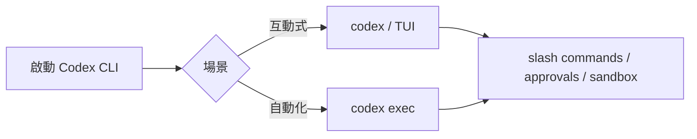

# Codex CLI

## Quick Navigation

- [更新時間與差異總結](#更新時間與差異總結)
- [安裝與登入](#安裝與登入)
- [常用 CLI 參數](#常用-cli-參數)
- [CLI 內建指令](#cli-內建指令)
- [互動式 slash commands](#互動式-slash-commands)
- [Hook 機制](#hook-機制)
- [設定與安全邊界](#設定與安全邊界)
- [互動式特殊功能](#互動式特殊功能)

[Back to top](#quick-navigation)

---

- 安裝：`npm install -g @openai/codex`，或 `brew install --cask codex`
- 更新：`codex update`；若為 npm 全域安裝，也可用 `npm update -g @openai/codex`
- 移除：若為 npm 全域安裝可用 `npm uninstall -g @openai/codex`；若為 Homebrew 安裝可用 `brew uninstall --cask codex`
- 來源：
  - [Codex Overview](https://developers.openai.com/codex)
  - [CLI Reference](https://developers.openai.com/codex/cli/reference)
  - [Slash Commands](https://developers.openai.com/codex/cli/slash-commands)
  - [CLI Features](https://developers.openai.com/codex/cli/features)
  - [Hooks](https://developers.openai.com/codex/hooks)
  - [Auth](https://developers.openai.com/codex/auth)
  - [openai/codex](https://github.com/openai/codex)



---

## 更新時間與差異總結

- 更新時間：`2026-05-13 08:26 UTC`
- 比較基準：上一版本地文件（補 `Hook 機制` 前）
- 差異摘要：
  - 新增「Hook 機制」章節，整理 Codex CLI hook feature flag、設定位置、支援事件與目前攔截限制。

[Back to top](#quick-navigation)

## 安裝與登入

### 安裝

```bash
# npm
npm install -g @openai/codex

# Homebrew
brew install --cask codex
```

也可以直接從 [openai/codex releases](https://github.com/openai/codex/releases/latest) 下載對應平台的 binary。

### 登入方式

Codex CLI 支援兩條認證路徑：

1. **Sign in with ChatGPT**：適合日常互動使用，依你的 ChatGPT plan / workspace 政策生效。
2. **API key**：適合 script、CI/CD、受控 automation；費用走 OpenAI API pricing。

常用做法：

```bash
# 互動式登入
codex login

# headless / 遠端環境優先考慮 device auth
codex login --device-auth
```

### 認證與快取注意事項

- 認證資訊會快取在 `~/.codex/auth.json` 或 OS credential store。
- `cli_auth_credentials_store = "keyring"` 可改成優先走系統 credential store。
- `~/.codex/auth.json` 內含 access token，**要把它當密碼看待**，不能 commit、不能貼到 issue、不能傳到聊天紀錄。

[Back to top](#quick-navigation)

## 常用 CLI 參數

> 下面優先整理對日常工作流影響最大的旗標。完整列表仍以 `codex --help`、`codex exec --help` 與官方文件為準。

| flag | example | 說明 | scope / risk | notes |
|---|---|---|---|---|
| `--ask-for-approval`, `-a` | `codex -a on-request` | 設定何時停下來等你核准：`untrusted`、`on-request`、`never`。 | 中 | `on-failure` 已 deprecated。 |
| `--sandbox`, `-s` | `codex -s workspace-write` | 控制 shell command 的 sandbox 層級：`read-only`、`workspace-write`、`danger-full-access`。 | **高** | 日常本機開發通常先用 `workspace-write`。 |
| `--model`, `-m` | `codex -m gpt-5.5` | 指定本次 session 使用的模型。 | 低 | 可取代互動模式中的 `/model`。 |
| `--profile`, `-p` | `codex -p work` | 套用 `~/.codex/config.toml` 內的 profile。 | 低 | 不同 repo / 權限策略切換很方便。 |
| `--config`, `-c` | `codex -c approval_policy=\"never\"` | 覆蓋單次執行的 config 值。 | 中 | CLI override 優先級最高。 |
| `--cd`, `-C` | `codex -C .. "review this repo"` | 啟動前先切換工作目錄。 | 低 | 適合 wrapper script。 |
| `--add-dir` | `codex --add-dir ..\shared` | 額外授權可寫入的目錄。 | 中 | 多 repo / monorepo 子目錄常用。 |
| `--image`, `-i` | `codex -i screenshot.png "explain this error"` | 將圖片附加到初始 prompt。 | 低 | 可重複使用或用逗號附多張圖。 |
| `--search` | `codex --search "latest API change"` | 把 web search 從 cached mode 切到 live。 | 中 | live web 結果要當作不可信輸入。 |
| `--enable` / `--disable` | `codex --enable apps` | 單次開關 feature flag。 | 中 | 等價於覆蓋 `[features]`。 |
| `--remote` | `codex --remote ws://127.0.0.1:4500` | 用本機 TUI 連遠端 app-server。 | 中 | 適合 code / credential 在遠端機器時。 |
| `--remote-auth-token-env` | `codex --remote wss://host:4500 --remote-auth-token-env CODEX_REMOTE_AUTH_TOKEN` | 提供 remote TUI 的 bearer token。 | 中 | 只會傳到 `wss://` 或 localhost `ws://`。 |
| `--oss` | `codex exec --oss "summarize this folder"` | 改用本機 open-source model provider。 | 中 | 會驗證 Ollama 是否可用。 |
| `--dangerously-bypass-approvals-and-sandbox`, `--yolo` | `codex --yolo` | 跳過 approvals 與 sandbox。 | **極高** | 只可在外部已強化的受控環境使用。 |
| `--no-alt-screen` | `codex --no-alt-screen` | 停用 TUI 的 alternate screen。 | 低 | 部分 terminal 相容性較好。 |

[Back to top](#quick-navigation)

## CLI 內建指令

| command | example | 說明 | 備註 |
|---|---|---|---|
| `codex` | `codex` | 啟動互動式 TUI。 | 可直接帶初始 prompt。 |
| `codex "PROMPT"` | `codex "Explain this codebase"` | 以單次 prompt 啟動互動 session。 | 仍是 TUI，不是 one-shot exec。 |
| `codex exec` | `codex exec "fix the CI failure"` | 非互動模式執行。 | 適合 script / automation。 |
| `codex exec resume` | `codex exec resume --last "implement the plan"` | 在非互動模式續接既有 session。 | 保留原本 transcript 與上下文。 |
| `codex resume` | `codex resume --last` | 續接先前互動式 session。 | 可用 picker、`--last` 或 `SESSION_ID`。 |
| `codex fork` | `codex fork SESSION_ID` | 把舊 session 分叉成新 thread。 | 適合保留主線又試新路線。 |
| `codex login` | `codex login` | 登入 ChatGPT 或 API key。 | headless 可用 `--device-auth`。 |
| `codex logout` | `codex logout` | 清除本機認證。 | CLI 與 IDE extension 共用 auth cache。 |
| `codex update` | `codex update` | 檢查並更新 CLI。 | 若為 npm 全域安裝，也可用 `npm update -g @openai/codex`；`codex update` 仍僅在支援 self-update 的安裝方式有效。 |
| `codex features` | `codex features list` | 管理 feature flags。 | 會寫入 `~/.codex/config.toml`。 |
| `codex completion` | `codex completion powershell` | 產生 shell completion script。 | 支援 Bash、Zsh、Fish、PowerShell。 |
| `codex app` | `codex app` | 啟動 Codex Desktop。 | Windows 會印出要開啟的 path。 |
| `codex app-server` | `codex app-server --listen ws://127.0.0.1:4500` | 啟動供遠端 TUI 連線的 app-server。 | 偏開發 / debug / remote 工作流。 |
| `codex cloud` | `codex cloud exec --env ENV_ID "Summarize open bugs"` | 管理或提交 Codex Cloud tasks。 | **需 ChatGPT 登入**。 |
| `codex apply` | `codex apply TASK_ID` | 將 cloud task 產生的 diff 套回本地 working tree。 | `git apply` 衝突會 non-zero exit。 |
| `codex mcp` | `codex mcp list` | 管理 MCP servers。 | 目前屬 experimental。 |
| `codex mcp-server` | `codex mcp-server` | 把 Codex 本身作為 MCP server 對外提供。 | 適合被其他 agent / runtime 消費。 |
| `codex plugin marketplace` | `codex plugin marketplace list` | 管理 plugin marketplace。 | 目前屬 experimental。 |
| `codex sandbox` | `codex sandbox --help` | 在 Codex sandbox 內跑任意命令。 | 目前屬 experimental。 |

[Back to top](#quick-navigation)

## 互動式 slash commands

> 在 TUI 中輸入 `/` 可開啟 slash command popup。若 task 正在執行中，按 `Tab` 可以把 slash command 排進下一個 turn。

### Model / thread / planning

| command | 說明 | notes |
|---|---|---|
| `/model` | 切換模型。 | 可搭配 `/status` 確認目前模型。 |
| `/fast` | 開關或查詢 Fast mode。 | 支援的模型才會顯示。 |
| `/personality` | 設定回答風格。 | 支援 `friendly`、`pragmatic`、`none`。 |
| `/agent` | 切換目前 active agent thread。 | 用於檢視或切回 subagent thread。 |
| `/plan` | 切到 plan mode。 | 可直接附 inline prompt。 |
| `/fork` | 將目前對話分叉成新 thread。 | 保留原對話脈絡。 |
| `/side` | 啟動 ephemeral side conversation。 | 適合臨時支線問題。 |
| `/resume` | 從 session list 恢復舊對話。 | 不必重建上下文。 |
| `/new` | 在同一個 CLI session 內開新對話。 | 重置 chat context，但不離開 CLI。 |

### Permissions / workspace / extensibility

| command | 說明 | notes |
|---|---|---|
| `/permissions` | 調整 approval preset。 | 常在 `Auto`、`Read Only`、`Full Access` 間切換。 |
| `/sandbox-add-read-dir` | 額外給 sandbox 讀取某個絕對路徑。 | **僅 Windows native CLI**。 |
| `/plugins` | 瀏覽已安裝或可安裝的 plugins。 | 可檢查 plugin tools 與可用性。 |
| `/apps` | 瀏覽 apps / connectors。 | 可插入 `$app-slug` 到 prompt。 |
| `/mention` | 附加檔案到對話。 | 指定下一步要看的檔案很快。 |
| `/mcp` | 列出 MCP tools / server 狀態。 | 加上 `verbose` 可看更多細節。 |
| `/debug-config` | 顯示 config layer 與 requirement diagnostics。 | 排 precedence 問題很好用。 |

### Review / session / lifecycle

| command | 說明 | notes |
|---|---|---|
| `/status` | 顯示模型、approval policy、writable roots、token 使用量。 | 是排查環境狀態的第一入口。 |
| `/diff` | 顯示目前 Git diff。 | 也會包含 Git 尚未追蹤的檔案。 |
| `/review` | 對 working tree、branch 或 commit 做 review。 | 走專門 reviewer，不直接改 working tree。 |
| `/compact` | 濃縮目前對話以節省 context。 | 長任務建議定期用。 |
| `/copy` | 複製最近一次完成的 Codex 輸出。 | 等同 `Ctrl+O`。 |
| `/clear` | 清 terminal 並開新 chat。 | 和 `Ctrl+L` 不同；`Ctrl+L` 只清畫面。 |
| `/ps` | 顯示 background terminals 與近期輸出。 | 實驗功能。 |
| `/stop` | 停止目前 session 啟動的 background terminals。 | 和 `/ps` 搭配。 |
| `/feedback` | 回報 logs 給 Codex maintainers。 | 遇到 CLI 問題時很有用。 |
| `/init` | 在目前目錄產生 `AGENTS.md` scaffold。 | 用於持久化 repo / subdir 規則。 |
| `/logout` | 登出 Codex。 | 共用 CLI / IDE 的 auth cache。 |
| `/exit`, `/quit` | 離開 CLI。 | 關閉互動 session。 |
| `/experimental` | 切換 experimental features。 | 有些功能需重啟才會生效。 |
| `/statusline` | 互動式調整 footer status-line 顯示。 | 會持久化到 `config.toml`。 |
| `/title` | 調整 terminal title 顯示項目。 | 可顯示 project、branch、thread 等。 |
| `/keymap` | 重新綁定 TUI 快捷鍵。 | 寫入 `tui.keymap`。 |

[Back to top](#quick-navigation)

---

## Hook 機制

Codex CLI 有正式 hook 機制，但目前需要在 `config.toml` 啟用 feature flag。它適合做提示檢查、稽核紀錄、approval policy、工具呼叫前後檢查與停止前驗證；不要把它當成完整安全邊界，因為官方文件明確指出部分 shell 路徑、`WebSearch` 與其他非 shell / 非 MCP tools 目前不一定都會被攔截。

```toml
[features]
codex_hooks = true
```

| 面向 | 說明 |
|---|---|
| 設定位置 | Codex 會從 active config layer 旁邊讀取 `hooks.json`，也支援 `config.toml` 內 inline `[hooks]` table。常見位置是 `~/.codex/hooks.json`、`~/.codex/config.toml`、`<repo>/.codex/hooks.json`、`<repo>/.codex/config.toml`。 |
| 載入規則 | 多個來源的 matching hooks 會全部執行；高優先序 config 不會覆蓋低優先序 hook。專案層 `.codex/` hooks 只會在 trusted project 載入。 |
| 支援事件 | `SessionStart`、`PreToolUse`、`PermissionRequest`、`PostToolUse`、`UserPromptSubmit`、`Stop`。 |
| matcher | `PreToolUse`、`PermissionRequest`、`PostToolUse` 主要 match tool name，例如 `Bash`、`apply_patch`、`Edit`、`Write` 或 MCP tool name；`SessionStart` match `startup`、`resume`、`clear`。 |
| 決策控制 | `PreToolUse` 可 deny Bash command；`PermissionRequest` 可 allow / deny approval request；`UserPromptSubmit` 可 block prompt；`Stop` 的 block 代表要求 Codex 繼續跑下一輪。 |
| 限制 | `PreToolUse` / `PostToolUse` 目前只是不完整攔截層；`PostToolUse` 發生在 tool 已執行後，不能回復副作用。 |

最小 `hooks.json` 範例：

```json
{
  "hooks": {
    "PreToolUse": [
      {
        "matcher": "^Bash$",
        "hooks": [
          {
            "type": "command",
            "command": "python3 \"$(git rev-parse --show-toplevel)/.codex/hooks/pre_tool_use_policy.py\"",
            "timeout": 30,
            "statusMessage": "Checking Bash command"
          }
        ]
      }
    ]
  }
}
```

來源：
- [Hooks](https://developers.openai.com/codex/hooks)

[Back to top](#quick-navigation)

---

## 設定與安全邊界

### 設定檔層級

Codex 的設定優先序（高到低）：

1. CLI flags 與 `--config`
2. `--profile <name>`
3. 專案 `.codex/config.toml`（只在 trusted project 載入）
4. 使用者 `~/.codex/config.toml`
5. 系統層 config
6. built-in defaults

### 常用設定

```toml
model = "gpt-5.5"
approval_policy = "on-request"
sandbox_mode = "workspace-write"
default_permissions = ":workspace"
web_search = "cached"
personality = "friendly"

[windows]
sandbox = "elevated"

[features]
multi_agent = true
shell_snapshot = true
```

### 三個最容易踩坑的點

1. **project config 不是一定會載入**：如果專案被標成 untrusted，Codex 會跳過 `.codex/` 下的 project config、hooks、rules。
2. **`--yolo` 不是只是少問一次而已**：它是直接繞過 approvals 與 sandbox，風險等級和一般 `workspace-write` 完全不同。
3. **web search 預設值要看版本**：官方新文件描述較新的本地工作流預設偏向 cached mode；若你本機版本較舊，仍可能需要明確加 `--search`。真的要最新資料時，顯式指定最穩。

[Back to top](#quick-navigation)

## 互動式特殊功能

### 鍵盤快捷鍵

| 快捷鍵 | 行為 | notes |
|---|---|---|
| `Ctrl+L` | 清除 terminal 畫面。 | **不會**開始新對話。 |
| `Ctrl+O` | 複製最近一次完成的 Codex 輸出。 | 等同 `/copy`。 |
| `Up` / `Down` | 在 composer 內瀏覽 draft history。 | 會連圖片 placeholder 一起還原。 |
| `Ctrl+R` | 搜尋 prompt history。 | `Enter` 接受，`Esc` 取消。 |
| `Tab` | 在 Codex 執行中排隊 follow-up text、slash commands 或 `!` shell commands。 | keyboard-first workflow 的核心操作。 |
| `Ctrl+C` | 關閉互動 session。 | 也可用 `/exit` / `/quit`。 |

### TUI 操作特性

- `codex` 預設進入全螢幕 terminal UI，可直接讀 repo、編輯檔案、執行命令。
- `codex resume --last` 很適合把昨天做到一半的任務直接接回來，不用重講上下文。
- `codex exec` 適合 script / CI；`codex` 適合人工在場、要即時審視 diff 與 approvals 的情境。
- 如果 code / credentials 在遠端主機，但你想保留本機 TUI 體驗，可以用 `codex app-server` + `codex --remote ...`。
- 圖片可直接貼進 composer，或用 `-i` / `--image` 在啟動時附上 screenshot、設計稿、圖表。

[Back to top](#quick-navigation)
