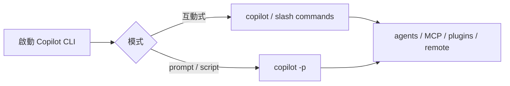

# GitHub Copilot CLI

## Quick Navigation

- [更新時間與差異總結](#更新時間與差異總結)
- [常用 CLI 參數](#常用-cli-參數)
- [CLI 內建指令](#cli-內建指令)
- [互動式 slash commands](#互動式-slash-commands)
- [Hook 機制](#hook-機制)
- [互動式特殊功能](#互動式特殊功能)

[Back to top](#quick-navigation)

---

- 安裝：`npm install -g @github/copilot@latest`
- 更新：`copilot update`；若為 npm 全域安裝，也可用 `npm update -g @github/copilot`，或重新執行 `npm install -g @github/copilot@latest`
- 移除：`npm uninstall -g @github/copilot`
- 來源：
  - [CLI Command Reference](https://docs.github.com/en/copilot/reference/copilot-cli-reference/cli-command-reference)
  - [Using GitHub Copilot CLI](https://docs.github.com/en/copilot/how-tos/use-copilot-agents/use-copilot-cli)
  - [GitHub Copilot hooks reference](https://docs.github.com/en/copilot/reference/hooks-reference)



---

## 更新時間與差異總結

- 更新時間：`2026-05-13 08:26 UTC`
- 比較基準：上一版本地文件（補 `Hook 機制` 前）
- 差異摘要：
  - 新增「Hook 機制」章節，整理 Copilot CLI hooks、設定來源、支援事件與 command / HTTP / prompt hook 類型。

[Back to top](#quick-navigation)

## 常用 CLI 參數

> 下面先整理最常用、最容易直接影響工作流的 `CLI flags`。完整參數仍以 `copilot help` 與官方文件為準。
>
> 官方還有不少較低層的 logging、config、accessibility 旗標；這份文件優先保留高影響、日常最常用的選項。

| flag | example | 說明 | scope / risk | notes |
|---|---|---|---|---|
| `-p`, `--prompt=PROMPT` | `copilot -p "Summarize this repo"` | 以單次模式執行 prompt，完成後退出。 | 中 | 適合腳本化或 CI 整合。 |
| `-i`, `--interactive=PROMPT` | `copilot -i "Review this folder"` | 啟動互動模式，並先執行一段 prompt。 | 低 | 適合直接帶著初始上下文進場。 |
| `--agent=AGENT` | `copilot --agent=refactor-agent` | 指定 custom agent。 | 低 | 任務明確時可降低行為漂移。 |
| `--model=MODEL` | `copilot --model=gpt-5.1` | 指定要使用的模型。 | 低 | 可取代互動模式內的 `/model`。 |
| `--effort=LEVEL` / `--reasoning-effort=LEVEL` | `copilot --effort=high` | 設定 reasoning effort level。 | 中 | 目前官方列出 `low`、`medium`、`high`。 |
| `--enable-reasoning-summaries` | `copilot --enable-reasoning-summaries` | 針對支援的 OpenAI models 請求 reasoning summaries。 | 低 | 只對支援的模型有效。 |
| `--continue` | `copilot --continue` | 直接續接最近一次 session。 | 低 | 不會先顯示 session 清單。 |
| `--resume[=SESSION-ID]` | `copilot --resume` | 從既有 session 清單中選擇續接，或直接指定 `SESSION-ID`。 | 低 | 長任務與中斷續跑很實用。 |
| `--connect[=SESSION-ID]` | `copilot --connect` | 直接連到 remote session，也可指定 session ID 或 task ID。 | 中 | 與 `--resume`、`--continue` 互斥。 |
| `--allow-all` | `copilot --allow-all` | 一次開啟所有 tools、paths、URLs 權限。 | **高** | 等價於 `--allow-all-tools --allow-all-paths --allow-all-urls`。 |
| `--yolo` | `copilot --yolo -p "fix failing tests"` | 一次開啟所有權限（等同 `--allow-all`）。 | **高** | `--allow-all` 的 alias；適合快速無障礙執行。 |
| `--allow-all-tools` | `copilot --allow-all-tools` | 讓所有 tools 自動執行，不再逐次詢問。 | **高** | 程式化執行時常用，但風險高。 |
| `--allow-all-paths` | `copilot --allow-all-paths` | 停用路徑驗證，允許存取任意檔案路徑。 | **高** | 適合受控環境；一般互動使用要保守。 |
| `--allow-all-urls` | `copilot --allow-all-urls` | 允許存取任意 URL，不再逐次詢問。 | **高** | Web / API 導向任務才建議開啟。 |
| `--allow-tool=TOOL ...` | `copilot --allow-tool write` | 預先允許指定 tool。 | 中 | 可用 quoted comma-separated list。 |
| `--allow-url=URL ...` | `copilot --allow-url github.com` | 預先允許特定 URL 或網域。 | 中 | 可與 `--deny-url` 類規則搭配。 |
| `--available-tools=TOOL ...` | `copilot --available-tools read,view,rg` | 限制只有列出的 tools 可供 model 使用。 | 中 | 做只讀分析或強化安全邊界很實用。 |
| `--additional-mcp-config=JSON` | `copilot --additional-mcp-config=@mcp.json` | 為本次 session 額外加入 MCP server。 | 中 | 不會永久改動既有設定。 |
| `--autopilot` | `copilot --autopilot -p "fix failing tests"` | 在 prompt mode 啟用 autopilot continuation。 | **高** | 讓 agent 更自主地持續完成多步驟任務。 |
| `--mode=MODE` | `copilot --mode=plan` | 設定初始 agent mode。 | 中 | 可用值為 `interactive`、`plan`、`autopilot`；不可與 `--autopilot` 或 `--plan` 並用。 |
| `--plan` | `copilot --plan` | 直接以 plan mode 啟動。 | 中 | 是 `--mode=plan` 的 shorthand。 |
| `--deny-tool=TOOL ...` | `copilot --deny-tool "shell(rm)"` | 預先禁止指定 tool。 | 低 | 適合建立安全護欄。 |
| `--deny-url=URL ...` | `copilot --deny-url "malicious.example.com"` | 拒絕存取特定 URL 或網域，優先於 `--allow-url`。 | 中 | 可與 `--allow-url` 組合建立精細的 URL 存取控制。 |
| `--experimental` / `--no-experimental` | `copilot --experimental` | 開啟或關閉 experimental features。 | 中 | 互動模式也可用 `/experimental` 切換。 |
| `--share=PATH` / `--share-gist` | `copilot -p "Summarize" --share=summary.md` | 在 programmatic session 結束後輸出分享檔或 gist。 | 中 | 適合留存執行紀錄。 |
| `--no-ask-user` | `copilot --no-ask-user -p "update dependencies"` | 停用 `ask_user` tool，改成完全自主執行。 | 中 | 批次或 unattended workflow 常用。 |
| `--no-custom-instructions` | `copilot --no-custom-instructions` | 停用 `AGENTS.md` 等 custom instructions。 | 中 | 排查指令干擾或做乾淨基線測試時實用。 |
| `--output-format=FORMAT` | `copilot -p "Summarize" --output-format=json` | 控制輸出格式。 | 中 | `FORMAT` 可為 `text` 或 `json`；`json` 會輸出 JSONL。 |
| `-s`, `--silent` | `copilot -p "Summarize" --silent` | 只輸出 agent 回應。 | 低 | 常用於 shell script。 |
| `--add-dir=PATH` | `copilot --add-dir ./data` | 新增目錄到允許的檔案存取清單（可重複使用多次）。 | 低 | 配合 `--allow-all-paths` 使用效果更佳。 |
| `--excluded-tools=TOOL ...` | `copilot --excluded-tools "shell,write"` | 指定不提供給 model 的 tools（quoted comma-separated list）。 | 中 | 建立精確的工具範圍限制。 |
| `--disable-parallel-tools-execution` | `copilot --disable-parallel-tools-execution` | 停用 tools 的平行執行（LLM 仍可發出平行呼叫，但會依序執行）。 | 中 | 除錯或需嚴格序列執行時使用。 |
| `--secret-env-vars=VAR ...` | `copilot --secret-env-vars "API_KEY,TOKEN"` | 在輸出中遮蔽指定環境變數的值。 | 低 | 防止敏感憑證洩漏到 session 輸出。 |
| `--bash-env` | `copilot --bash-env` | 啟用 bash shells 的 `BASH_ENV` 支援。 | 低 | 需要 bash hook 時使用。 |
| `--no-bash-env` | `copilot --no-bash-env` | 停用 bash shells 的 `BASH_ENV` 支援。 | 低 | 明確關閉 BASH_ENV hook。 |
| `--disallow-temp-dir` | `copilot --disallow-temp-dir` | 阻止自動存取系統暫存目錄。 | 中 | 沙盒或受控環境下加強隔離。 |
| `--add-github-mcp-tool=TOOL` | `copilot --add-github-mcp-tool create_issue` | 為 GitHub MCP server 額外啟用指定 tool（可重複使用多次）。 | 低 | 取代預設的 CLI subset，精確新增單一工具。 |
| `--add-github-mcp-toolset=TOOLSET` | `copilot --add-github-mcp-toolset issues` | 為 GitHub MCP server 額外啟用指定 toolset（可重複使用多次）。 | 低 | 一次開啟一組相關 tools。 |
| `--enable-all-github-mcp-tools` | `copilot --enable-all-github-mcp-tools` | 啟用 GitHub MCP server 的全部 tools（覆蓋 `--add-github-mcp-tool` / `--add-github-mcp-toolset`）。 | 中 | 適合需要完整 GitHub 操作能力的場景。 |
| `--disable-builtin-mcps` | `copilot --disable-builtin-mcps` | 停用所有內建 MCP servers（目前：`github-mcp-server`）。 | 中 | 僅使用外部 MCP 設定時的隔離選項。 |
| `--disable-mcp-server=SERVER-NAME` | `copilot --disable-mcp-server github-mcp-server` | 停用指定的 MCP server（可重複使用多次）。 | 中 | 精細控制哪些 MCP servers 啟用。 |
| `--plugin-dir=DIRECTORY` | `copilot --plugin-dir ./my-plugin` | 從本機目錄載入 plugin。 | 低 | 可重複使用多次。 |
| `--config-dir=PATH` | `copilot --config-dir ~/.copilot-work` | 設定 config 目錄（預設 `~/.copilot`）。 | 低 | 多環境或 CI 場景下切換設定集合。 |
| `--remote` | `copilot --remote` | 啟用從 GitHub.com 與 GitHub Mobile 遠端控制目前 session 的能力。 | 中 | 適合遠端 steer session 的工作流。 |
| `--no-remote` | `copilot --no-remote` | 停用本次 session 的 remote access。 | 低 | 明確禁止遠端連入。 |
| `--stream=MODE` | `copilot --stream=off -p "query"` | 開啟或關閉 streaming 模式（`on` 或 `off`）。 | 低 | 非互動管道或偵錯時可能需要關閉。 |
| `--max-autopilot-continues=COUNT` | `copilot --autopilot --max-autopilot-continues 10 -p "task"` | 限制 autopilot 模式的最大繼續輪數（預設：無限制）。 | 中 | 防止長任務無限執行。 |
| `--no-auto-update` | `copilot --no-auto-update` | 停用自動下載 CLI 更新。 | 低 | 鎖定版本的 CI / 受控環境。 |
| `--log-dir=DIRECTORY` | `copilot --log-dir ./logs` | 設定 log 檔目錄（預設 `~/.copilot/logs/`）。 | 低 | 集中管理多個 session 的 logs。 |
| `--log-level=LEVEL` | `copilot --log-level debug` | 設定 log level（`none`、`error`、`warning`、`info`、`debug`、`all`、`default`）。 | 低 | 除錯時搭配 `debug` 或 `all`。 |
| `--acp` | `copilot --acp` | 啟動 Agent Client Protocol server。 | 中 | 供外部 ACP 客戶端整合使用。 |
| `--banner` | `copilot --banner` | 顯示啟動 banner。 | 低 | 預設行為；可用於確認版本資訊。 |
| `--alt-screen=VALUE` | `copilot --alt-screen=off` | 控制 terminal alternate screen buffer（`on` 或 `off`）。 | 低 | 不支援 alternate screen 的 terminal 可設 off。 |
| `--no-alt-screen` | `copilot --no-alt-screen` | 停用 terminal alternate screen buffer。 | 低 | `--alt-screen=off` 的 shorthand。 |
| `--mouse[=VALUE]` | `copilot --mouse=off` | 控制 alt screen mode 下的 mouse support。 | 低 | `VALUE` 可為 `on` 或 `off`，設定會寫回 config。 |
| `--no-mouse` | `copilot --no-mouse` | 停用 mouse support。 | 低 | 是 `--mouse=off` 的簡寫。 |
| `--no-color` | `copilot --no-color` | 停用所有彩色輸出。 | 低 | CI logs 或純文字環境。 |
| `--plain-diff` | `copilot --plain-diff` | 停用 diff 的語法高亮顯示（改用 git config 的 diff tool）。 | 低 | 純文字環境或偏好外部 diff tool 時使用。 |
| `--screen-reader` | `copilot --screen-reader` | 啟用無障礙螢幕閱讀器最佳化。 | 低 | 搭配 NVDA、JAWS 等輔助技術。 |

[Back to top](#quick-navigation)

## CLI 內建指令

| command | example | 說明 | 備註 |
|---|---|---|---|
| `copilot` | `copilot` | 啟動互動式 CLI。 | 預設進入對話式工作流。 |
| `copilot completion SHELL` | `copilot completion bash` | 產生指定 shell 的 tab completion script。 | 支援 `bash`、`zsh`、`fish`。 |
| `copilot help [topic]` | `copilot help permissions` | 顯示 CLI 說明。 | `topic` 常見值有 `config`、`commands`、`environment`、`logging`、`permissions`。 |
| `copilot init` | `copilot init` | 初始化 repository 的 Copilot custom instructions。 | 會協助建立與 agentic workflow 相關的檔案。 |
| `copilot update` | `copilot update` | 更新 CLI 到最新版本。 | 若為 npm 全域安裝，也可用 `npm update -g @github/copilot`；要明確重抓最新 dist-tag 時可重新執行 `npm install -g @github/copilot@latest`。 |
| `copilot version` | `copilot version` | 顯示版本資訊並檢查更新。 | 可快速確認本機版本。 |
| `copilot login` | `copilot login` | 登入 GitHub Copilot。 | 支援指定 `--host HOST`。 |
| `copilot logout` | `copilot logout` | 登出並移除本機憑證。 | 常用於切換帳號或清理環境。 |
| `copilot mcp` | `copilot mcp` | 從命令列管理 MCP server 設定。 | 與互動模式的 `/mcp` 對應。 |
| `copilot plugin` | `copilot plugin` | 管理 plugins 與 plugin marketplace。 | 也可在互動模式用 `/plugin`。 |

[Back to top](#quick-navigation)

## 互動式 slash commands

> 以下整理的是目前 GitHub Copilot CLI 內建的 `slash commands`。實際可用清單仍可能隨版本或 feature flag 變動，**最準仍以互動模式輸入 `/help` 為準**。

### Agent / model / subagent

| command | 說明 | notes |
|---|---|---|
| `/agent` | 瀏覽並切換可用 agent。 | 有 custom agents 時特別有用。 |
| `/model`, `/models [MODEL]` | 選擇或直接切換模型。 | `MODEL` 可直接指定目標模型。 |
| `/ask QUESTION` | 問一個不寫入主對話歷史的快速 side question。 | 只在 experimental mode 可用。 |
| `/delegate [PROMPT]` | 把工作委派到 GitHub，建立 AI 生成的 PR。 | 適合要交給 remote workflow 的任務。 |
| `/fleet [PROMPT]` | 啟用平行 subagent 執行。 | 適合可拆分的大型任務。 |
| `/research TOPIC` | 以 GitHub search 與 web sources 做深度研究調查。 | 適合先蒐證、再決定實作。 |
| `/tasks` | 檢視與管理背景 tasks。 | 包含 subagents 與 shell sessions。 |
| `/plan [PROMPT]` | 先做 implementation plan，再開始寫程式。 | 適合需求未定或高風險改動。 |
| `/review [PROMPT]` | 啟動 code review agent 分析變更。 | 偏向 code review workflow。 |

### Code / workspace / tooling

| command | 說明 | notes |
|---|---|---|
| `/ide` | 連接到 IDE workspace。 | 適合和 IDE 工作區同步。 |
| `/diff` | 檢視目前目錄的變更。 | 常用於快速 review。 |
| `/pr [view|create|fix|auto]` | 管理目前 branch 的 pull requests。 | 適合直接在 CLI 內處理 PR workflow。 |
| `/lsp [show|test|reload|help] [SERVER-NAME]` | 管理 LSP 設定與狀態。 | 適合確認 code intelligence 狀態。 |
| `/terminal-setup` | 設定 multiline input 支援。 | 讓 `Shift+Enter` / `Ctrl+Enter` 可用。 |
| `/init` | 初始化目前 repository 的 Copilot instructions / agentic features。 | 也可用來關閉 init suggestion。 |

### Permissions / directories

| command | 說明 | notes |
|---|---|---|
| `/allow-all [on|off|show]`, `/yolo [on|off|show]` | 一次開啟所有權限。 | 包含 tools、paths、URLs；高風險。 |
| `/add-dir PATH` | 新增允許讀取的目錄。 | 當需要跨工作目錄取檔時很常用。 |
| `/list-dirs` | 顯示目前允許讀取的目錄清單。 | 可用於權限稽核。 |
| `/cwd`, `/cd [PATH]` | 顯示或切換目前工作目錄。 | `PATH` 省略時通常顯示目前位置。 |
| `/reset-allowed-tools` | 重設允許的 tools 清單。 | 適合清理暫時性授權。 |

### Session / context / sharing

| command | 說明 | notes |
|---|---|---|
| `/resume [SESSION-ID]`, `/continue [SESSION-ID]` | 切換到其他 session，或直接指定 `SESSION-ID`。 | 會從清單中選擇或直接續接指定 session。 |
| `/rename NAME` | 重新命名目前 session。 | 是 `/session rename` 的 alias。 |
| `/chronicle <standup|tips|improve|reindex>` | 使用 session history 工具與 insight。 | 只在 experimental mode 可用。 |
| `/context` | 顯示 context window token 使用情況。 | 可視覺化目前上下文負載。 |
| `/usage` | 顯示 session usage metrics。 | 含 duration、premium requests、token usage 等。 |
| `/session [info|checkpoints [n]|files|plan|rename [NAME]|cleanup|prune|delete [ID]|delete-all]` | 顯示 session 資訊與 workspace 摘要。 | 也可做 cleanup、prune 與 delete 系列管理。 |
| `/compact` | 壓縮對話歷史以節省 context。 | 常用於長 session。 |
| `/share [file|html|gist] [session|research] [PATH]`, `/export [file|html|gist] [session|research] [PATH]` | 將 session 或 research 結果匯出到 Markdown、互動式 HTML 或 GitHub gist。 | 適合留存或分享調查紀錄。 |
| `/copy` | 複製最近一次回應到剪貼簿。 | 快速摘取結果時很好用。 |
| `/clear [PROMPT]`, `/new [PROMPT]`, `/reset [PROMPT]` | 清空目前對話歷史。 | 可選擇直接帶新的 prompt 開新對話。 |
| `/remote [on|off]` | 顯示 remote control 狀態，或切換遠端 steering。 | 用於從其他裝置接手目前 session。 |

### Extensibility / configuration

| command | 說明 | notes |
|---|---|---|
| `/skills [list|info|add|remove|reload] [ARGS...]` | 管理 skills。 | 用於增強特定領域能力。 |
| `/mcp [show|add|edit|delete|disable|enable|auth|reload] [SERVER-NAME]` | 管理 MCP server 設定。 | 內建 GitHub MCP server 也在此管理。 |
| `/plugin [marketplace|install|uninstall|update|list] [ARGS...]` | 管理 plugins 與 marketplace。 | 與 `copilot plugin` 對應。 |
| `/theme [default|dim|high-contrast|colorblind]` | 顯示或切換 CLI color mode。 | 適合調整可讀性。 |
| `/instructions` | 檢視並切換 custom instruction files。 | 用來確認目前載入了哪些 instructions。 |
| `/statusline`, `/footer` | 設定 status line 要顯示哪些項目。 | 用來調整底部資訊列。 |
| `/experimental [on|off|show]` | 顯示或切換 experimental features。 | 會影響可用功能集合。 |

### Help / account / lifecycle

| command | 說明 | notes |
|---|---|---|
| `/help` | 顯示互動模式指令說明。 | **最準的即時指令清單入口。** |
| `/changelog [summarize] [VERSION|last N|since VERSION]`, `/release-notes [summarize] [VERSION|last N|since VERSION]` | 顯示 CLI changelog。 | 加上 `summarize` 可產生 AI 摘要。 |
| `/feedback`, `/bug` | 提供 CLI 回饋。 | 可用於 bug report 或 feature request。 |
| `/login` | 登入 GitHub Copilot。 | 首次使用或 token 失效時會用到。 |
| `/logout` | 登出 GitHub Copilot。 | 切換帳號或清理憑證時使用。 |
| `/env` | 顯示已載入的 environment 詳情。 | 包含 instructions、MCP servers、skills、agents、plugins、LSPs、extensions。 |
| `/keep-alive [on|busy|NUMBERm|NUMBERh]` | 防止機器睡眠。 | 可設定成 session 存活期間、agent 忙碌期間，或固定時長。 |
| `/downgrade <VERSION>` | 下載並重啟到指定 CLI 版本。 | Team accounts 才有。 |
| `/restart` | 重新啟動 CLI，但保留目前 session。 | 適合套用設定後快速重啟。 |
| `/update`, `/upgrade` | 更新 CLI 到最新版本。 | 互動模式下的升級入口。 |
| `/user [show|list|switch]` | 管理目前 GitHub 使用者。 | 多帳號場景很實用。 |
| `/version` | 顯示版本資訊並檢查更新。 | 可快速確認目前版本。 |
| `/exit`, `/quit` | 離開 CLI。 | 正常結束互動 session。 |

[Back to top](#quick-navigation)

---

## Hook 機制

GitHub Copilot CLI 有正式 hook 機制，可在 session lifecycle 的固定時點執行自訂 shell command、HTTP request 或 session start prompt。它適合做工具 guardrails、prompt / session 稽核、錯誤處理政策、subagent 完成後驗證與 team policy enforcement。

| 面向 | 說明 |
|---|---|
| 設定位置 | repository hook files：`.github/hooks/*.json`。使用者層：`~/.copilot/hooks/*.json`，Windows 為 `%USERPROFILE%\.copilot\hooks\*.json`；若設定 `COPILOT_HOME`，則使用 `$COPILOT_HOME/hooks/`。也可放在 `.github/copilot/settings.json`、`.github/copilot/settings.local.json`、`~/.copilot/settings.json` 的 top-level `hooks`，或由 plugin 提供。 |
| 載入規則 | user、project、plugin hooks 會合併；同一事件來自多個來源時，所有 hook entries 都會執行。 |
| 支援事件 | `sessionStart`、`sessionEnd`、`userPromptSubmitted`、`preToolUse`、`postToolUse`、`postToolUseFailure`、`permissionRequest`、`agentStop`、`subagentStart`、`subagentStop`、`errorOccurred`、`notification`、`preCompact`。 |
| hook type | `command` 可指定 `bash`、`powershell` 或 cross-platform `command`；`http` 會送 JSON `POST`；`prompt` 只支援 `sessionStart`，且只在新的互動式 session 觸發。 |
| 決策控制 | `preToolUse` 可 allow / deny / modify；`permissionRequest` 可 allow / deny；`agentStop` / `subagentStop` 可 block 並要求繼續；`postToolUseFailure` 可提供 recovery context。 |
| CLI / cloud 差異 | Copilot CLI hooks 在開發者本機、同一 shell 執行，支援 reference 內所有事件。Copilot cloud agent 只從 `.github/hooks/*.json` 讀設定，並在 ephemeral Linux sandbox 內執行，部分事件不觸發或行為不同。 |

最小 `preToolUse` 範例：

```json
{
  "version": 1,
  "hooks": {
    "preToolUse": [
      {
        "type": "command",
        "bash": "./.github/hooks/check-tool.sh",
        "powershell": ".\\.github\\hooks\\check-tool.ps1",
        "timeoutSec": 30
      }
    ]
  }
}
```

來源：
- [GitHub Copilot hooks reference](https://docs.github.com/en/copilot/reference/hooks-reference)
- [Using hooks with GitHub Copilot CLI](https://docs.github.com/en/copilot/how-tos/copilot-cli/customize-copilot/use-hooks)
- [Comparing GitHub Copilot CLI customization features](https://docs.github.com/en/copilot/concepts/agents/copilot-cli/comparing-cli-features)

[Back to top](#quick-navigation)

---

## 互動式特殊功能

> 這一節補官方 command reference 另外列出的互動式快捷操作與鍵盤快捷鍵。

### 輸入前綴與快速操作

| 操作 | 行為 | notes |
|---|---|---|
| `/` 開頭 | 觸發 slash command。 | 可直接輸入 `/help` 查看完整清單。 |
| `@ FILENAME` | 將指定檔案內容加入 context。 | 適合在 prompt 中精準點名檔案。 |
| `! COMMAND` | 直接執行本機 shell 指令。 | 會繞過 Copilot agent。 |
| `Ctrl+X` 後 `/` | 在已開始輸入 prompt 後切換成 slash command。 | 可保留已打到一半的 prompt。 |

### 鍵盤快捷鍵

**全域與時間軸**

| 快捷鍵 | 說明 |
|---|---|
| `Esc` | 取消目前操作。 |
| `Ctrl+C` | 取消操作或清空輸入；連按兩次退出。 |
| `Ctrl+D` | 關閉 CLI。 |
| `Ctrl+L` | 清除 terminal 畫面。 |
| `Shift+Tab` | 在 standard、plan、autopilot mode 間切換。 |
| `Ctrl+O` | 展開最近 timeline 項目的細節。 |
| `Ctrl+E` | 展開所有 timeline 項目。 |
| `Ctrl+T` | 展開或收合 reasoning 顯示。 |
| `Ctrl+G` | 在外部編輯器中開啟目前 prompt。 |

**編輯與導覽**

| 快捷鍵 | 說明 |
|---|---|
| `Ctrl+A` / `Ctrl+E` | 移到行首 / 行尾。 |
| `Ctrl+B` / `Ctrl+F` | 游標往前 / 往後一個字元。 |
| `Ctrl+H` | 刪除前一個字元。 |
| `Ctrl+K` | 刪除到行尾。 |
| `Ctrl+U` | 刪除到行首。 |
| `Ctrl+W` | 刪除前一個單字。 |
| `Home` / `End` | 移到目前行的開頭 / 結尾。 |
| `Ctrl+Home` / `Ctrl+End` | 移到整段文字開頭 / 結尾。 |
| `Meta+← / →` | 以單字為單位移動游標。 |
| `↑ / ↓` | 瀏覽指令歷史。 |

[Back to top](#quick-navigation)
