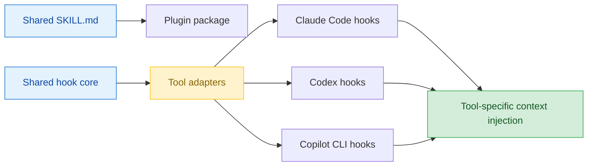
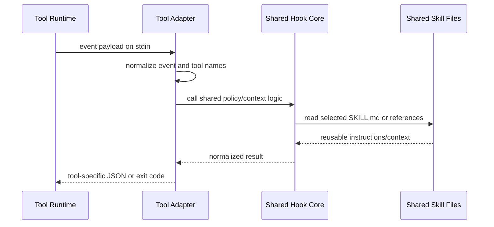

# Cross-Tool Hook 與 Skill 載入策略

## Quick Navigation

- [結論](#結論)
- [核心差異](#核心差異)
- [共用載入架構](#共用載入架構)
- [封裝方式](#封裝方式)
- [實作範例](#實作範例)
- [限制與驗證](#限制與驗證)
- [參考資料](#參考資料)

[Back to top](#quick-navigation)

---

## 結論

截至 2026-05-14，如果目標是「建立一個 plugin skill，並搭配 hook，讓 Claude Code、Codex CLI、GitHub Copilot CLI 都能正確載入」，不要追求三個 tool 共用同一份 hook config。三者的事件命名、handler schema、plugin manifest 位置與 hook output JSON 都不同；硬做單一 config 會讓行為不可預期。

比較穩定的做法是共用「skill 內容」與「hook 核心腳本」，再為三個 tool 各放一層很薄的 adapter：



SBE 範例：

| 輸入 | 期望輸出 |
|------|----------|
| 使用者安裝 `policy-loader` plugin，plugin 內含 `skills/policy-loader/SKILL.md` 與 session start hook。 | 三個 tool 都能看到該 skill 的名稱與描述；session 啟動時 hook 會注入該 tool 可理解的 context。 |
| hook 要阻擋危險 shell command。 | 共用核心腳本產生標準化決策，再由 Claude Code、Codex、Copilot adapter 轉成各自的 block / deny output。 |
| 只想讓 skill 被正常 discover，不要求第一輪就強制載入完整內容。 | 優先使用各 tool 的 native skill discovery；hook 只補充 deterministic bootstrap，不取代 skill discovery。 |

[Back to top](#quick-navigation)

---

## 核心差異

| 面向 | Claude Code | Codex CLI | GitHub Copilot CLI |
|------|-------------|-----------|--------------------|
| hook 成熟度 | 事件與 handler 類型最完整；官方文件列出 command、HTTP、prompt、agent、MCP tool 等 handler。 | 已有正式 hooks 頁面，但目前仍需在 config 啟用 `codex_hooks` feature flag。 | CLI 與 cloud agent 都有 hooks；CLI 支援 command、HTTP、prompt hooks。 |
| plugin 內 hook 位置 | plugin root 下的 hook config，常見為 `hooks/hooks.json`；也可由 manifest 指到自訂位置。 | plugin manifest 可指向 lifecycle config，預設可放 `hooks/hooks.json`。 | `plugin.json` 可用 `hooks` 指到 hook config；預設也會找 `hooks.json` 或 `hooks/hooks.json`。 |
| skill 位置 | plugin root 的 `skills/`；project skills 可放 `.claude/skills/`。 | skill 是 authoring format，plugin 是 distribution unit；repo 內會掃描 `.agents/skills`，plugin 可包含 `skills/`。 | plugin 可包含 `skills/`，每個 skill 是含 `SKILL.md` 的子目錄。 |
| skill 與 hook 關係 | hook 可由 plugin 提供，也可寫在 skill / agent frontmatter，scope 只在 component active 時有效。 | skill 本身負責 workflow；plugin 可把 skill 與 lifecycle config 一起發佈。 | plugin 可同時包含 skills 與 hooks，但 hook schema 是 Copilot 自己的 JSON 格式。 |
| 事件命名 | PascalCase，例如 `SessionStart`、`PreToolUse`、`UserPromptSubmit`、`Stop`。 | PascalCase，例如 `SessionStart`、`PreToolUse`、`PermissionRequest`、`Stop`。 | 原生是 camelCase，例如 `sessionStart`；也支援 PascalCase / snake_case payload 的 VS Code-compatible format。 |
| payload 形狀 | command hook 從 stdin 收 JSON；常見欄位包含 `hook_event_name`、`session_id`、`cwd`、`tool_name`、`tool_input`。 | command hook 從 stdin 收 JSON；常見欄位包含 `hook_event_name`、`session_id`、`cwd`、`model`。 | 依事件名稱決定 payload：camelCase event 給 camelCase 欄位，PascalCase event 給 VS Code-compatible snake_case 欄位。 |
| context 注入 | 常用 `hookSpecificOutput.additionalContext`；部分事件 stdout 也會進 context。 | `SessionStart` 可用 stdout 純文字或 `hookSpecificOutput.additionalContext` 加入 developer context。 | 常用 `additionalContext`；`sessionStart` 可注入 session context，部分事件也能追加 context 或 recovery guidance。 |
| 阻擋能力 | `PreToolUse`、`PermissionRequest`、`UserPromptSubmit`、`Stop` 等多個事件可 block 或 force continuation。 | `PreToolUse`、`PermissionRequest`、`UserPromptSubmit`、`Stop` 等事件可做決策，但 tool 覆蓋面仍是 guardrail，不是完整安全邊界。 | `preToolUse` 可 allow / deny / ask / modify；`permissionRequest` 可 allow / deny；`agentStop` / `subagentStop` 可 force continuation。 |
| 合併語意 | 多個來源的 hooks 會合併；plugin hooks 與 user / project hooks 並存。 | 多個 hook source 的 matching hooks 都會跑，高優先序 config 不會覆蓋低優先序 hook；project hooks 需 trusted。 | user、project、plugin hooks 合併；hook 輸出會按規則 merge，且 cloud agent 行為和本機 CLI 不完全相同。 |

第一原理判斷：三個 tool 真正能共用的是「要執行的 deterministic 邏輯」，不是 hook 設定檔。hook 設定檔是各 runtime 的 integration contract，應保持薄且各自原生。

[Back to top](#quick-navigation)

---

## 共用載入架構

建議把 plugin 分成四層：

| 層 | 內容 | 是否共用 |
|----|------|----------|
| Skill 內容 | `SKILL.md`、references、scripts、assets。 | 共用。三個 tool 都以 `skills/<name>/SKILL.md` 為主要載入單位。 |
| Hook 核心 | 真正的檢查、掃描、context 組裝、決策邏輯。 | 共用。輸出一個 tool-agnostic result，例如 `allow`、`deny`、`additional_context`。 |
| Adapter | 讀取各 tool 的 stdin payload，呼叫核心邏輯，轉成該 tool 的 stdout JSON / exit code。 | 不共用。每個 tool 一支薄 adapter 最乾淨。 |
| Manifest / hook config | `.claude-plugin`、`.codex-plugin`、Copilot `plugin.json` 或 marketplace entry，以及各自 hooks JSON。 | 不共用。用各 tool 官方 schema。 |

推薦資料流：



這個設計符合 KISS：核心邏輯只有一份；不把三種 runtime schema 混在同一支腳本裡；debug 時也能直接看是哪個 adapter 輸出錯誤。

[Back to top](#quick-navigation)

---

## 封裝方式

### 目錄建議

```text
policy-loader-plugin/
├── .claude-plugin/
│   └── plugin.json
├── .codex-plugin/
│   └── plugin.json
├── plugin.json
├── skills/
│   └── policy-loader/
│       ├── SKILL.md
│       └── references/
├── hooks/
│   ├── claude.hooks.json
│   ├── codex.hooks.json
│   ├── copilot.hooks.json
│   └── adapters/
│       ├── claude-session-start.js
│       ├── codex-session-start.js
│       └── copilot-session-start.js
└── lib/
    └── hook-core.js
```

### Claude Code

Claude Code plugin 使用 [Claude Code plugin 文件](https://code.claude.com/docs/en/plugins) 的 plugin root 結構，技能放在 `skills/`，hooks 放在 plugin root 的 hook config。若 hook 腳本在 plugin 內，使用 [Claude Code hooks reference](https://code.claude.com/docs/en/hooks) 提到的 `${CLAUDE_PLUGIN_ROOT}` 參照 plugin 檔案。

```json
{
  "name": "policy-loader",
  "version": "0.1.0",
  "description": "Load policy skill context at session start.",
  "skills": "./skills/",
  "hooks": "./hooks/claude.hooks.json"
}
```

```json
{
  "hooks": {
    "SessionStart": [
      {
        "matcher": "startup|resume|clear|compact",
        "hooks": [
          {
            "type": "command",
            "command": "node \"${CLAUDE_PLUGIN_ROOT}/hooks/adapters/claude-session-start.js\"",
            "timeout": 30
          }
        ]
      }
    ]
  }
}
```

如果只在某個 skill active 時才需要 hook，可依 [Claude Code hooks in skills and agents](https://code.claude.com/docs/en/hooks) 把 hooks 寫入 skill frontmatter。若目標是「session 一開始就載入 bootstrap」，應放 plugin hook，不要放 skill frontmatter，因為 skill 尚未 active 時 frontmatter hook 不會先跑。

### Codex CLI

Codex 的 skills 與 plugin 分工很明確：[Codex Agent Skills](https://developers.openai.com/codex/skills) 說 skill 是 reusable workflow 的 authoring format；[Codex Build plugins](https://developers.openai.com/codex/plugins/build) 說 plugin 是 distribution unit，且 manifest 可指向 `skills` 與 `hooks`。Codex hooks 目前必須先啟用 feature flag：

```toml
[features]
codex_hooks = true
```

Codex plugin manifest：

```json
{
  "name": "policy-loader",
  "version": "0.1.0",
  "description": "Load policy skill context at session start.",
  "skills": "./skills/",
  "hooks": "./hooks/codex.hooks.json"
}
```

Codex hook config：

```json
{
  "hooks": {
    "SessionStart": [
      {
        "matcher": "startup|resume|clear",
        "hooks": [
          {
            "type": "command",
            "command": "node ./hooks/adapters/codex-session-start.js",
            "timeout": 30,
            "statusMessage": "Loading policy-loader context"
          }
        ]
      }
    ]
  }
}
```

Codex 的 `SessionStart` source 目前是 `startup`、`resume`、`clear`；不要直接沿用 Claude Code 的 `compact`。這點也出現在 Superpowers 社群對 Codex bootstrap 的討論中。

路徑注意：Codex 官方文件明確定義 plugin manifest 的 `hooks` 路徑相對於 plugin root，但 hook command 本身執行時使用 session `cwd`。實作時不要假設 `node ./hooks/adapters/...` 一定會解析到 plugin 目錄；較穩的做法是用安裝流程產生絕對 command、把 adapter 放進可解析的 wrapper，或在目標版本實測 plugin lifecycle config 如何傳遞 plugin root。

### GitHub Copilot CLI

GitHub Copilot CLI plugin manifest 是 plugin root 的 `plugin.json`，可用 `skills` 與 `hooks` 欄位指向元件；這是 [GitHub Copilot CLI plugin reference](https://docs.github.com/en/copilot/reference/copilot-cli-reference/cli-plugin-reference) 定義的格式。Copilot hooks 建議使用 camelCase event；若要讓 adapter 更接近 Claude / Codex payload，也可刻意用 PascalCase event 取得 VS Code-compatible snake_case payload。

```json
{
  "name": "policy-loader",
  "description": "Load policy skill context at session start.",
  "version": "0.1.0",
  "skills": "skills/",
  "hooks": "hooks/copilot.hooks.json"
}
```

```json
{
  "version": 1,
  "hooks": {
    "sessionStart": [
      {
        "type": "command",
        "bash": "node ./hooks/adapters/copilot-session-start.js",
        "powershell": "node .\\hooks\\adapters\\copilot-session-start.js",
        "timeoutSec": 30
      }
    ]
  }
}
```

若 plugin 同時要支援 Copilot cloud agent，必須另外驗證 cloud agent 行為。根據 [GitHub Copilot hooks reference](https://docs.github.com/en/copilot/reference/hooks-reference)，cloud agent 只觸發部分事件，prompt hooks 在非互動環境可能不會觸發。

路徑注意：Copilot command hook 可設定 `cwd`，但 plugin 安裝後的實際位置與 repo hook 的相對路徑語意不同。跨專案 plugin 不應依賴目前 repo root 內存在 adapter；應把 adapter 隨 plugin 安裝，並用該 tool 實際支援的 manifest / hook path 規則測試。

[Back to top](#quick-navigation)

---

## 實作範例

### 共用核心回傳格式

共用核心不要直接輸出 Claude / Codex / Copilot 的 JSON。先回傳內部格式：

```json
{
  "action": "allow",
  "additional_context": "Use the policy-loader skill before changing deployment files.",
  "user_message": "policy-loader context loaded"
}
```

各 adapter 再轉換：

| 內部結果 | Claude Code adapter | Codex adapter | Copilot CLI adapter |
|----------|---------------------|---------------|---------------------|
| `additional_context` | `hookSpecificOutput.additionalContext` | `hookSpecificOutput.additionalContext` 或純文字 stdout | `additionalContext` |
| `deny` for tool use | `hookSpecificOutput.permissionDecision = "deny"` 或 exit code `2` | `decision = "deny"` / event-specific decision | `permissionDecision = "deny"` 或 `behavior = "deny"` |
| force continuation | `decision = "block"` on `Stop` | `decision = "block"` on `Stop` | `decision = "block"` on `agentStop` / `subagentStop` |

### Adapter 偵測規則

最小可行做法是每個 hook config 明確呼叫自己的 adapter，不需要在一支入口腳本猜 runtime。若真的要同一支入口腳本，偵測順序可用：

| 偵測條件 | 判斷 |
|----------|------|
| `CLAUDE_PLUGIN_ROOT` 存在且不是 Copilot compatibility mode。 | Claude Code |
| payload 有 `model` 且事件名是 PascalCase Codex events。 | Codex |
| `COPILOT_CLI` 存在，或 payload 使用 camelCase event fields。 | GitHub Copilot CLI |

更簡單且更可靠的做法：三個 hook config 都呼叫同一支 `node ./hooks/entry.js --runtime claude|codex|copilot`，由參數指定 runtime，不靠環境猜測。

### 載入 skill 的策略

| 目標 | 建議 |
|------|------|
| 讓 tool 知道 skill 存在 | 依各 tool 的 native skill discovery 放 `skills/<name>/SKILL.md`，不要靠 hook 手動塞完整 skill。 |
| 讓第一輪就有必要背景 | 用 `SessionStart` / `sessionStart` hook 注入短 context，說明何時應使用該 skill。 |
| 讓 skill full content 被使用 | 由使用者顯式呼叫 skill，或讓 skill `description` 足夠精準，讓 model 自行選中。 |
| 需要強制政策 | 用 `PreToolUse` / `permissionRequest` 類 hook 做 deterministic 檢查，不要只靠 skill prompt。 |

[Back to top](#quick-navigation)

---

## 限制與驗證

### 必須接受的限制

| 限制 | 影響 |
|------|------|
| 三個 tool 的 hook event set 不同。 | 只能取交集做共用能力；Claude Code 的特殊事件不能期待 Codex / Copilot 同步支援。 |
| hook 不是完整安全邊界。 | 尤其 Codex 官方文件也提醒 `PreToolUse` 是 guardrail；高風險政策仍需 repo 權限、CI、pre-commit 或 sandbox 配合。 |
| plugin cache 會改變實際執行路徑。 | Claude Code 有 `${CLAUDE_PLUGIN_ROOT}`；Codex 與 Copilot 的 hook config 可由 manifest 指到 plugin 內檔案，但 command 執行路徑仍必須實測，不要用 repo-relative path 當成 portable plugin path。 |
| Copilot cloud agent 與 CLI 行為不同。 | 本機可用的 prompt / notification 行為，不一定在 cloud agent 可用。 |
| skill discovery 不等於 skill full content 已載入。 | 多數 tool 只先放 skill metadata；完整 `SKILL.md` 仍需被選中後才讀。 |

### 驗證清單

| 驗證 | Claude Code | Codex CLI | GitHub Copilot CLI |
|------|-------------|-----------|--------------------|
| plugin 是否安裝 | `/plugin` 或啟動時指定 plugin dir。 | `/plugins`，並確認 plugin enabled。 | `copilot plugin list`。 |
| skill 是否可見 | `/skills`。 | `/skills` 或 `$skill` mention。 | Copilot CLI 的 skill / plugin UI 或 plugin list。 |
| hook 是否觸發 | `/hooks` 檢查來源與 handler。 | 啟用 `codex_hooks` 後用 `SessionStart` 或 `PreToolUse` 測試。 | 放一個短 command hook，確認 stdout / logs。 |
| context 是否注入 | 在新 session 直接問 tool 是否收到該 context。 | 新 thread 問是否收到 bootstrap context。 | 新 interactive session 問是否收到 `additionalContext`。 |
| block 是否有效 | 對測試 command 回傳 deny。 | 對 `Bash` 或 `apply_patch` 測試 deny。 | 對 `bash` / `powershell` 測試 deny。 |

[Back to top](#quick-navigation)

---

## 參考資料

- [Claude Code Hooks Reference](https://code.claude.com/docs/en/hooks)：hook locations、handler types、JSON output、`additionalContext`、skill / agent frontmatter hooks。
- [Claude Code Plugins](https://code.claude.com/docs/en/plugins)：plugin 結構、從 standalone config 遷移 hooks 到 plugin。
- [Claude Code Plugins Reference](https://code.claude.com/docs/en/plugins-reference)：plugin cache、file resolution、標準 plugin layout。
- [Claude Code Skills](https://code.claude.com/docs/en/skills)：skills sharing、plugin skills、skill visibility。
- [Codex Hooks](https://developers.openai.com/codex/hooks)：feature flag、hook discovery、matcher、事件與 output。
- [Codex Agent Skills](https://developers.openai.com/codex/skills)：skill discovery、repo / user / admin skill locations、plugin distribution。
- [Codex Build Plugins](https://developers.openai.com/codex/plugins/build)：`.codex-plugin/plugin.json`、`skills`、`hooks`、marketplace loading。
- [GitHub Copilot Hooks Reference](https://docs.github.com/en/copilot/reference/hooks-reference)：events、command / HTTP / prompt hooks、payload format、cloud agent 差異。
- [GitHub Copilot CLI Plugin Reference](https://docs.github.com/en/copilot/reference/copilot-cli-reference/cli-plugin-reference)：`plugin.json`、`skills`、`hooks`、default hook config locations。
- [About Plugins for GitHub Copilot CLI](https://docs.github.com/en/copilot/concepts/agents/copilot-cli/about-cli-plugins)：plugin 可包含 agents、skills、hooks、MCP、LSP。
- [Superpowers issue: Optional Codex SessionStart bootstrap docs](https://github.com/obra/superpowers/issues/898)：社群驗證 Codex `SessionStart` source 與 optional bootstrap 差異。
- [Superpowers issue: Claude Code hook bootstrap difference](https://github.com/obra/superpowers/issues/223)：社群討論 Claude Code 與 Codex bootstrap 可見度差異。
- [OpenAI Codex issue: Plugin manifests define hooks](https://github.com/openai/codex/issues/17331)：社群曾追蹤 Codex plugin-scoped hooks 與 runtime 載入行為的落差；即使官方文件已列出 plugin lifecycle config，仍建議在目標版本驗證。
- [OpenAI Codex issue: Full Claude Code Hook Parity](https://github.com/openai/codex/issues/21753)：社群追蹤 Codex hook 與 Claude Code hook parity 缺口。

[Back to top](#quick-navigation)
