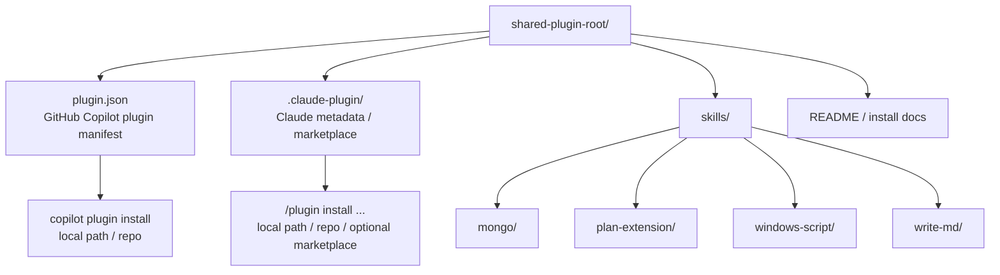

# 本地 Skills Plugin 化重構方案

## 快速導覽

- [問題與目標](#問題與目標)
- [範圍](#範圍)
- [方案概述](#方案概述)
- [目標結構](#目標結構)
- [分階段實作（TDD）](#分階段實作tdd)
- [影響檔案與模組](#影響檔案與模組)
- [風險與待確認事項](#風險與待確認事項)

## 問題與目標

目前本 repo 的本地 skills 直接放在 [`.agents/skills/`](../.agents/skills)，適合本機或手動掛載，但不適合用單一 plugin 形式同時提供給 Claude Code 與 GitHub Copilot 安裝。

這次目標是把四個既有 skills 重構成**單一 shared plugin root**：

1. 四個 skills 只保留一份來源內容。
2. Claude Code 與 GitHub Copilot 都能從同一個 repo 來源安裝。
3. 安裝方式以 **local path / git repository** 為主，不把 marketplace 當前置條件。
4. 不保留舊 `.agents/skills/<skill>` 相容結構，正式文件全面切到新結構。

[返回開頭](#快速導覽)

## 範圍

### In Scope

- 建立單一 plugin root 與共用 `skills/` 目錄。
- 搬遷 `mongo`、`plan-extension`、`windows-script`、`write-md` 四個 skills。
- 補齊 GitHub Copilot 與 Claude Code 所需的 plugin metadata。
- 更新 repo 文件、router 與安裝說明。
- 驗證 local path / git install 流程。

### Out of Scope

- 立即公開到 marketplace。
- 保留舊 `.agents/skills/` 載入方式。
- 擴充新的 skills 內容或重寫既有規則。
- 為其他工具（如 Cursor、OpenCode、Codex）同步提供完整支援。

[返回開頭](#快速導覽)

## 方案概述

採用 **單一 shared plugin root** 作為新的 source of truth，將四個既有 skills 集中於同一個 `skills/` 目錄，並在同一棵目錄下放置：

- GitHub Copilot 使用的 root `plugin.json`
- Claude Code 使用的 metadata / marketplace 定義
- 共同的安裝文件與驗證說明

這個做法的核心不是把 skill 內容複製成兩份，而是把**平台差異限制在 metadata 與安裝說明層**。真正的技能內容仍維持單一來源，降低後續維護成本。

由於同時要描述「shared skills 內容」與「雙平台安裝入口」，僅靠文字不容易快速建立結構心智模型，因此這裡補一張 Mermaid 圖說明新目錄的責任切分。



圖的重點是：**skills 內容只放在一處，平台各自只吃自己的 metadata**。

[返回開頭](#快速導覽)

## 目標結構

建議實作時收斂成以下型態：

```text
{shared-plugin-root}/
├── plugin.json
├── skills/
│   ├── mongo/
│   ├── plan-extension/
│   ├── windows-script/
│   └── write-md/
├── .claude-plugin/
│   ├── plugin.json
│   └── marketplace.json
└── README.md
```

命名不必死守，但原則要固定：

1. `plugin.json` 作為 GitHub Copilot 的安裝入口。
2. `skills/` 成為唯一技能內容來源。
3. Claude Code 的平台專屬檔案收進 [`.claude-plugin/`](../superpowers/.claude-plugin) 這類集中位置。
4. 安裝文件需同時說明 Claude Code 與 GitHub Copilot 的 local path / git install 流程。

[返回開頭](#快速導覽)

## 分階段實作（TDD）

### Phase 1: 建立 shared plugin 骨架與 metadata

**Step 1 — 寫測試（Red）**

先實作 [local-skills-plugin-migration-plan-test.md](./local-skills-plugin-migration-plan-test.md) 中以下 test case 對應的驗證：

- Test Case 1-1: `test_plugin_manifest_exposes_shared_skills_directory`
- Test Case 1-2: `test_plugin_manifest_rejects_missing_skill_entry`
- Test Case 1-3: `test_plugin_metadata_uses_single_bundle_for_all_skills`

預期結果：至少有一部分檢查失敗，因為 shared plugin 結構與 metadata 尚未建立。

**Step 2 — 最少實作（Green）**

建立新的 plugin root、`skills/` 目錄、GitHub Copilot 的 root `plugin.json`，以及 Claude Code 對應 metadata。先滿足單一 bundle 與四個 skills 可被引用，不急著處理文件。

**Step 3 — 重構（Refactor）**

統一 metadata 命名、版本欄位與 skills 路徑寫法，避免未來多平台說明分叉。

### Phase 2: 搬遷 skills 並更新 repo 整合面

**Step 1 — 寫測試（Red）**

先對以下 test case 建立檢查：

- Test Case 2-1: `test_skill_content_moved_without_frontmatter_loss`
- Test Case 2-2: `test_repo_docs_no_longer_point_to_agents_skills_layout`
- Test Case 2-3: `test_plugin_router_docs_describe_claude_and_copilot_flows`

預期結果：內容搬遷、文件與 router 更新尚未完成，因此搜尋與比對應先失敗。

**Step 2 — 最少實作（Green）**

把四個 skills 移入新的 `skills/`，更新 README、AGENTS、必要 router 或說明文件，讓 repo 正式敘述以新結構為準。

**Step 3 — 重構（Refactor）**

收斂文件中的重複描述，把平台差異集中到安裝章節，避免到處散落不同版本的安裝指令。

### Phase 3: 驗證安裝與發現流程

**Step 1 — 寫測試（Red）**

先對以下 test case 建立驗證清單或手動驗證腳本：

- Test Case 3-1: `test_claude_code_can_install_plugin_from_local_or_git_source`
- Test Case 3-2: `test_github_copilot_can_install_plugin_without_marketplace`
- Test Case 3-3: `test_installation_failure_surfaces_missing_metadata_or_invalid_path`

預期結果：在安裝文件、metadata 或命令尚未調整完整前，至少部分驗證會失敗。

**Step 2 — 最少實作（Green）**

補齊缺少的安裝說明、必要 metadata 與驗證步驟，直到 Claude Code 與 GitHub Copilot 都能透過 local path 或 git source 成功安裝。

**Step 3 — 重構（Refactor）**

整理驗證命令、移除臨時除錯痕跡，讓最終文件只保留可持續維護的安裝與驗證流程。

[返回開頭](#快速導覽)

## 影響檔案與模組

預期會影響下列區域：

| 類型 | 代表路徑 | 影響 |
|------|---------|------|
| Skills 內容 | [`.agents/skills/`](../.agents/skills) 或其重構後位置 | 四個 skills 需要搬遷為共用 `skills/` 結構 |
| Claude plugin metadata | [`superpowers/.claude-plugin/`](../superpowers/.claude-plugin) 可作為參考 | 新增或調整 Claude Code 的 plugin / marketplace metadata |
| Copilot plugin metadata | 新 plugin root `plugin.json` | 定義 GitHub Copilot 安裝入口 |
| 文件 | [README.md](../README.md)、[AGENTS.md](../AGENTS.md)、[`github-copilot/gc-cli.md`](../github-copilot/gc-cli.md) | 更新安裝方式與本地 skills 架構描述 |
| 驗證流程 | 既有 CLI / plugin 指令 | 補充安裝、列出 plugin、列出 skills 的驗證步驟 |

[返回開頭](#快速導覽)

## 風險與待確認事項

1. Claude Code 與 GitHub Copilot 的 plugin metadata 雖可共用同一份 skills 內容，但 manifest 格式不完全相同，實作時要避免把平台規格硬揉成單一檔案。
2. 直接放棄舊 `.agents/skills/` 結構代表 repo 內所有正式說明都必須同步更新，否則使用者很容易照著舊路徑操作失敗。
3. 若未來要上 marketplace，屆時仍可能需要補 owner / publishing metadata 與 release 流程，但這不應阻擋本次 git-based 安裝目標。
4. 實作階段需再次核對 GitHub Copilot 官方 plugin manifest 與安裝命令細節，避免只靠 repo 內推測。

[返回開頭](#快速導覽)
