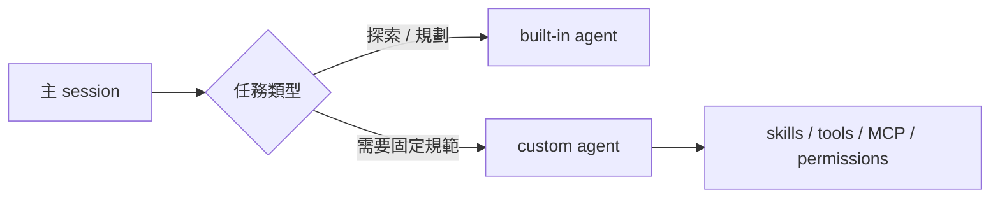

# Claude Code Agent 使用指南

## Quick Navigation

- [概覽](#概覽)
- [內建與自訂 Agent](#內建與自訂-agent)
- [建立自訂 Agent](#建立自訂-agent)
- [使用 Agent 的方法](#使用-agent-的方法)
- [自訂 Agent 可以做到什麼](#自訂-agent-可以做到什麼)
- [注意事項](#注意事項)
- [參考文件](#參考文件)

[Back to top](#quick-navigation)

---

## 概覽

Claude Code 的 agent 在官方文件中主要稱為 **subagent**。主 session 會依任務描述與 agent 的 `description` 自動判斷是否委派，讓探索、測試、review、實作等工作在各自的 context window 中進行，避免主對話被雜訊塞滿。

這份文件聚焦在「如何在 Claude Code 使用 agent」與「自訂 agent 能做到哪些事」。如果你想查完整 CLI flags、slash commands 與快捷鍵，請先看 [Claude Code CLI 參考](../cli-agents/claude-code/cc-cli.md)。



[Back to top](#quick-navigation)

## 內建與自訂 Agent

| 類型 | 代表項目 | 典型用途 | 如何啟動 |
|---|---|---|---|
| 內建 agent | `Explore` | 快速、唯讀地搜尋與理解 codebase | Claude 自動委派 |
| 內建 agent | `Plan` | 在 plan mode 內做唯讀研究 | 進入 plan mode 後自動委派 |
| 內建 agent | `general-purpose` | 多步驟研究、修改、整合 | Claude 自動委派 |
| 自訂 agent | 你在 `.claude/agents/`、`~/.claude/agents/`、plugin 或 `--agents` JSON 中定義的 agent | 套用團隊規則、限制工具、掛 MCP、跑背景任務、用 worktree 隔離等 | 自動委派、手動點名、`@` mention、`claude --agent` |

如果同名 agent 同時存在多個層級，優先序由高到低大致是：**managed settings > `--agents` > project (`.claude/agents/`) > user (`~/.claude/agents/`) > plugin**。也就是說，專案內定義的 agent 會覆蓋使用者層級同名 agent。

[Back to top](#quick-navigation)

## 建立自訂 Agent

### 用 `/agents` 建立

`/agents` 是官方建議的主要入口。它可以列出 built-in、user、project 與 plugin agents，也可以互動式建立、編輯或刪除 custom agents。

### 手動建立 Markdown 檔

你也可以直接建立 `.md` 檔。Claude Code 的 agent 檔不是 `.agent.md`，而是一般 Markdown 檔加上 YAML frontmatter。

```md
---
name: code-reviewer
description: Expert code reviewer. Use immediately after code changes.
tools: Read, Grep, Glob, Bash
model: sonnet
permissionMode: default
---

You are a senior code reviewer.

Review the recent changes for correctness, security, and maintainability.
Prioritize actionable findings over style commentary.
```

- `name`：agent 識別名稱，建議使用小寫加連字號
- `description`：Claude 判斷何時應該委派給它的關鍵欄位
- Markdown body：就是這個 agent 的 system prompt

### 用 `--agents` 臨時定義 session-only agents

如果只是要快速試驗，或在 script/CI 中臨時掛一個 agent，可以直接在啟動時用 JSON 注入：

```shell
claude --agents '{
  "reviewer": {
    "description": "Reviews recent code changes and reports only important issues.",
    "prompt": "You are a senior code reviewer. Focus on correctness and security."
  }
}'
```

這種方式只存在於當前 session，不會寫回檔案。

[Back to top](#quick-navigation)

## 使用 Agent 的方法

| 方法 | 範例 | 適用情境 | 強制程度 |
|---|---|---|---|
| 自動委派 | `Review the auth changes and flag security issues.` | 你只想描述任務，讓 Claude 自己決定是否派 agent | 低 |
| 自然語言點名 | `Use the code-reviewer subagent to inspect the auth module.` | 想明確暗示應使用哪個 agent | 中 |
| `@` mention | `@"code-reviewer (agent)" look at the auth changes` | 想保證某個特定 agent 執行這次任務 | 高 |
| 整個 session 直接套用 agent | `claude --agent code-reviewer` | 想讓主 session 從頭到尾都帶同一套 system prompt、model 與工具限制 | 高 |
| 專案預設 agent | 在 `.claude/settings.json` 設定 `"agent": "code-reviewer"` | 想讓某專案每次開啟都預設用同一個 agent | 高 |
| 背景執行 | 請 Claude「run this in the background」或在執行中按 `Ctrl+B` | 測試、掃描、長時間 research 等不想阻塞主線的工作 | 任務模式 |

如果你只是想使用 built-in agents，通常不需要手動指定名稱；Claude 會依任務特性自動派出 `Explore`、`Plan` 或 `general-purpose`。真正需要手動選擇的，多半是你自己定義了明確規範的 custom agent。

[Back to top](#quick-navigation)

## 自訂 Agent 可以做到什麼

Claude Code 的自訂 agent 不只是 persona；它比較接近一個可編排的 subagent runtime。常見可配置能力如下：

| 能力 | 對應欄位 | 能做的事 |
|---|---|---|
| 工具邊界 | `tools`、`disallowedTools` | 只允許唯讀搜尋、禁止寫檔，或限制只能呼叫特定 `Agent(...)` |
| 模型選擇 | `model` | 針對不同任務固定用 `haiku`、`sonnet`、`opus` 或完整 model ID |
| 權限模式 | `permissionMode` | 套用 `default`、`plan`、`auto`、`dontAsk`、`bypassPermissions` 等模式 |
| 預載知識 | `skills` | 直接把特定 skills 內容灌進 agent context，避免執行時再探索 |
| 外部工具 | `mcpServers` | 只讓某個 agent 能接上 Playwright、GitHub 或其他 MCP server |
| Lifecycle 控制 | `hooks` | 在 `PreToolUse`、`PostToolUse`、`Stop` 等事件前後插入驗證或自動化腳本 |
| 跨 session 記憶 | `memory` | 讓 agent 在 `user`、`project` 或 `local` scope 持續累積 knowledge |
| 執行模式 | `background` | 預設在背景執行，主對話可繼續工作 |
| 隔離執行 | `isolation: worktree` | 在暫時的 git worktree 裡跑 agent，減少互相踩工作樹 |
| 任務控制 | `maxTurns`、`initialPrompt`、`effort`、`color` | 控制回合上限、啟動提示、推理力度與任務清單顏色 |

如果你要做的是高控制度的工程工作流，例如「安全審查只能唯讀」「資料庫查詢只能 SELECT」「測試 agent 一律在背景跑」「特定 agent 要帶 project memory」，Claude Code 的 agent 系統會很有優勢。

[Back to top](#quick-navigation)

## 注意事項

1. Subagent **不會自動繼承父對話已載入的 skills**；如果需要，請在 `skills` 欄位明確列出。
2. 用 `--add-dir` 加進來的額外目錄只會授權檔案存取，不會讓 Claude 去掃描那個目錄裡的 `.claude/` 設定。
3. Subagent 本身不能再生 subagent；只有作為主執行緒的 agent 才能用 `Agent` 工具繼續分派。
4. 背景 subagent 適合長任務，但如果工作中途需要大量澄清問題，前景模式通常更穩。

[Back to top](#quick-navigation)

## 參考文件

- [Claude Code CLI 參考](../cli-agents/claude-code/cc-cli.md)
- [Claude Code 官方文件：Subagents](https://code.claude.com/docs/en/sub-agents)
- [Claude Code 官方文件：CLI Reference](https://code.claude.com/docs/en/cli-reference)

[Back to top](#quick-navigation)
