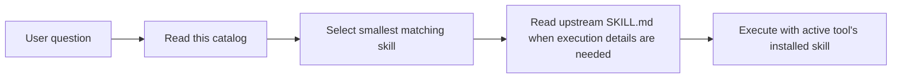

# Anthropic Skills Catalog

## Quick Navigation

- [Overview](#overview)
- [Catalog Flow](#catalog-flow)
- [Skill Map](#skill-map)
- [Usage Notes](#usage-notes)

## Overview

This document is the repo-level reference for answering questions about which Anthropic upstream skill fits a task. It is not an executable skill. When a task needs implementation behavior, read the upstream skill under [anthropic-skills/skills](../../skill-source/anthropic-skills/skills/) or use the installed plugin/native skill for the active tool.

[Back to top](#quick-navigation)

---

## Catalog Flow

[Back to top](#quick-navigation)

---

## Skill Map

### Creative Design

- [algorithmic-art](../../skill-source/anthropic-skills/skills/algorithmic-art/SKILL.md) — code-driven generative art, flow fields, particles, and geometry.
- [canvas-design](../../skill-source/anthropic-skills/skills/canvas-design/SKILL.md) — posters, artwork, static visuals, PNG, and PDF design output.
- [theme-factory](../../skill-source/anthropic-skills/skills/theme-factory/SKILL.md) — reusable visual themes for artifacts.
- [brand-guidelines](../../skill-source/anthropic-skills/skills/brand-guidelines/SKILL.md) — Anthropic brand colors, typography, and visual rules.
- [slack-gif-creator](../../skill-source/anthropic-skills/skills/slack-gif-creator/SKILL.md) — animated Slack GIF creation.

### Frontend Engineering

- [frontend-design](../../skill-source/anthropic-skills/skills/frontend-design/SKILL.md) — distinctive, subject-grounded visual design for new or reshaped web UI.
- [web-artifacts-builder](../../skill-source/anthropic-skills/skills/web-artifacts-builder/SKILL.md) — complex Claude artifacts using React and shadcn/ui.
- [webapp-testing](../../skill-source/anthropic-skills/skills/webapp-testing/SKILL.md) — Playwright-based testing for local web apps.

### AI Engineering

- [claude-api](../../skill-source/anthropic-skills/skills/claude-api/SKILL.md) — Claude API and Anthropic SDK models, pricing, tool use, caching, migration, and Managed Agents.
- [mcp-builder](../../skill-source/anthropic-skills/skills/mcp-builder/SKILL.md) — MCP servers for LLM tool access.
- [skill-creator](../../skill-source/anthropic-skills/skills/skill-creator/SKILL.md) — creating, improving, packaging, and evaluating AI skills.

### Office Documents

- [pdf](../../skill-source/anthropic-skills/skills/pdf/SKILL.md) — PDF reading, forms, splitting, merging, OCR, and creation.
- [docx](../../skill-source/anthropic-skills/skills/docx/SKILL.md) — Word document creation, editing, inspection, and validation.
- [pptx](../../skill-source/anthropic-skills/skills/pptx/SKILL.md) — PowerPoint creation, editing, and validation.
- [xlsx](../../skill-source/anthropic-skills/skills/xlsx/SKILL.md) — Excel creation, editing, analysis, and recalculation.

### Writing

- [doc-coauthoring](../../skill-source/anthropic-skills/skills/doc-coauthoring/SKILL.md) — technical specs, proposals, and design docs.
- [internal-comms](../../skill-source/anthropic-skills/skills/internal-comms/SKILL.md) — 3P updates, newsletters, incident reports, and internal announcements.

[Back to top](#quick-navigation)

---

## Usage Notes

- Use this catalog only to choose or explain a skill; do not treat it as a runtime workflow.
- For execution details, read the linked upstream [SKILL.md](../../skill-source/anthropic-skills/skills/) file and only load supporting files that the upstream skill explicitly needs.
- Repo-specific sync, governance, and maintenance work belongs to [project skills](../../.claude/skills/), not this catalog.

[Back to top](#quick-navigation)
