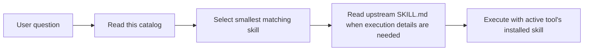

# Superpowers Skills Catalog

## Quick Navigation

- [Overview](#overview)
- [Catalog Flow](#catalog-flow)
- [Skill Map](#skill-map)
- [Usage Notes](#usage-notes)

## Overview

This document is the repo-level reference for answering questions about which Superpowers upstream skill fits a task. It is not an executable skill. When a task needs implementation behavior, read the upstream skill under [superpowers/skills](../../skill-source/superpowers/skills/) or use the installed plugin/native skill for the active tool.

[Back to top](#quick-navigation)

---

## Catalog Flow

[Back to top](#quick-navigation)

---

## Skill Map

### Development Workflow

- [brainstorming](../../skill-source/superpowers/skills/brainstorming/SKILL.md) — clarify user intent, requirements, and design before feature or behavior changes.
- [writing-plans](../../skill-source/superpowers/skills/writing-plans/SKILL.md) — turn an approved spec into an implementation plan.
- [executing-plans](../../skill-source/superpowers/skills/executing-plans/SKILL.md) — execute an existing plan in a new session.
- [test-driven-development](../../skill-source/superpowers/skills/test-driven-development/SKILL.md) — start feature or bugfix work with failing tests.
- [systematic-debugging](../../skill-source/superpowers/skills/systematic-debugging/SKILL.md) — investigate root cause before fixing bugs, test failures, and unexpected behavior.
- [verification-before-completion](../../skill-source/superpowers/skills/verification-before-completion/SKILL.md) — verify evidence before claiming work is complete.

### Review And Wrap-Up

- [receiving-code-review](../../skill-source/superpowers/skills/receiving-code-review/SKILL.md) — evaluate review feedback before implementing it.
- [requesting-code-review](../../skill-source/superpowers/skills/requesting-code-review/SKILL.md) — request a reviewer subagent after implementation.
- [finishing-a-development-branch](../../skill-source/superpowers/skills/finishing-a-development-branch/SKILL.md) — choose merge, PR, or cleanup path after work is done.

### Collaboration

- [dispatching-parallel-agents](../../skill-source/superpowers/skills/dispatching-parallel-agents/SKILL.md) — split two or more independent tasks across agents.
- [subagent-driven-development](../../skill-source/superpowers/skills/subagent-driven-development/SKILL.md) — execute planned tasks with focused subagents in the current session.
- [using-git-worktrees](../../skill-source/superpowers/skills/using-git-worktrees/SKILL.md) — isolate feature work when worktree isolation is required.

### System And Meta

- [using-superpowers](../../skill-source/superpowers/skills/using-superpowers/SKILL.md) — establish skill lookup discipline at session start.
- [writing-skills](../../skill-source/superpowers/skills/writing-skills/SKILL.md) — create, edit, and validate skills.

[Back to top](#quick-navigation)

---

## Usage Notes

- Use this catalog only to choose or explain a skill; do not treat it as a runtime workflow.
- For execution details, read the linked upstream [SKILL.md](../../skill-source/superpowers/skills/) file and only load supporting files that the upstream skill explicitly needs.
- Repo-specific sync, governance, and maintenance work belongs to [project skills](../../.claude/skills/), not this catalog.

[Back to top](#quick-navigation)
