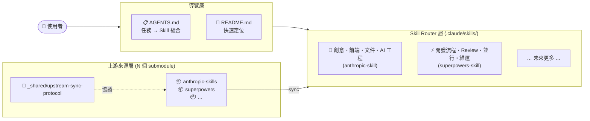

# Superpowers Submodule Integration Implementation Plan

> **For agentic workers:** REQUIRED SUB-SKILL: Use superpowers:subagent-driven-development (recommended) or superpowers:executing-plans to implement this plan task-by-task. Steps use checkbox (`- [ ]`) syntax for tracking.

**Goal:** 以 git submodule 引入 superpowers repo，建立兩層 router、共用 sync 協議，並重構 AGENTS.md（任務導向）與 README.md（視覺優先）。

**Architecture:** 新增 `superpowers/` submodule 作為上游來源；`.claude/skills/_shared/upstream-sync-protocol.md` 抽取通用 sync 流程，讓 `anthropic-skills-sync` 與 `superpowers-skills-sync` 各自只保留庫設定；`superpowers-skill/` 採與 `anthropic-skill/` 相同的兩層 router（SKILL.md → categories/ → skills/）結構。

**Tech Stack:** git submodule、Markdown、Mermaid flowchart

---

## File Structure

**新建：**
- `superpowers/` — git submodule（https://github.com/obra/superpowers.git）
- `.claude/skills/_shared/upstream-sync-protocol.md` — 通用 sync 協議（無 frontmatter）
- `.claude/skills/superpowers-skill/SKILL.md` — 第一層 router
- `.claude/skills/superpowers-skill/categories/development-process.md`
- `.claude/skills/superpowers-skill/categories/review-and-wrap-up.md`
- `.claude/skills/superpowers-skill/categories/collaboration.md`
- `.claude/skills/superpowers-skill/categories/system-and-meta.md`
- `.claude/skills/superpowers-skill/skills/brainstorming/SKILL.md`
- `.claude/skills/superpowers-skill/skills/writing-plans/SKILL.md`
- `.claude/skills/superpowers-skill/skills/executing-plans/SKILL.md`
- `.claude/skills/superpowers-skill/skills/test-driven-development/SKILL.md`
- `.claude/skills/superpowers-skill/skills/systematic-debugging/SKILL.md`
- `.claude/skills/superpowers-skill/skills/verification-before-completion/SKILL.md`
- `.claude/skills/superpowers-skill/skills/receiving-code-review/SKILL.md`
- `.claude/skills/superpowers-skill/skills/requesting-code-review/SKILL.md`
- `.claude/skills/superpowers-skill/skills/finishing-a-development-branch/SKILL.md`
- `.claude/skills/superpowers-skill/skills/dispatching-parallel-agents/SKILL.md`
- `.claude/skills/superpowers-skill/skills/subagent-driven-development/SKILL.md`
- `.claude/skills/superpowers-skill/skills/using-git-worktrees/SKILL.md`
- `.claude/skills/superpowers-skill/skills/using-superpowers/SKILL.md`
- `.claude/skills/superpowers-skill/skills/writing-skills/SKILL.md`
- `.claude/skills/superpowers-skills-sync/SKILL.md`

**修改：**
- `.gitmodules` — 新增 superpowers entry
- `.claude/skills/anthropic-skills-sync/SKILL.md` — 瘦化，移除通用段落
- `AGENTS.md` — 重構為任務導向查表
- `README.md` — 重構為視覺優先 + Mermaid

---

## Task 1: 加入 superpowers git submodule

**Files:**
- Modify: `.gitmodules`
- Create: `superpowers/` (submodule)

- [ ] **Step 1: 確認尚無 superpowers 目錄**

```bash
ls superpowers 2>/dev/null && echo "EXISTS - stop" || echo "OK - proceed"
git submodule status | grep superpowers || echo "not registered"
```

Expected: 兩行都顯示「不存在」才繼續。

- [ ] **Step 2: 加入 submodule**

```bash
git submodule add https://github.com/obra/superpowers.git superpowers
git submodule update --init superpowers
```

Expected: 無 error；`superpowers/` 目錄出現。

- [ ] **Step 3: 驗證 submodule 結構**

```bash
git submodule status | grep superpowers
ls superpowers/skills/ | head -5
```

Expected:
- 第一行顯示 hash + `superpowers`（無前置 `-`）
- 第二行列出至少 `brainstorming`、`writing-plans` 等目錄

- [ ] **Step 4: Commit**

```bash
git add .gitmodules superpowers
git commit -m "feat: add superpowers as git submodule

Upstream: https://github.com/obra/superpowers.git
Path: superpowers/

Co-Authored-By: Claude Sonnet 4.6 <noreply@anthropic.com>"
```

---

## Task 2: 建立 `_shared/upstream-sync-protocol.md`

**Files:**
- Create: `.claude/skills/_shared/upstream-sync-protocol.md`

- [ ] **Step 1: 確認目錄不存在**

```bash
ls .claude/skills/_shared 2>/dev/null && echo "EXISTS" || echo "OK"
```

Expected: `OK`

- [ ] **Step 2: 建立目錄**

```bash
mkdir -p .claude/skills/_shared
```

- [ ] **Step 3: 寫入 upstream-sync-protocol.md**

寫入以下完整內容到 `.claude/skills/_shared/upstream-sync-protocol.md`：

```markdown
# Upstream Skills Library Sync Protocol

供所有 upstream skill library 的 sync skill 共用。引用方在自己的 SKILL.md 填入庫設定後，
按照本文件的流程執行。本文件非 Claude Code skill（無 frontmatter），不直接出現在 skill 清單。

---

## 變數定義

各引用方在自己的 SKILL.md 提供以下值：

| 變數 | 說明 | 範例（anthropic） | 範例（superpowers） |
|------|------|-----------------|-------------------|
| `LIBRARY_NAME` | 庫的識別名稱 | `anthropic-skills` | `superpowers` |
| `SUBMODULE_PATH` | git submodule 相對路徑 | `anthropic-skills/` | `superpowers/` |
| `LOCAL_ROUTER_PATH` | 本地 router 目錄 | `.claude/skills/anthropic-skill/` | `.claude/skills/superpowers-skill/` |
| `SKILL_SOURCE_PATTERN` | skill 來源路徑模式 | `skills/<name>/SKILL.md` | `skills/<name>/SKILL.md` |

---

## Sync 流程

### Step 1 — 確認 submodule 狀態

```bash
git -C <SUBMODULE_PATH> status
```

若失敗（非 git repo）：停止，通知使用者先初始化 submodule：
```bash
git submodule update --init <SUBMODULE_PATH>
```

### Step 2 — 檢查上游更新

```bash
git -C <SUBMODULE_PATH> fetch origin
git -C <SUBMODULE_PATH> log HEAD..origin/main --oneline
```

- 若輸出**為空** → 無更新，告知使用者並停止。
- 若輸出**有 commits** → 繼續 Step 3。

### Step 3 — 識別異動 skill

```bash
# 所有異動的檔案
git -C <SUBMODULE_PATH> diff HEAD..origin/main --name-only

# 只看新增的 skill
git -C <SUBMODULE_PATH> diff HEAD..origin/main --name-only --diff-filter=A
```

從輸出解析 skill 名稱，模式為 `skills/<name>/...`：
- `CHANGED_SKILLS` — 有任何異動的 skill 目錄列表
- `NEW_SKILLS` — 全新新增的 skill（`CHANGED_SKILLS` 的子集）

### Step 4 — Pull 更新

```bash
git -C <SUBMODULE_PATH> pull origin main
```

記錄新的 HEAD hash（供 commit message 使用）：
```bash
NEW_HEAD=$(git -C <SUBMODULE_PATH> rev-parse --short HEAD)
```

### Step 5 — Regenerate 每個異動 skill 的摘要

對 `CHANGED_SKILLS` 中的每個 skill：

1. 讀取 `<SUBMODULE_PATH>/skills/<name>/SKILL.md`（上游原文）
2. 按照下方「**SKILL.md 摘要格式**」重新生成 `<LOCAL_ROUTER_PATH>/skills/<name>/SKILL.md`
3. 若為新 skill（在 `NEW_SKILLS` 中）：先建立 `<LOCAL_ROUTER_PATH>/skills/<name>/` 目錄

### Step 6 — 更新 router 與 category 文件（視情況）

若 `NEW_SKILLS` 非空，或有 skill 需要移動 category：

1. 更新 `<LOCAL_ROUTER_PATH>/SKILL.md`（第一層 router 查詢表）
2. 更新對應的 `<LOCAL_ROUTER_PATH>/categories/*.md`
3. 更新 `AGENTS.md` 的任務查詢表（若新 skill 影響任務導向路由）

### Step 7 — Commit

```bash
git add -A
git commit -m "sync: update <LIBRARY_NAME> skill summaries

Synced from <LIBRARY_NAME> @ $NEW_HEAD
Updated skills: <CHANGED_SKILLS 以逗號分隔>

Co-Authored-By: Claude Sonnet 4.6 <noreply@anthropic.com>"
```

---

## SKILL.md 摘要格式

生成 `<LOCAL_ROUTER_PATH>/skills/<name>/SKILL.md` 時使用此格式：

```markdown
---
name: <skill-name>
description: <原文 description，來自上游 SKILL.md frontmatter，保持英文>
source: <SUBMODULE_PATH>/skills/<name>/SKILL.md
---

## 概述

<1-2 句繁體中文，說明這個 skill 做什麼>

## 能做什麼

<條列或表格，具體說明支援的操作；保持精確，不要泛化>

## 解決什麼問題

<這個 skill 存在的原因；它解決什麼具體痛點>

## 何時使用（觸發條件）

<觸發關鍵字、使用者意圖短語、觸發情境；複製上游的 "When to Use" 精華>

## 關鍵技術棧

<使用的工具、框架、語言；若無特定技術棧，描述搭配使用的其他 skill>

## 重要注意事項

<限制、已知問題、陷阱、Iron Law（若有）>
```

---

## Edge Cases

| 情境 | 處理方式 |
|------|---------|
| Skill 在上游被刪除 | 通知使用者，**確認後**才移除本地摘要與 category 引用；不自動刪除 |
| 新 skill 無 SKILL.md | 記錄警告並跳過；不建立空摘要 |
| Skill 跨 category 異動 | 更新 `categories/` 對應檔；若影響 AGENTS.md 的路由表也一併更新 |
| git push 需要認證 | 等待 browser auth 完成後繼續 |
| Submodule 未初始化 | Step 1 會失敗；提示執行 `git submodule update --init` |
| `origin/main` 不存在 | 確認上游 default branch 名稱（可能為 `master`），調整 fetch 指令 |

---

## 驗證步驟

Sync 完成後執行：

```bash
# 確認 router 結構完整（每個 skill 都有對應目錄）
ls <LOCAL_ROUTER_PATH>/skills/

# 確認無未提交異動
git status

# 確認最新 commit
git log --oneline -3
```
```

- [ ] **Step 4: 驗證檔案建立**

```bash
ls .claude/skills/_shared/
head -5 .claude/skills/_shared/upstream-sync-protocol.md
```

Expected: 列出 `upstream-sync-protocol.md`；前幾行為 `# Upstream Skills Library Sync Protocol`

- [ ] **Step 5: Commit**

```bash
git add .claude/skills/_shared/
git commit -m "feat: add shared upstream-sync-protocol for skill library sync

Extracts the generic sync workflow, SKILL.md summary format, edge cases,
and verification steps into a shared reference document. Both
anthropic-skills-sync and superpowers-skills-sync will reference this.

Co-Authored-By: Claude Sonnet 4.6 <noreply@anthropic.com>"
```

---

## Task 3: 瘦化 `anthropic-skills-sync/SKILL.md`

**Files:**
- Modify: `.claude/skills/anthropic-skills-sync/SKILL.md`

- [ ] **Step 1: 確認現有 frontmatter 完整**

```bash
head -6 .claude/skills/anthropic-skills-sync/SKILL.md
```

Expected: 看到 `---` 包住的 frontmatter，含 `name: anthropic-skills-sync` 與 description。

- [ ] **Step 2: 替換檔案內容**

將 `.claude/skills/anthropic-skills-sync/SKILL.md` 完整替換為：

```markdown
---
name: anthropic-skills-sync
description: Use this skill when the user asks to sync, update, refresh, or check for updates to the anthropic-skills library. Triggers when user says "sync skills", "update skills", "check for upstream changes", "pull latest skills from Anthropic", "refresh skill summaries", or any variation of wanting to keep local skills in sync with the upstream Anthropic repository.
---

# Anthropic Skills Sync

## 庫設定

| 欄位 | 值 |
|------|-----|
| 庫名稱 | `anthropic-skills` |
| 上游 URL | `https://github.com/anthropics/skills.git` |
| Submodule 路徑 | `anthropic-skills/` |
| 本地 Router 路徑 | `.claude/skills/anthropic-skill/` |
| Skill 來源模式 | `skills/<name>/SKILL.md` |

## Sync 流程

參閱 [_shared/upstream-sync-protocol.md](../_shared/upstream-sync-protocol.md)，
以上方「庫設定」填入對應變數後執行。
```

- [ ] **Step 3: 驗證**

```bash
wc -l .claude/skills/anthropic-skills-sync/SKILL.md
grep "upstream-sync-protocol" .claude/skills/anthropic-skills-sync/SKILL.md
```

Expected: 行數 < 25；第二行找到 `upstream-sync-protocol` 的引用。

- [ ] **Step 4: Commit**

```bash
git add .claude/skills/anthropic-skills-sync/SKILL.md
git commit -m "refactor: slim down anthropic-skills-sync to library config only

Moved generic sync workflow, summary format, edge cases, and verification
steps to .claude/skills/_shared/upstream-sync-protocol.md. This skill
now contains only the anthropic-specific library config and a reference.

Co-Authored-By: Claude Sonnet 4.6 <noreply@anthropic.com>"
```

---

## Task 4: 建立 `superpowers-skill/SKILL.md`（第一層 router）

**Files:**
- Create: `.claude/skills/superpowers-skill/SKILL.md`

- [ ] **Step 1: 建立目錄**

```bash
mkdir -p .claude/skills/superpowers-skill
```

- [ ] **Step 2: 寫入 SKILL.md**

寫入以下完整內容到 `.claude/skills/superpowers-skill/SKILL.md`：

```markdown
---
name: superpowers-skill
description: Use this skill when a user asks which superpowers skill fits a task, or when the task involves development workflow (brainstorming, planning, TDD, debugging), code review, parallel agent coordination, git worktree management, or skill engineering covered by the superpowers catalog. Start here, route by category, then load only the relevant category and skill notes.
---

# Superpowers Skill Router

## 快速導覽

- [定位原則](#定位原則)
- [快速查詢：問題 → Skill](#快速查詢問題--skill)
- [第二層讀取規則](#第二層讀取規則)
- [分類入口](#分類入口)
- [注意事項](#注意事項)

## 定位原則

`superpowers-skill` 是本 repo 針對 superpowers skills 整理後的唯一第一層入口。它的工作不是一次把所有 skill 細節載入，而是先做路由，再按需揭露第二層內容。

執行順序固定如下：

1. 先用本檔的「快速查詢：問題 → Skill」判斷需求落在哪個類別。
2. 再讀對應的分類檔（`categories/`）。
3. 最後只讀需要的 skill 細節檔（`skills/<name>/SKILL.md`）。
4. 除非任務真的跨類別，否則不要一口氣讀完整個 `skills/` 目錄。

[返回開頭](#快速導覽)

## 快速查詢：問題 → Skill

### 🔄 開發流程

| 我需要... | 使用 Skill |
|----------|-----------|
| 開始任何新功能、組件或修改前，先釐清需求與設計 | **brainstorming** |
| 把確認好的 spec 轉成逐步實作計畫 | **writing-plans** |
| 在新 session 按計畫逐步執行（含 checkpoint） | **executing-plans** |
| 寫任何功能或 bug fix 時，強制先寫失敗測試 | **test-driven-development** |
| 遇到 bug、測試失敗、非預期行為，先找根因 | **systematic-debugging** |
| 宣告工作完成、準備 commit 或 PR 前，強制先驗證 | **verification-before-completion** |

### 👀 Review 與收尾

| 我需要... | 使用 Skill |
|----------|-----------|
| 收到 code review 意見，先技術評估再決定是否實作 | **receiving-code-review** |
| 完成功能後，派遣 reviewer subagent 進行 review | **requesting-code-review** |
| 所有 task 完成、測試通過，選擇收尾方式（merge/PR） | **finishing-a-development-branch** |

### 🤝 協作與並行

| 我需要... | 使用 Skill |
|----------|-----------|
| 面對 2+ 個獨立任務，並行派遣多個 subagent | **dispatching-parallel-agents** |
| 在當前 session 中，為每個計畫 task 派遣新 subagent | **subagent-driven-development** |
| 開始功能開發前，建立隔離的 git worktree 工作空間 | **using-git-worktrees** |

### ⚙️ 系統與維運

| 我需要... | 使用 Skill |
|----------|-----------|
| 對話開始，建立「先查 skill 再動手」的使用習慣 | **using-superpowers** |
| 創建新 skill、修改 skill、部署前驗證 skill 有效性 | **writing-skills** |

[返回開頭](#快速導覽)

## 第二層讀取規則

- 若需求涉及 brainstorming、planning、TDD、debugging、verification，讀 [categories/development-process.md](categories/development-process.md)
- 若需求涉及 code review 或 branch 收尾，讀 [categories/review-and-wrap-up.md](categories/review-and-wrap-up.md)
- 若需求涉及平行 agent、subagent 執行、worktree，讀 [categories/collaboration.md](categories/collaboration.md)
- 若需求涉及 skill 使用紀律或 skill 工程，讀 [categories/system-and-meta.md](categories/system-and-meta.md)

若分類檔已足夠回答，就不要再展開更多 skill 細節；只有在需要具體 Iron Law、觸發條件或注意事項時，才往 `skills/<name>/SKILL.md` 深入。

[返回開頭](#快速導覽)

## 分類入口

- [Development Process](categories/development-process.md)
- [Review & Wrap-up](categories/review-and-wrap-up.md)
- [Collaboration](categories/collaboration.md)
- [System & Meta](categories/system-and-meta.md)

[返回開頭](#快速導覽)

## 注意事項

- Superpowers skills 在 Claude Code plugin 系統中有 `superpowers:` prefix，透過 `Skill` 工具呼叫（例：`Skill("superpowers:brainstorming")`）。
- `superpowers-skills-sync` 是獨立的維運 skill，位於 [`.claude/skills/superpowers-skills-sync/SKILL.md`](../superpowers-skills-sync/SKILL.md)，不屬於這個 router 的第二層內容。
- 若需求跨多個 skill，先找主 skill，再只補讀必要的次要 skill，避免一開始就把所有內容灌進 context。

[返回開頭](#快速導覽)
```

- [ ] **Step 3: 驗證**

```bash
head -5 .claude/skills/superpowers-skill/SKILL.md
grep "brainstorming\|writing-plans\|systematic-debugging" .claude/skills/superpowers-skill/SKILL.md | wc -l
```

Expected: 看到 frontmatter；grep 找到至少 3 行。

- [ ] **Step 4: Commit**

```bash
git add .claude/skills/superpowers-skill/SKILL.md
git commit -m "feat: add superpowers-skill first-layer router

Two-layer router matching anthropic-skill structure. Routes across 4
categories: development-process, review-and-wrap-up, collaboration,
system-and-meta. Covers all 14 superpowers skills.

Co-Authored-By: Claude Sonnet 4.6 <noreply@anthropic.com>"
```

---

## Task 5: 建立 4 個 category 檔案

**Files:**
- Create: `.claude/skills/superpowers-skill/categories/development-process.md`
- Create: `.claude/skills/superpowers-skill/categories/review-and-wrap-up.md`
- Create: `.claude/skills/superpowers-skill/categories/collaboration.md`
- Create: `.claude/skills/superpowers-skill/categories/system-and-meta.md`

- [ ] **Step 1: 建立 categories 目錄**

```bash
mkdir -p .claude/skills/superpowers-skill/categories
```

- [ ] **Step 2: 寫入 development-process.md**

```markdown
# Development Process

## 快速導覽

- [何時讀這份](#何時讀這份)
- [問題 → Skill](#問題--skill)
- [Skill 細節入口](#skill-細節入口)
- [注意事項](#注意事項)

## 何時讀這份

當需求涉及開始新功能前的設計探索、把 spec 轉成計畫、TDD 實作紀律、除錯流程、或完成前的強制驗證時，先讀這份分類檔。

[返回開頭](#快速導覽)

## 問題 → Skill

| 情境 | 建議 Skill |
|------|------------|
| 開始任何功能/組件/修改前，需要釐清需求與設計 | [brainstorming](../skills/brainstorming/SKILL.md) |
| 有確認好的 spec，需要逐步實作計畫 | [writing-plans](../skills/writing-plans/SKILL.md) |
| 有計畫文件，在新 session 按步執行 | [executing-plans](../skills/executing-plans/SKILL.md) |
| 實作任何功能或 bug fix，強制先寫失敗測試 | [test-driven-development](../skills/test-driven-development/SKILL.md) |
| 遇到 bug、測試失敗、非預期行為 | [systematic-debugging](../skills/systematic-debugging/SKILL.md) |
| 準備宣告完成、commit 或 PR 前 | [verification-before-completion](../skills/verification-before-completion/SKILL.md) |

[返回開頭](#快速導覽)

## Skill 細節入口

- [brainstorming](../skills/brainstorming/SKILL.md) — 需求探索、設計對話、spec 產出
- [writing-plans](../skills/writing-plans/SKILL.md) — TDD 任務分解、完整程式碼、無佔位符計畫
- [executing-plans](../skills/executing-plans/SKILL.md) — 按計畫逐步執行、checkpoint review
- [test-driven-development](../skills/test-driven-development/SKILL.md) — 紅-綠-重構循環、Iron Law
- [systematic-debugging](../skills/systematic-debugging/SKILL.md) — 四階段除錯、根因優先
- [verification-before-completion](../skills/verification-before-completion/SKILL.md) — 證據先於宣稱、Gate Function

[返回開頭](#快速導覽)

## 注意事項

- `brainstorming` 有 HARD-GATE：設計未確認前不得呼叫任何實作 skill。
- `test-driven-development` 有 Iron Law：無失敗測試不得寫產品程式碼；先寫的程式碼必須刪掉重來。
- `systematic-debugging` 有 Iron Law：未完成根因調查不得提出修復。
- `verification-before-completion` 有 Iron Law：在當前 message 內執行驗證指令才算驗證。
- 典型完整流程：brainstorming → writing-plans → test-driven-development → subagent-driven-development → verification-before-completion。

[返回開頭](#快速導覽)
```

- [ ] **Step 3: 寫入 review-and-wrap-up.md**

```markdown
# Review & Wrap-up

## 快速導覽

- [何時讀這份](#何時讀這份)
- [問題 → Skill](#問題--skill)
- [Skill 細節入口](#skill-細節入口)
- [注意事項](#注意事項)

## 何時讀這份

當需求涉及收到 PR review 意見的處理、派遣 reviewer subagent、或開發完成後的 branch 收尾時，先讀這份分類檔。

[返回開頭](#快速導覽)

## 問題 → Skill

| 情境 | 建議 Skill |
|------|------------|
| 收到 code review 意見，不確定要不要照做 | [receiving-code-review](../skills/receiving-code-review/SKILL.md) |
| 完成功能後想讓 reviewer 檢查符不符合需求 | [requesting-code-review](../skills/requesting-code-review/SKILL.md) |
| 所有 task 完成、測試通過，要選收尾方式 | [finishing-a-development-branch](../skills/finishing-a-development-branch/SKILL.md) |

[返回開頭](#快速導覽)

## Skill 細節入口

- [receiving-code-review](../skills/receiving-code-review/SKILL.md) — 六步回應模式、技術評估、避免表演性同意
- [requesting-code-review](../skills/requesting-code-review/SKILL.md) — 精準構建 reviewer context、superpowers:code-reviewer subagent
- [finishing-a-development-branch](../skills/finishing-a-development-branch/SKILL.md) — 驗證測試、merge/PR/squash 選項

[返回開頭](#快速導覽)

## 注意事項

- `receiving-code-review`：絕不自動同意；先驗證 review 意見在 codebase 中的前提是否成立。
- `requesting-code-review`：reviewer subagent 的 context 要精確構建（git SHA + 需求描述），不繼承當前 session 歷史。
- `finishing-a-development-branch`：必須測試先通過才能進入收尾；測試失敗時停下，不繼續。

[返回開頭](#快速導覽)
```

- [ ] **Step 4: 寫入 collaboration.md**

```markdown
# Collaboration

## 快速導覽

- [何時讀這份](#何時讀這份)
- [問題 → Skill](#問題--skill)
- [Skill 細節入口](#skill-細節入口)
- [注意事項](#注意事項)

## 何時讀這份

當需求涉及平行派遣多個 subagent、在當前 session 中執行計畫、或建立隔離工作空間時，先讀這份分類檔。

[返回開頭](#快速導覽)

## 問題 → Skill

| 情境 | 建議 Skill |
|------|------------|
| 有 2+ 個獨立問題，想同時調查 | [dispatching-parallel-agents](../skills/dispatching-parallel-agents/SKILL.md) |
| 有計畫文件，想在當前 session 逐 task 執行（每 task 一個新 subagent） | [subagent-driven-development](../skills/subagent-driven-development/SKILL.md) |
| 開始功能前需要隔離 workspace 避免互相干擾 | [using-git-worktrees](../skills/using-git-worktrees/SKILL.md) |

[返回開頭](#快速導覽)

## Skill 細節入口

- [dispatching-parallel-agents](../skills/dispatching-parallel-agents/SKILL.md) — 平行派遣、isolated context 構建
- [subagent-driven-development](../skills/subagent-driven-development/SKILL.md) — 每 task 一個新 subagent、雙階段 review
- [using-git-worktrees](../skills/using-git-worktrees/SKILL.md) — 目錄優先順序、安全性驗證、branch 設置

[返回開頭](#快速導覽)

## 注意事項

- `dispatching-parallel-agents`：subagent 不應繼承當前 session 的歷史 context；共享狀態的任務不可平行。
- `subagent-driven-development`：需要 subagent 支援；比 `executing-plans` 品質更高但要求更多。
- `subagent-driven-development` vs `executing-plans`：同 session 用前者；跨 session 或無 subagent 支援用後者。
- `using-git-worktrees`：優先查 `.worktrees/`、其次 `worktrees/`、再次 CLAUDE.md 設定、最後才詢問使用者。

[返回開頭](#快速導覽)
```

- [ ] **Step 5: 寫入 system-and-meta.md**

```markdown
# System & Meta

## 快速導覽

- [何時讀這份](#何時讀這份)
- [問題 → Skill](#問題--skill)
- [Skill 細節入口](#skill-細節入口)
- [注意事項](#注意事項)

## 何時讀這份

當需求涉及建立「先查 skill 再動手」的使用習慣、或創建 / 修改 / 驗證 AI skill 本身時，先讀這份分類檔。

[返回開頭](#快速導覽)

## 問題 → Skill

| 情境 | 建議 Skill |
|------|------------|
| 對話開始，需要建立查 skill 的使用紀律 | [using-superpowers](../skills/using-superpowers/SKILL.md) |
| 創建新 skill、修改現有 skill、部署前驗證 | [writing-skills](../skills/writing-skills/SKILL.md) |

[返回開頭](#快速導覽)

## Skill 細節入口

- [using-superpowers](../skills/using-superpowers/SKILL.md) — 「1% 機率就呼叫 skill」紀律、紅旗清單、skill 優先順序
- [writing-skills](../skills/writing-skills/SKILL.md) — TDD 應用於文件、壓力測試情境、RED-GREEN-REFACTOR for skills

[返回開頭](#快速導覽)

## 注意事項

- `using-superpowers`：subagent 可跳過（SUBAGENT-STOP 標記）；使用者指令永遠優先於 superpowers skills。
- `writing-skills`：必須先在沒有 skill 的情況下看到 agent 失敗（RED）才算真正驗證了 skill 有效。
- `writing-skills` 有前置需求：必須先理解 `test-driven-development` 才能使用。

[返回開頭](#快速導覽)
```

- [ ] **Step 6: 驗證 4 個檔案都存在**

```bash
ls .claude/skills/superpowers-skill/categories/
```

Expected: 顯示 4 個 `.md` 檔案：`development-process.md`、`review-and-wrap-up.md`、`collaboration.md`、`system-and-meta.md`

- [ ] **Step 7: Commit**

```bash
git add .claude/skills/superpowers-skill/categories/
git commit -m "feat: add superpowers-skill category files (4 categories)

development-process: brainstorming/writing-plans/executing-plans/TDD/debugging/verification
review-and-wrap-up: receiving/requesting code-review, finishing-a-branch
collaboration: parallel-agents/subagent-driven-development/git-worktrees
system-and-meta: using-superpowers/writing-skills

Co-Authored-By: Claude Sonnet 4.6 <noreply@anthropic.com>"
```

---

## Task 6: 建立開發流程類 skill 摘要（6 個）

**Files:**
- Create: `.claude/skills/superpowers-skill/skills/brainstorming/SKILL.md`
- Create: `.claude/skills/superpowers-skill/skills/writing-plans/SKILL.md`
- Create: `.claude/skills/superpowers-skill/skills/executing-plans/SKILL.md`
- Create: `.claude/skills/superpowers-skill/skills/test-driven-development/SKILL.md`
- Create: `.claude/skills/superpowers-skill/skills/systematic-debugging/SKILL.md`
- Create: `.claude/skills/superpowers-skill/skills/verification-before-completion/SKILL.md`

- [ ] **Step 1: 建立 skills 目錄**

```bash
mkdir -p .claude/skills/superpowers-skill/skills/brainstorming
mkdir -p .claude/skills/superpowers-skill/skills/writing-plans
mkdir -p .claude/skills/superpowers-skill/skills/executing-plans
mkdir -p .claude/skills/superpowers-skill/skills/test-driven-development
mkdir -p .claude/skills/superpowers-skill/skills/systematic-debugging
mkdir -p .claude/skills/superpowers-skill/skills/verification-before-completion
```

- [ ] **Step 2: 寫入 brainstorming/SKILL.md**

```markdown
---
name: brainstorming
description: "You MUST use this before any creative work - creating features, building components, adding functionality, or modifying behavior. Explores user intent, requirements and design before implementation."
source: superpowers/skills/brainstorming/SKILL.md
---

## 概述

在動手寫任何功能、組件或修改行為之前，強制進行需求探索與設計討論的流程 skill。透過一問一答的方式協助釐清使用者意圖、約束條件與成功標準，最終產出設計文件並取得確認後才允許進入實作。

## 能做什麼

- 問題驅動的需求收斂（每次一個問題，偏好選擇題）
- 提出 2-3 種設計方案並分析 trade-off
- 設計文件撰寫到 `docs/superpowers/specs/YYYY-MM-DD-<topic>-design.md` 並 commit
- Spec 自我審查（佔位符掃描、內部一致性、範疇檢查）
- 視覺 companion 輔助（mockups、diagram，需使用者同意）
- 確認 spec 後移交 `writing-plans` skill

## 解決什麼問題

「我以為知道要做什麼，做了一半才發現方向錯了」這種浪費。強制在實作前對齊理解，讓後續計畫與執行方向確定。

## 何時使用（觸發條件）

- 建新功能、加組件、修改行為之前
- 看到「從頭開始」「重新設計」「加功能」「建 X」類需求時
- 需要 2-3 個方案比較時
- 任何實作前有超過 1% 機率需要設計決策時

## 關鍵技術棧

純提示工程；強制搭配 `writing-plans`（brainstorming 的終態是呼叫 writing-plans）。

## 重要注意事項

- **HARD-GATE**：未完成設計並取得使用者確認，不得呼叫任何實作 skill（frontend-design、mcp-builder 等）。
- 「這太簡單不需要設計」是最常見的陷阱；所有任務都走這個流程，設計可以很短。
- 若需求描述多個獨立子系統，先拆解為子專案再個別 brainstorm。
- 終態固定是呼叫 `writing-plans`，不得直接跳到其他實作 skill。
```

- [ ] **Step 3: 寫入 writing-plans/SKILL.md**

```markdown
---
name: writing-plans
description: Use when you have a spec or requirements for a multi-step task, before touching code
source: superpowers/skills/writing-plans/SKILL.md
---

## 概述

把已確認的 spec 或需求，轉換成工程師零脈絡也能執行的逐步實作計畫。每個步驟都有精確的檔案路徑、完整程式碼與驗證指令，不留任何佔位符。

## 能做什麼

- 以 TDD 為基礎的任務分解（每步 2-5 分鐘）
- 精確到行的檔案路徑（含 `Create:` / `Modify:` / `Test:` 標記）
- 每個步驟含完整程式碼，不使用「TBD」或「實作後補」
- 測試指令含預期輸出（PASS / FAIL 訊息）
- 設計頻繁 commit 點
- 計畫儲存到 `docs/superpowers/plans/YYYY-MM-DD-<feature-name>.md`

## 解決什麼問題

「我知道要做什麼，但不知道從哪裡切入」；模糊計畫導致執行時卡頓、猜測、走偏。

## 何時使用（觸發條件）

- `brainstorming` 完成並 spec 確認後
- 有需求或規格描述，準備開始多步驟任務前
- 在動任何程式碼之前

## 關鍵技術棧

Markdown 計畫文件；搭配 `subagent-driven-development`（推薦）或 `executing-plans` 執行。

## 重要注意事項

- **No Placeholders**：計畫中不得出現 TBD、TODO、「類似 Task N」、「加適當 error handling」等模糊描述。
- 每個涉及程式碼的步驟必須含完整程式碼區塊。
- Spec 覆蓋多個獨立子系統時，應先拆解為多個計畫，每個計畫獨立可驗證。
- 自我 review 後才儲存：佔位符掃描、型別一致性、spec 覆蓋率。
```

- [ ] **Step 4: 寫入 executing-plans/SKILL.md**

```markdown
---
name: executing-plans
description: Use when you have a written implementation plan to execute in a separate session with review checkpoints
source: superpowers/skills/executing-plans/SKILL.md
---

## 概述

在獨立的對話 session 中，載入已寫好的實作計畫並逐步執行，含 checkpoint review。適合在沒有 subagent 支援的環境，或需要跨 session 繼續執行的情境。

## 能做什麼

- 載入並批判性地 review 計畫文件
- 逐 task 執行（標記 in_progress → completed）
- 遇到阻塞時停下詢問，不猜測
- 所有 task 完成後呼叫 `finishing-a-development-branch`

## 解決什麼問題

計畫執行時「跳步」或「假設未知細節」導致的品質問題；在不同 session 中繼續執行計畫的需求。

## 何時使用（觸發條件）

- 有已寫好的計畫文件（`docs/superpowers/plans/` 下）
- 在新的 session 開始執行計畫時
- 不需要每個 task 後都進行 review 的情境
- 平台無 subagent 支援時的替代方案

## 關鍵技術棧

搭配 `subagent-driven-development`（同 session 執行時更優）；計畫由 `writing-plans` 產出。

## 重要注意事項

- 有 subagent 支援時，優先使用 `subagent-driven-development`（品質更高）。
- 遇到任何阻塞（missing dependency、測試失敗、指令不清楚）立即停下詢問，不要強行繼續。
- 先 review 計畫再執行；有疑慮先提出，不要默默跳過問題步驟。
```

- [ ] **Step 5: 寫入 test-driven-development/SKILL.md**

```markdown
---
name: test-driven-development
description: Use when implementing any feature or bugfix, before writing implementation code
source: superpowers/skills/test-driven-development/SKILL.md
---

## 概述

強制先寫失敗的測試、觀察其失敗、再寫最小實作程式碼的開發紀律 skill。核心原則：如果沒有看到測試失敗，就不知道測試是否真的在測對的東西。

## 能做什麼

- 紅-綠-重構（Red-Green-Refactor）循環執行
- 驗證測試確實在預期原因下失敗（不是 import error 等無關錯誤）
- 寫最小化實作程式碼直到測試通過
- 確保所有既有測試繼續通過

## 解決什麼問題

「我寫了測試，但測試從來沒有失敗過」這種假安全感；在沒有測試保護下產品程式碼漏出；測試形同虛設。

## 何時使用（觸發條件）

- 任何新功能實作前
- 任何 bug fix 前
- 任何行為修改前
- 在寫任何一行實作程式碼前

## 關鍵技術棧

各語言測試框架（pytest、Jest、go test、cargo test、RSpec 等）。

## 重要注意事項

- **Iron Law**：`NO PRODUCTION CODE WITHOUT A FAILING TEST FIRST`。
- 先寫了實作程式碼才想到要補測試？刪掉，從測試開始重寫。不能「保留作參考」。
- 「這個功能太簡單不需要測試」是理由化。
- 不得跳過「觀察測試失敗」這個步驟。
- 例外（需詢問）：一次性原型、生成程式碼、設定檔。
```

- [ ] **Step 6: 寫入 systematic-debugging/SKILL.md**

```markdown
---
name: systematic-debugging
description: Use when encountering any bug, test failure, or unexpected behavior, before proposing fixes
source: superpowers/skills/systematic-debugging/SKILL.md
---

## 概述

遇到任何 bug、測試失敗或非預期行為時，強制先完成根因調查再提出修復的流程 skill。核心原則：症狀修復等於失敗；隨機嘗試修復會製造新 bug 並掩蓋真正問題。

## 能做什麼

- 四階段除錯：根因調查 → 假設形成 → 修復設計 → 驗證
- 仔細閱讀 error message（不跳過、不假設）
- 建立可一致重現的最小重現案例
- 驗證修復確實解決根因（非症狀）

## 解決什麼問題

「打補丁打了三次還沒好」；隨機嘗試修復浪費時間且掩蓋真正問題；在時間壓力下更容易做出導致更多問題的猜測性修復。

## 何時使用（觸發條件）

- 任何測試失敗
- 任何 bug 回報
- 任何效能問題
- 任何建置失敗
- 任何整合問題
- **尤其是**在時間壓力下（壓力讓猜測更誘人）

## 關鍵技術棧

各平台 debugger、log 分析工具、git bisect（用於回歸定位）。

## 重要注意事項

- **Iron Law**：`NO FIXES WITHOUT ROOT CAUSE INVESTIGATION FIRST`。
- 未完成 Phase 1（根因調查），不得提出任何修復。
- 「看起來很明顯的修復」也要先找根因。
- 在時間壓力下更要遵守（系統性方法比亂試更快）。
```

- [ ] **Step 7: 寫入 verification-before-completion/SKILL.md**

```markdown
---
name: verification-before-completion
description: Use when about to claim work is complete, fixed, or passing, before committing or creating PRs - requires running verification commands and confirming output before making any success claims; evidence before assertions always
source: superpowers/skills/verification-before-completion/SKILL.md
---

## 概述

在宣告任何工作完成、測試通過或 bug 修復之前，強制執行驗證指令並確認完整輸出的流程 skill。核心原則：證據先於宣稱。

## 能做什麼

- Gate Function：識別「什麼指令能證明這個宣稱」→ 執行完整指令 → 讀完整輸出 → 依據證據宣稱
- 防止基於「上次看到通過」或「應該會通過」的虛假宣稱
- 在 commit / push / PR 前強制驗證

## 解決什麼問題

「我以為好了」型的不負責任宣稱；代理人說成功但實際上沒有；只看部分輸出就宣告通過。

## 何時使用（觸發條件）

- 即將說「完成了」「測試通過了」「bug 修了」之前
- 即將執行 git commit 或 git push 之前
- 即將建立 PR 之前
- 即將表達滿意（"Done!"、"Perfect!" 等）之前

## 關鍵技術棧

任何驗證工具：pytest、cargo test、go test ./...、npm test、eslint、tsc 等。

## 重要注意事項

- **Iron Law**：`NO COMPLETION CLAIMS WITHOUT FRESH VERIFICATION EVIDENCE`。
- 必須在**當前這條 message** 中執行驗證指令才算驗證；上一條 message 的結果不算。
- 「應該通過」、「似乎好了」、「probably」是紅旗，必須停下驗證。
- 只看部分輸出（不看 exit code、不數 failure 數量）不算驗證。
- 信任代理人回報「成功」不算驗證；必須看 VCS diff 或指令輸出。
```

- [ ] **Step 8: 驗證 6 個 skill 目錄與檔案**

```bash
ls .claude/skills/superpowers-skill/skills/
```

Expected: 顯示 6 個目錄（brainstorming、writing-plans、executing-plans、test-driven-development、systematic-debugging、verification-before-completion）

- [ ] **Step 9: Commit**

```bash
git add .claude/skills/superpowers-skill/skills/brainstorming/ \
        .claude/skills/superpowers-skill/skills/writing-plans/ \
        .claude/skills/superpowers-skill/skills/executing-plans/ \
        .claude/skills/superpowers-skill/skills/test-driven-development/ \
        .claude/skills/superpowers-skill/skills/systematic-debugging/ \
        .claude/skills/superpowers-skill/skills/verification-before-completion/
git commit -m "feat: add superpowers-skill summaries - development process (6 skills)

brainstorming, writing-plans, executing-plans, test-driven-development,
systematic-debugging, verification-before-completion

Co-Authored-By: Claude Sonnet 4.6 <noreply@anthropic.com>"
```

---

## Task 7: 建立 Review 與收尾類 skill 摘要（3 個）

**Files:**
- Create: `.claude/skills/superpowers-skill/skills/receiving-code-review/SKILL.md`
- Create: `.claude/skills/superpowers-skill/skills/requesting-code-review/SKILL.md`
- Create: `.claude/skills/superpowers-skill/skills/finishing-a-development-branch/SKILL.md`

- [ ] **Step 1: 建立目錄**

```bash
mkdir -p .claude/skills/superpowers-skill/skills/receiving-code-review
mkdir -p .claude/skills/superpowers-skill/skills/requesting-code-review
mkdir -p .claude/skills/superpowers-skill/skills/finishing-a-development-branch
```

- [ ] **Step 2: 寫入 receiving-code-review/SKILL.md**

```markdown
---
name: receiving-code-review
description: Use when receiving code review feedback, before implementing suggestions, especially if feedback seems unclear or technically questionable - requires technical rigor and verification, not performative agreement or blind implementation
source: superpowers/skills/receiving-code-review/SKILL.md
---

## 概述

收到 code review 意見時，先進行技術性評估再決定是否實作的流程 skill。核心原則：技術嚴謹先於情感表演；驗證先於實作；有根據的異議優於盲目服從。

## 能做什麼

- 六步回應模式：READ → UNDERSTAND → VERIFY → EVALUATE → RESPOND → IMPLEMENT
- 以自己的話重述需求（確認理解正確）
- 在 codebase 中驗證 review 意見的前提是否成立
- 技術上有理由時，有根據地推回

## 解決什麼問題

「好的你說得對！」型的盲目服從；在未驗證的情況下實作技術上不正確的 review 意見；表演性同意浪費雙方時間。

## 何時使用（觸發條件）

- 收到任何 PR review 意見時
- Review 意見不清楚或技術上有疑慮時
- 看到「你應該改成 X」「這裡有問題」類描述時

## 關鍵技術棧

git diff、程式碼搜尋工具（grep/ripgrep）、測試工具。

## 重要注意事項

- **絕不說**「你說得對！」「太棒了！」「我馬上改」（未驗證前）。
- NEVER 直接說「Let me implement that now」（驗證前）。
- 一次只實作一個 review 意見；每個都要單獨測試。
- 有技術根據時，應提出異議而非默默接受。
```

- [ ] **Step 3: 寫入 requesting-code-review/SKILL.md**

```markdown
---
name: requesting-code-review
description: Use when completing tasks, implementing major features, or before merging to verify work meets requirements
source: superpowers/skills/requesting-code-review/SKILL.md
---

## 概述

完成功能或 task 後，精準構建 reviewer 的 context 並派遣獨立 code-reviewer subagent 進行 review，確保符合需求再合併。核心原則：自我 review 有盲點；早 review 早發現。

## 能做什麼

- 取得 git SHA（BASE_SHA 和 HEAD_SHA）
- 精確構建 reviewer 的 context（實作描述 + 需求 + git range）
- 派遣 `superpowers:code-reviewer` subagent（隔離 context，不繼承當前 session 歷史）
- 在 subagent-driven-development 流程中每個 task 後觸發

## 解決什麼問題

自我 review 的盲點（寫了就看不到問題）；「我覺得好了就合」的品質問題；review 太晚導致大量返工。

## 何時使用（觸發條件）

- `subagent-driven-development` 每個 task 完成後
- 重大功能完成後
- 合併到 main/master 前
- 卡住需要新視角時

## 關鍵技術棧

`superpowers:code-reviewer` subagent；`git rev-parse`；Agent 工具。

## 重要注意事項

- Reviewer 的 context 必須精確構建：實作內容 + 需求/計畫 + BASE_SHA + HEAD_SHA。
- Reviewer **不應**繼承當前 session 的歷史（隔離 context）。
- 只看 diff 的部分，不是整個 codebase。
```

- [ ] **Step 4: 寫入 finishing-a-development-branch/SKILL.md**

```markdown
---
name: finishing-a-development-branch
description: Use when implementation is complete, all tests pass, and you need to decide how to integrate the work - guides completion of development work by presenting structured options for merge, PR, or cleanup
source: superpowers/skills/finishing-a-development-branch/SKILL.md
---

## 概述

實作完成、測試通過後，引導選擇適合的收尾方式（merge/PR/squash/cleanup）並執行的流程 skill。核心原則：驗證測試 → 提供選項 → 執行選擇 → 清理。

## 能做什麼

- 驗證測試套件通過（進入收尾前的 gate）
- 判斷 base branch（main/master/develop）
- 提供 merge/PR/squash merge/rebase 等選項
- 處理 branch cleanup（刪除 feature branch）

## 解決什麼問題

「我以為完成了，但忘了處理 branch cleanup」；不知道該 merge 還是開 PR 還是 squash；收尾流程不一致。

## 何時使用（觸發條件）

- 所有 task 完成且測試通過後
- `executing-plans` 或 `subagent-driven-development` 結束後
- 準備把功能整合到主線前

## 關鍵技術棧

`git merge`、`git rebase`、`git squash`；`gh pr create`（GitHub CLI）。

## 重要注意事項

- **必須先通過測試才能進入收尾流程**；測試失敗時停下，不繼續。
- 測試失敗時顯示具體失敗訊息，並告知「必須修復後才能收尾」。
- 選項呈現後等使用者選擇，不要自行假設。
```

- [ ] **Step 5: 驗證 3 個目錄**

```bash
ls .claude/skills/superpowers-skill/skills/ | grep -E "receiving|requesting|finishing"
```

Expected: 顯示 3 個目錄名稱

- [ ] **Step 6: Commit**

```bash
git add .claude/skills/superpowers-skill/skills/receiving-code-review/ \
        .claude/skills/superpowers-skill/skills/requesting-code-review/ \
        .claude/skills/superpowers-skill/skills/finishing-a-development-branch/
git commit -m "feat: add superpowers-skill summaries - review and wrap-up (3 skills)

receiving-code-review, requesting-code-review, finishing-a-development-branch

Co-Authored-By: Claude Sonnet 4.6 <noreply@anthropic.com>"
```

---

## Task 8: 建立協作與並行類 skill 摘要（3 個）

**Files:**
- Create: `.claude/skills/superpowers-skill/skills/dispatching-parallel-agents/SKILL.md`
- Create: `.claude/skills/superpowers-skill/skills/subagent-driven-development/SKILL.md`
- Create: `.claude/skills/superpowers-skill/skills/using-git-worktrees/SKILL.md`

- [ ] **Step 1: 建立目錄**

```bash
mkdir -p .claude/skills/superpowers-skill/skills/dispatching-parallel-agents
mkdir -p .claude/skills/superpowers-skill/skills/subagent-driven-development
mkdir -p .claude/skills/superpowers-skill/skills/using-git-worktrees
```

- [ ] **Step 2: 寫入 dispatching-parallel-agents/SKILL.md**

```markdown
---
name: dispatching-parallel-agents
description: Use when facing 2+ independent tasks that can be worked on without shared state or sequential dependencies
source: superpowers/skills/dispatching-parallel-agents/SKILL.md
---

## 概述

面對 2 個以上獨立、無共享狀態的任務時，並行派遣多個專注 subagent 同時處理，縮短總時間並保持各自 context 乾淨的協作 skill。

## 能做什麼

- 判斷任務是否可平行（無共享狀態、可獨立理解）
- 為每個 subagent 精準構建隔離的 context（不繼承當前 session 歷史）
- 並行執行後整合各 subagent 的結果
- 決策流：多個失敗？→ 是否獨立？→ 是否可平行？→ 並行 dispatch

## 解決什麼問題

獨立問題依序調查浪費時間；多個測試失敗各自根因不同時的效率問題；context 污染（一個調查的中間結果影響下一個）。

## 何時使用（觸發條件）

- 3+ 個測試檔案各自失敗且根因不同時
- 多個子系統獨立損壞時
- 每個問題可以在不了解其他問題的情況下獨立理解時
- 各任務間無共享狀態

## 關鍵技術棧

`Agent` 工具（subagent 派遣）；`TaskCreate`/`TaskUpdate`（追蹤進度）。

## 重要注意事項

- Subagent **不應**繼承當前 session 的歷史 context；精確構建它所需的最小 context。
- 有共享狀態的任務**不可**平行（例：同一個 database migration 的多個步驟）。
- 平行結果整合是 orchestrator（當前 session）的工作，不是 subagent 的工作。
```

- [ ] **Step 3: 寫入 subagent-driven-development/SKILL.md**

```markdown
---
name: subagent-driven-development
description: Use when executing implementation plans with independent tasks in the current session
source: superpowers/skills/subagent-driven-development/SKILL.md
---

## 概述

在當前 session 中，為計畫的每個 task 派遣一個全新的 subagent 執行，並在每個 task 後進行雙階段 review（spec 合規 → 程式碼品質）的執行方式。

## 能做什麼

- 每 task 一個新 subagent（無 context 污染）
- 雙階段 review：第一階段 spec 合規（實作符合需求嗎？）；第二階段程式碼品質
- 每個 task 完成後觸發 `requesting-code-review`
- 比 `executing-plans` 品質更高（更乾淨的 context、更細緻的 review）

## 解決什麼問題

在長 session 中 context 累積導致的遺忘與錯誤；需要頻繁 review 保持品質；「做了一大堆才發現方向錯了」的浪費。

## 何時使用（觸發條件）

- 有已寫好的實作計畫（`docs/superpowers/plans/` 下）
- Tasks 之間大致獨立
- 想在同一個 session 中執行（不需跨 session）
- 平台支援 subagent（Claude Code、Codex 等）

## 關鍵技術棧

`Agent` 工具；`superpowers:code-reviewer` subagent；`TaskCreate`/`TaskUpdate`。

## 重要注意事項

- **需要 subagent 支援**；無 subagent 時改用 `executing-plans`。
- Tasks 緊密耦合（後一個 task 需要前一個的中間狀態）時不適用。
- `subagent-driven-development`（同 session）vs `executing-plans`（跨 session 或無 subagent）。
- Subagent 不繼承當前 session 歷史；orchestrator 負責構建每個 subagent 所需的最小 context。
```

- [ ] **Step 4: 寫入 using-git-worktrees/SKILL.md**

```markdown
---
name: using-git-worktrees
description: Use when starting feature work that needs isolation from current workspace or before executing implementation plans - creates isolated git worktrees with smart directory selection and safety verification
source: superpowers/skills/using-git-worktrees/SKILL.md
---

## 概述

在開始需要隔離的功能開發或執行計畫前，建立獨立 git worktree 工作空間的設置 skill。Worktrees 共享同一個 `.git`，但各自有獨立的 working directory 與 branch。

## 能做什麼

- 按優先順序選擇 worktree 目錄（`.worktrees` > `worktrees` > CLAUDE.md 設定 > 詢問使用者）
- 安全性驗證（確認 target directory 不是 git repo 本身）
- 建立新 branch 並 checkout 到 worktree
- 確認 worktree 狀態與路徑

## 解決什麼問題

在同一個 workspace 上做多個功能導致狀態混亂；branch 切換中斷正在進行的工作；需要同時在多個功能上工作。

## 何時使用（觸發條件）

- 開始需要隔離的功能開發時
- 執行實作計畫前（brainstorming skill 建議在獨立 worktree 執行計畫）
- 需要同時在多個 branch 工作時
- 修改可能影響主 workspace 的實驗性工作時

## 關鍵技術棧

`git worktree add`、`git worktree list`、`git worktree remove`；bash。

## 重要注意事項

- 優先查 `.worktrees/`，其次 `worktrees/`，再查 CLAUDE.md 偏好設定，最後才詢問使用者。
- Worktrees 共享同一個 `.git`（一個 branch 不能同時被兩個 worktree 使用）。
- 本 skill 開始時宣告：「I'm using the using-git-worktrees skill to set up an isolated workspace.」
```

- [ ] **Step 5: 驗證 3 個目錄**

```bash
ls .claude/skills/superpowers-skill/skills/ | grep -E "dispatching|subagent|worktree"
```

Expected: 顯示 3 個目錄名稱

- [ ] **Step 6: Commit**

```bash
git add .claude/skills/superpowers-skill/skills/dispatching-parallel-agents/ \
        .claude/skills/superpowers-skill/skills/subagent-driven-development/ \
        .claude/skills/superpowers-skill/skills/using-git-worktrees/
git commit -m "feat: add superpowers-skill summaries - collaboration (3 skills)

dispatching-parallel-agents, subagent-driven-development, using-git-worktrees

Co-Authored-By: Claude Sonnet 4.6 <noreply@anthropic.com>"
```

---

## Task 9: 建立系統與維運類 skill 摘要（2 個）

**Files:**
- Create: `.claude/skills/superpowers-skill/skills/using-superpowers/SKILL.md`
- Create: `.claude/skills/superpowers-skill/skills/writing-skills/SKILL.md`

- [ ] **Step 1: 建立目錄**

```bash
mkdir -p .claude/skills/superpowers-skill/skills/using-superpowers
mkdir -p .claude/skills/superpowers-skill/skills/writing-skills
```

- [ ] **Step 2: 寫入 using-superpowers/SKILL.md**

```markdown
---
name: using-superpowers
description: Use when starting any conversation - establishes how to find and use skills, requiring Skill tool invocation before ANY response including clarifying questions
source: superpowers/skills/using-superpowers/SKILL.md
---

## 概述

對話開始時建立「先查 skill 再動手」使用習慣的系統 skill。確保任何任務（包括釐清問題）前，都先查詢是否有相關 skill，再按 skill 指示行動。

## 能做什麼

- 建立「1% 機率就呼叫 skill」的使用紀律
- Skill 優先順序規則：流程 skill（brainstorming、debugging）優先；實作 skill 次之
- 辨識 12 個常見的理由化陷阱（「這太簡單」「我只是要快速查一下」等）
- 說明 Claude Code 的 `Skill` 工具使用方式

## 解決什麼問題

「這個任務太簡單不需要 skill」的理由化；忘記先查 skill 直接動手導致走偏；重複犯同樣的流程錯誤。

## 何時使用（觸發條件）

- 每次對話開始時（session start）
- 每個任務前（確認是否有相關 skill）

## 關鍵技術棧

`Skill` 工具（Claude Code）；`activate_skill`（Gemini CLI）。

## 重要注意事項

- **Subagent 可跳過**：skill 開頭有 `<SUBAGENT-STOP>` 標記，被 dispatch 的 subagent 不需要執行。
- 使用者指令（CLAUDE.md、AGENTS.md、直接指示）永遠優先於 superpowers skills。
- 「我記得這個 skill 的內容」不代表可以跳過呼叫；skills 會更新，要讀當前版本。
```

- [ ] **Step 3: 寫入 writing-skills/SKILL.md**

```markdown
---
name: writing-skills
description: Use when creating new skills, editing existing skills, or verifying skills work before deployment
source: superpowers/skills/writing-skills/SKILL.md
---

## 概述

用 TDD 方法學創建、編輯、驗證 AI skill 文件的流程 skill。核心原則：Writing skills IS TDD applied to process documentation — 先看到 agent 在沒有 skill 時失敗（RED），再寫 skill 讓它通過（GREEN），再關閉漏洞（REFACTOR）。

## 能做什麼

- 壓力測試情境設計（測試案例 = 容易出錯的情境）
- RED 階段：在沒有 skill 的情況下執行 subagent，記錄它的理由化模式
- GREEN 階段：撰寫 skill 文件讓 subagent 合規
- REFACTOR 階段：識別並關閉 skill 中的漏洞
- Skill 的 description 欄位優化（供 Skill picker 用）

## 解決什麼問題

沒有驗證的 skill 可能不會被遵守；「我寫了 skill 但 AI 不按照做」；skill 有漏洞讓 agent 找到藉口跳過。

## 何時使用（觸發條件）

- 創建新的 SKILL.md 時
- 修改或改善現有 skill 時
- 部署前驗證 skill 是否有效時
- skill 被 agent 忽略或理由化跳過時

## 關鍵技術棧

`superpowers:test-driven-development`（前置需求，必須先理解）；SKILL.md frontmatter 格式；subagent 派遣工具。

## 重要注意事項

- **前置需求**：必須先理解 `test-driven-development` 才能有效使用本 skill。
- 必須先在沒有 skill 的情況下執行並看到 agent 失敗（RED），才算真正驗證了 skill 有效。
- Personal skills 位置：`~/.claude/skills/`（Claude Code）或 `~/.agents/skills/`（Codex）。
- 官方 Anthropic 最佳實踐：參閱 `anthropic-best-practices.md`（在 superpowers 上游 repo 中）。
```

- [ ] **Step 4: 驗證 2 個目錄與 14 個 skill 總數**

```bash
ls .claude/skills/superpowers-skill/skills/ | wc -l
ls .claude/skills/superpowers-skill/skills/
```

Expected: 第一行輸出 `14`；第二行列出全部 14 個 skill 目錄

- [ ] **Step 5: Commit**

```bash
git add .claude/skills/superpowers-skill/skills/using-superpowers/ \
        .claude/skills/superpowers-skill/skills/writing-skills/
git commit -m "feat: add superpowers-skill summaries - system and meta (2 skills)

using-superpowers, writing-skills. All 14 superpowers skill summaries complete.

Co-Authored-By: Claude Sonnet 4.6 <noreply@anthropic.com>"
```

---

## Task 10: 建立 `superpowers-skills-sync/SKILL.md`

**Files:**
- Create: `.claude/skills/superpowers-skills-sync/SKILL.md`

- [ ] **Step 1: 建立目錄**

```bash
mkdir -p .claude/skills/superpowers-skills-sync
```

- [ ] **Step 2: 寫入 SKILL.md**

```markdown
---
name: superpowers-skills-sync
description: Use this skill when the user asks to sync, update, refresh, or check for updates to the superpowers skills library. Triggers when user says "sync superpowers", "update superpowers skills", "check superpowers upstream", "pull latest superpowers", or any variation of keeping superpowers local descriptions in sync with the upstream repo.
---

# Superpowers Skills Sync

## 庫設定

| 欄位 | 值 |
|------|-----|
| 庫名稱 | `superpowers` |
| 上游 URL | `https://github.com/obra/superpowers.git` |
| Submodule 路徑 | `superpowers/` |
| 本地 Router 路徑 | `.claude/skills/superpowers-skill/` |
| Skill 來源模式 | `skills/<name>/SKILL.md` |

## Sync 流程

參閱 [_shared/upstream-sync-protocol.md](../_shared/upstream-sync-protocol.md)，
以上方「庫設定」填入對應變數後執行。
```

- [ ] **Step 3: 驗證**

```bash
head -6 .claude/skills/superpowers-skills-sync/SKILL.md
grep "upstream-sync-protocol" .claude/skills/superpowers-skills-sync/SKILL.md
```

Expected: frontmatter 正確；找到協議引用連結

- [ ] **Step 4: Commit**

```bash
git add .claude/skills/superpowers-skills-sync/
git commit -m "feat: add superpowers-skills-sync maintenance skill

Thin wrapper referencing _shared/upstream-sync-protocol.md.
Mirrors anthropic-skills-sync pattern.

Co-Authored-By: Claude Sonnet 4.6 <noreply@anthropic.com>"
```

---

## Task 11: 重構 AGENTS.md

**Files:**
- Modify: `AGENTS.md`

- [ ] **Step 1: 備份現有 AGENTS.md 中需要保留的 plugin 安裝資訊**

```bash
grep -A 30 "安裝方式" AGENTS.md | head -35
grep -A 10 "已知 bug" AGENTS.md | head -12
```

記下 plugin 安裝指令與已知 bug 說明（後面需要保留）。

- [ ] **Step 2: 替換 AGENTS.md 完整內容**

```markdown
# AGENTS.md — Skill 組合查表

本文件的用途：**你有任務要做時，快速找到需要哪些 skill 組合**。Skill 名稱點進去才展開細節，這裡只保留第一層。

## 快速導覽

- [任務 → Skill 組合](#任務--skill-組合)
- [第一層 Router 入口](#第一層-router-入口)
- [Plugin 安裝](#plugin-安裝)
- [Skill Locations](#skill-locations)

---

## 任務 → Skill 組合

### 🔄 開發流程

| 我想要... | 使用 Skills（依序） |
|----------|-------------------|
| 開發新功能（完整流程） | `brainstorming` → `writing-plans` → `test-driven-development` → `subagent-driven-development` → `requesting-code-review` |
| Debug 一個 bug | `systematic-debugging` |
| 宣告完成 / 準備 commit / PR 前 | `verification-before-completion` |
| 在新 session 執行計畫 | `executing-plans` |
| 在當前 session 執行計畫（subagent 逐 task） | `subagent-driven-development` |
| 多個獨立子任務並行 | `dispatching-parallel-agents` |
| 開始工作前需要隔離 workspace | `using-git-worktrees` |

### 👀 Review 與收尾

| 我想要... | 使用 Skills |
|----------|------------|
| 收到 code review 意見，技術評估後再實作 | `receiving-code-review` |
| 完成功能需要 review | `requesting-code-review` |
| 所有 task 完成，選擇收尾方式 | `finishing-a-development-branch` |

### 🎨 創意・前端・文件

| 我想要... | 使用 Skills |
|----------|------------|
| 建 Web UI / landing page | `brainstorming` → `frontend-design` |
| 建複雜 Claude artifact（React + shadcn） | `web-artifacts-builder` |
| 測試本地 Web 應用（Playwright） | `webapp-testing` |
| 生成海報 / 靜態視覺（PNG/PDF） | `canvas-design` |
| 生成算法藝術（流場、粒子、幾何） | `algorithmic-art` |
| 為 artifact 套主題 | `theme-factory` |
| 套用 Anthropic 品牌色彩 | `brand-guidelines` |
| 做 Slack 動態 GIF | `slack-gif-creator` |

### ⚙️ AI 工程・文件操作・寫作

| 我想要... | 使用 Skills |
|----------|------------|
| 建 Claude API 應用 / Anthropic SDK | `brainstorming` → `claude-api` |
| 建 MCP server | `brainstorming` → `mcp-builder` |
| 操作 PDF | `pdf` |
| 操作 Word 文件 | `docx` |
| 操作 Excel | `xlsx` |
| 操作 PowerPoint | `pptx` |
| 撰寫技術規格 / 設計文件 | `doc-coauthoring` |
| 撰寫內部溝通（3P 更新、事故報告） | `internal-comms` |

### 🛠 Skill 維護

| 我想要... | 使用 Skills |
|----------|------------|
| 創建或改善 AI Skill | `brainstorming` → `writing-skills` |
| 同步 Anthropic skills 上游 | `anthropic-skills-sync` |
| 同步 superpowers 上游 | `superpowers-skills-sync` |
| 同步 CLI 文件（Claude Code / Copilot） | `cli-doc-sync` |

---

## 第一層 Router 入口

按需進入，不要一次展開全部：

| 涵蓋範疇 | Router |
|---------|--------|
| 創意設計・前端工程・AI 工程・Office 文件・技術寫作 | [anthropic-skill](.claude/skills/anthropic-skill/SKILL.md) |
| 開發流程・Code Review・並行協作・Git 工作流・維運 | [superpowers-skill](.claude/skills/superpowers-skill/SKILL.md) |

---

## Plugin 安裝

`anthropic-skills` 以 plugin 為單位組織，目前共三個 plugin，可依需求選擇性安裝：

| Plugin | 包含 Skills | 適用場景 |
|--------|------------|---------|
| **document-skills** | `xlsx`, `docx`, `pptx`, `pdf` | 各類 Office 文件與 PDF |
| **example-skills** | `algorithmic-art`, `brand-guidelines`, `canvas-design`, `doc-coauthoring`, `frontend-design`, `internal-comms`, `mcp-builder`, `skill-creator`, `slack-gif-creator`, `theme-factory`, `web-artifacts-builder`, `webapp-testing` | 創意設計、前端工程、AI 工程、文字寫作 |
| **claude-api** | `claude-api` | Claude API / Anthropic SDK 應用 |

詳細安裝設定見 [`anthropic-skills/.claude-plugin/marketplace.json`](anthropic-skills/.claude-plugin/marketplace.json)。

**安裝指令：**

```
/plugin marketplace add anthropics/skills
/plugin install example-skills@anthropic-agent-skills
/plugin install document-skills@anthropic-agent-skills
```

`superpowers` skills 透過 superpowers plugin marketplace 安裝（`superpowers:` prefix）。

> **已知 bug**：若同一批 skills 同時由 project top-level entries 與 plugin namespace 暴露，context 與 slash command picker 仍可能重複。當前結構設計就是為了避免這個情況。相關 issue：[anthropics/claude-code#29520](https://github.com/anthropics/claude-code/issues/29520)、[anthropics/skills#189](https://github.com/anthropics/skills/issues/189)

---

## Skill Locations

| 目錄 | 來源 | 說明 |
|------|------|------|
| `anthropic-skills/` | Anthropic 上游 | 原始 skill 定義（勿直接修改） |
| `superpowers/` | superpowers 上游 | 原始 skill 定義（勿直接修改） |
| `.claude/skills/anthropic-skill/` | 本地 router | Anthropic skills 第一層分類入口 |
| `.claude/skills/superpowers-skill/` | 本地 router | Superpowers skills 第一層分類入口 |
| `.claude/skills/_shared/` | 共用協議 | `upstream-sync-protocol.md` 供各 sync skill 引用 |
| `.claude/skills/anthropic-skills-sync/` | 維運 skill | 同步 Anthropic skills 上游 |
| `.claude/skills/superpowers-skills-sync/` | 維運 skill | 同步 superpowers 上游 |
| `.claude/skills/cli-doc-sync/` | 維運 skill | CLI 文件同步（Claude Code、GitHub Copilot） |
| `.agents/skills/` | 個人自製 | mongo、plan-extension、windows-script、write-md |
```

- [ ] **Step 3: 驗證關鍵段落存在**

```bash
grep -c "任務 → Skill\|Router 入口\|Plugin 安裝\|Skill Locations" AGENTS.md
grep "superpowers-skill\|superpowers-skills-sync" AGENTS.md | wc -l
```

Expected: 第一行 `4`；第二行 ≥ 3（superpowers 在多個位置被引用）

- [ ] **Step 4: Commit**

```bash
git add AGENTS.md
git commit -m "refactor: rewrite AGENTS.md as task-oriented skill combination lookup

Replaces library-centric structure with task-first navigation covering
all skills from both anthropic-skills and superpowers submodules.
Adds superpowers-skill router and superpowers-skills-sync references.

Co-Authored-By: Claude Sonnet 4.6 <noreply@anthropic.com>"
```

---

## Task 12: 重構 README.md

**Files:**
- Modify: `README.md`

- [ ] **Step 1: 替換 README.md 完整內容**

```markdown
# ai-research

> AI 工具研究 × Skills 知識庫：彙整 Claude Code、GitHub Copilot 等 AI 工具的使用方式，並沉澱為可重複使用的 Skills。



**你現在想做什麼？** → 看 [AGENTS.md](AGENTS.md) 找 skill 組合，一秒定位。

---

## 快速導覽

- [Skills 系統](#skills-系統)
- [AI 工具文件](#ai-工具文件)
- [個人自製 Skills](#個人自製-skills)
- [目錄結構](#目錄結構)

---

## Skills 系統

本 repo 維護三個層次的 skills：

| 目錄 | 來源 | 用途 |
|------|------|------|
| `anthropic-skills/` | [Anthropic 上游](https://github.com/anthropics/skills) | 創意設計、前端工程、AI 工程、Office 文件、技術寫作 |
| `superpowers/` | [superpowers 上游](https://github.com/obra/superpowers) | 開發流程、Code Review、並行協作、Git 工作流、維運 |
| `.agents/skills/` | 個人自製 | 工作踩坑與實戰決策邏輯 |

### Skill Routers（第一層入口）

| Router | 涵蓋範疇 |
|--------|---------|
| [`.claude/skills/anthropic-skill/`](.claude/skills/anthropic-skill/SKILL.md) | 創意設計・前端工程・AI 工程・Office 文件・技術寫作 |
| [`.claude/skills/superpowers-skill/`](.claude/skills/superpowers-skill/SKILL.md) | 開發流程・Code Review・並行協作・Git 工作流・維運 |

### 共用基礎設施

[`.claude/skills/_shared/upstream-sync-protocol.md`](.claude/skills/_shared/upstream-sync-protocol.md) — 各 upstream sync skill 共用的通用 sync 流程協議。新增第三、四個 submodule 時，sync skill 只需引用這份文件 + 填入庫設定。

### Plugin 安裝

```bash
# Anthropic skills（需先加 marketplace）
/plugin marketplace add anthropics/skills
/plugin install example-skills@anthropic-agent-skills
/plugin install document-skills@anthropic-agent-skills

# superpowers skills（需先加 superpowers marketplace）
```

詳細安裝說明見 [AGENTS.md](AGENTS.md#plugin-安裝)。

---

## AI 工具文件

| 工具 | 文件 | 說明 |
|------|------|------|
| **Claude Code** | [`claude-code/cc-cli.md`](claude-code/cc-cli.md) | CLI 參數、slash commands、快捷鍵 |
| **GitHub Copilot** | [`github-copilot/gc-cli.md`](github-copilot/gc-cli.md) | CLI 參數、slash commands、custom instructions |

其他工具操作文件索引：[`tool/README.md`](tool/README.md)

---

## 個人自製 Skills

[`.agents/skills/`](.agents/skills/) 內收的是工作實際踩坑後沉澱的本地 skills：

| Skill | 解決的問題 |
|-------|-----------|
| **mongo** | MongoDB 查詢、aggregation pipeline、Go driver、JS shell 型別陷阱 |
| **plan-extension** | 強制規範實作前先出 plan 文件，含驗收標準格式要求 |
| **windows-script** | `.bat`/`.cmd`/`.ps1` 語法陷阱、errorlevel、delayed expansion |
| **write-md** | Markdown 文件撰寫，含 Mermaid 圖表使用決策規則 |

---

## 目錄結構

```
ai-research/
├── anthropic-skills/         # Anthropic 上游 skills submodule
├── superpowers/              # superpowers 上游 skills submodule
├── claude-code/              # Claude Code CLI 參考
├── github-copilot/           # GitHub Copilot CLI + custom instructions
│   └── .github/              # instructions 擺放位置
├── .claude/skills/           # Claude Code project skills
│   ├── _shared/              # 共用協議（upstream-sync-protocol）
│   ├── anthropic-skill/      # Anthropic router（categories + skills）
│   ├── anthropic-skills-sync/ # Anthropic sync 維運 skill
│   ├── superpowers-skill/    # Superpowers router（categories + skills）
│   ├── superpowers-skills-sync/ # Superpowers sync 維運 skill
│   └── cli-doc-sync/         # CLI 文件同步工具
├── .agents/skills/           # 個人自製 skills
│   ├── mongo/
│   ├── plan-extension/
│   ├── windows-script/
│   └── write-md/
├── AGENTS.md                 # Skill 組合查表（任務導向）
├── tool/                     # 工具操作文件
│   ├── README.md
│   ├── claude_desktop_hot_key.md
│   ├── ps_func.md
│   └── wsl-claude-code-env-setup.md
└── docs/
    └── superpowers/
        ├── specs/            # 設計文件
        └── plans/            # 實作計畫
```
```

- [ ] **Step 2: 驗證 Mermaid 區塊與關鍵段落**

```bash
grep -c "mermaid\|快速導覽\|Skills 系統\|目錄結構" README.md
grep "superpowers" README.md | wc -l
```

Expected: 第一行 `4`；第二行 ≥ 5

- [ ] **Step 3: Commit**

```bash
git add README.md
git commit -m "refactor: rewrite README.md with Mermaid three-layer architecture diagram

Visual-first redesign: three-layer stable Mermaid diagram (nav/router/upstream)
followed by skills system overview, AI tool docs, custom skills, and directory
structure. Adds superpowers submodule entry throughout.

Co-Authored-By: Claude Sonnet 4.6 <noreply@anthropic.com>"
```

---

## 驗收確認

執行以下指令確認所有驗收標準通過：

```bash
# 1. Submodule 正確加入
git submodule status | grep superpowers

# 2. 14 個 skill 摘要完整
ls .claude/skills/superpowers-skill/skills/ | wc -l

# 3. 共用協議存在
ls .claude/skills/_shared/upstream-sync-protocol.md

# 4. Sync 協議共用（兩個 sync skill 都引用 _shared/）
grep "upstream-sync-protocol" .claude/skills/anthropic-skills-sync/SKILL.md
grep "upstream-sync-protocol" .claude/skills/superpowers-skills-sync/SKILL.md

# 5. AGENTS.md 跨庫路由
grep "superpowers-skill\|brainstorming\|systematic-debugging" AGENTS.md | wc -l

# 6. README.md 有 Mermaid
grep "mermaid" README.md

# 7. 無未提交異動
git status
```

Expected outputs:
1. 顯示 superpowers hash
2. `14`
3. 檔案路徑
4. 兩行都找到引用
5. ≥ 5
6. 找到 `mermaid`
7. `nothing to commit`
