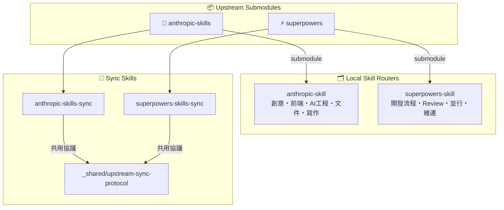

# Design Spec: Superpowers Submodule Integration

**Date:** 2026-03-30
**Status:** Approved
**Scope:** 新增 superpowers submodule、建立本地 router 套件、抽象共用 sync 協議、重構 AGENTS.md 與 README.md

---

## 目錄

- [目標](#目標)
- [架構總覽](#架構總覽)
- [元件設計](#元件設計)
  - [1. superpowers submodule](#1-superpowers-submodule)
  - [2. _shared/upstream-sync-protocol.md](#2-_sharedupstream-sync-protocolmd)
  - [3. anthropic-skills-sync 瘦化](#3-anthropic-skills-sync-瘦化)
  - [4. superpowers-skill router 套件](#4-superpowers-skill-router-套件)
  - [5. superpowers-skills-sync](#5-superpowers-skills-sync)
  - [6. AGENTS.md 重構](#6-agentsmd-重構)
  - [7. README.md 重構](#7-readmemd-重構)
- [閱讀路徑設計](#閱讀路徑設計)
- [驗證標準](#驗證標準)

---

## 目標

1. 以 submodule 形式引入 `https://github.com/obra/superpowers`，路徑為 `superpowers/`
2. 按 `anthropic-skill` 相同的兩層 router 模式，在 `.claude/skills/superpowers-skill/` 建立本地中文描述 router
3. 抽象 `_shared/upstream-sync-protocol.md`，讓 `anthropic-skills-sync` 與 `superpowers-skills-sync` 共用，支援未來新增第三、四個庫
4. 重構 AGENTS.md 為**任務導向 skill 組合查表**（跨兩個庫、第一層即可）
5. 重構 README.md 以 Mermaid 圖表為首，讓人第一眼看懂這個 repo 的用途

---

## 架構總覽

```
ai-research/
├── anthropic-skills/                      ← 現有 submodule（不動）
├── superpowers/                           ← 新 submodule
│
└── .claude/skills/
    ├── _shared/
    │   └── upstream-sync-protocol.md     ← 新：通用 sync 協議
    │
    ├── anthropic-skill/                   ← 不動
    ├── anthropic-skills-sync/
    │   └── SKILL.md                       ← 瘦化：只留庫設定 + 引用協議
    │
    ├── superpowers-skill/                 ← 新：superpowers router
    │   ├── SKILL.md                       ← 第一層 router
    │   ├── categories/
    │   │   ├── development-process.md
    │   │   ├── review-and-wrap-up.md
    │   │   ├── collaboration.md
    │   │   └── system-and-meta.md
    │   └── skills/
    │       └── <14 個 skill>/SKILL.md    ← 中文摘要
    │
    └── superpowers-skills-sync/           ← 新：薄 sync skill
        └── SKILL.md
```

---

## 元件設計

### 1. superpowers submodule

```gitmodules
[submodule "superpowers"]
    path = superpowers
    url = https://github.com/obra/superpowers.git
```

執行指令：
```bash
git submodule add https://github.com/obra/superpowers.git superpowers
git submodule update --init superpowers
```

Skill 來源路徑：`superpowers/skills/<name>/SKILL.md`

---

### 2. `_shared/upstream-sync-protocol.md`

非 skill 檔，無 frontmatter。供各 sync skill 引用，不直接掛在 Claude Code skill 清單。

**內容大綱：**

#### 變數定義

各引用方在自己的 SKILL.md 中填入以下變數：

| 變數 | 說明 | 範例 |
|------|------|------|
| `{{LIBRARY_NAME}}` | 庫的識別名稱 | `anthropic-skills` / `superpowers` |
| `{{SUBMODULE_PATH}}` | git submodule 相對路徑 | `anthropic-skills/` / `superpowers/` |
| `{{LOCAL_ROUTER_PATH}}` | 本地 router 目錄 | `.claude/skills/anthropic-skill/` |
| `{{SKILL_SOURCE_PATTERN}}` | skill 來源路徑模式 | `skills/<name>/SKILL.md` |

#### 通用 Sync 流程（5 步）

1. **檢查上游更新**：`git -C {{SUBMODULE_PATH}} fetch origin && git log HEAD..origin/main --oneline`
2. **識別異動 skill**：`git diff HEAD..origin/main --name-only`，解析出 `CHANGED_SKILLS` 與 `NEW_SKILLS`
3. **Pull**：`git -C {{SUBMODULE_PATH}} pull origin main`
4. **逐一 regenerate skill 摘要**：按 Summary Format 重寫 `{{LOCAL_ROUTER_PATH}}/skills/<name>/SKILL.md`
5. **更新 router / category / AGENTS.md**：若有新 skill 或 category 異動則更新；commit

#### SKILL.md 摘要格式（六欄位）

```markdown
---
name: <skill-name>
description: <原文 description，來自上游 SKILL.md frontmatter>
source: {{SUBMODULE_PATH}}/skills/<name>/SKILL.md
---

## 概述
<1-2 句繁體中文，說明這個 skill 做什麼>

## 能做什麼
<條列或表格，具體說明支援的操作與格式>

## 解決什麼問題
<這個 skill 存在的原因；它解決什麼痛點>

## 何時使用（觸發條件）
<觸發關鍵字、使用者意圖短語、條件>

## 關鍵技術棧
<使用的工具、框架、語言>

## 重要注意事項
<限制、已知問題、使用陷阱>
```

#### Edge Cases 表

| 情境 | 處理方式 |
|------|---------|
| Skill 在上游被刪除 | 通知使用者，確認後才移除本地摘要與 category 引用 |
| 新 skill 無 SKILL.md | 記錄警告，跳過 summary 生成 |
| Skill 跨 category 異動 | 更新 `categories/`，若影響 AGENTS.md 也一併更新 |
| git push 需要認證 | 等待 browser auth 完成 |
| Submodule 非 git repo | 執行前先 `git -C {{SUBMODULE_PATH}} status` 確認 |

#### 驗證步驟

```bash
# 確認 router 結構完整
ls .claude/skills/{{LOCAL_ROUTER_PATH}}/skills/

# 確認無未提交異動
git status

# 確認最新 commit
git log --oneline -3
```

---

### 3. `anthropic-skills-sync` 瘦化

保留 frontmatter description 不變。正文縮減為：

```markdown
## 庫設定

| 欄位 | 值 |
|------|-----|
| 庫名稱 | anthropic-skills |
| 上游 URL | https://github.com/anthropics/skills.git |
| Submodule 路徑 | anthropic-skills/ |
| 本地 Router 路徑 | .claude/skills/anthropic-skill/ |
| Skill 來源模式 | skills/<name>/SKILL.md |

## Sync 流程

參閱 [_shared/upstream-sync-protocol.md](../_shared/upstream-sync-protocol.md)，
以上方「庫設定」填入對應變數後執行。
```

移除：Sync Workflow、Repository Layout、Summary Format、Edge Cases、Verification（全數移至 `_shared/`）。

---

### 4. `superpowers-skill` router 套件

#### SKILL.md（第一層 router）

結構對齊 `anthropic-skill/SKILL.md`：

- frontmatter description（英文，供 Skill picker 顯示）
- **定位原則**：router 先分類，按需展開 categories → skills 細節
- **快速查詢表**（問題 → skill）：4 個類別各一張表
- **第二層讀取規則**：條件 → 讀哪個 category 檔
- **Plugin 注意事項**：superpowers skills 在 Claude Code 中有 `superpowers:` prefix，透過 `Skill` 工具呼叫

#### 14 個 Skill 的分類與對應

| 類別 | Category 檔 | Skills |
|------|------------|--------|
| 🔄 開發流程 | `development-process.md` | brainstorming, writing-plans, executing-plans, test-driven-development, systematic-debugging, verification-before-completion |
| 👀 Review 與收尾 | `review-and-wrap-up.md` | receiving-code-review, requesting-code-review, finishing-a-development-branch |
| 🤝 協作與並行 | `collaboration.md` | dispatching-parallel-agents, subagent-driven-development, using-git-worktrees |
| ⚙️ 系統與維運 | `system-and-meta.md` | using-superpowers, writing-skills |

#### Categories 檔結構

每個 category 檔對齊 `anthropic-skill/categories/` 格式：
- 何時讀這份
- 問題 → Skill 對照表（含連結到 `../skills/<name>/SKILL.md`）
- Skill 細節入口列表
- 注意事項

---

### 5. `superpowers-skills-sync`

```markdown
---
name: superpowers-skills-sync
description: Use this skill when the user asks to sync, update, refresh, or check
for updates to the superpowers skills library. Triggers when user says "sync
superpowers", "update superpowers skills", "check superpowers upstream", or any
variation of keeping superpowers local descriptions in sync with the upstream repo.
---

## 庫設定

| 欄位 | 值 |
|------|-----|
| 庫名稱 | superpowers |
| 上游 URL | https://github.com/obra/superpowers.git |
| Submodule 路徑 | superpowers/ |
| 本地 Router 路徑 | .claude/skills/superpowers-skill/ |
| Skill 來源模式 | skills/<name>/SKILL.md |

## Sync 流程

參閱 [_shared/upstream-sync-protocol.md](../_shared/upstream-sync-protocol.md)，
以上方「庫設定」填入對應變數後執行。
```

---

### 6. AGENTS.md 重構

**設計原則：** 使用者詢問時可快速定位「要組合哪些 skill 完成任務」，所有 submodule 的核心 skill 第一層就要到位，按需揭露細節。

**結構：**

1. **一句說明**：這份文件是幹嘛的
2. **任務 → Skill 組合查表**（跨兩個庫）：
   - 建新功能（完整流程）
   - Debug
   - 建 Web UI
   - 建 Claude API 應用
   - 建 MCP server
   - 操作 Office 文件（PDF/Word/Excel/PPT）
   - 跑平行子任務
   - Code review 相關
   - Skill 維護（sync、create）
   - 其餘各 skill 一行列出
3. **第一層 Router 入口**（按需展開）：
   - anthropic-skill router
   - superpowers-skill router
4. **Plugin 安裝說明**（保留現有內容）
5. **Skill Locations 表**（新增 superpowers/ 行）

---

### 7. README.md 重構

**設計原則：** 第一眼知道 repo 在幹嘛，視覺優先。

**結構：**

1. **一行標語**：「AI 工具研究 × Skills 知識庫」
2. **Mermaid 架構圖**（全域視圖）：

3. **工具覆蓋一覽**（Claude Code CLI、GitHub Copilot）
4. **個人自製 Skills 簡介**（.agents/skills/）
5. **快速開始**（如何安裝 plugin、如何使用 skill）
6. **目錄結構**（更新 superpowers/ 行）

---

## 閱讀路徑設計

```
使用者問題
    ↓
AGENTS.md（任務 → skill 組合，跨庫第一層）
    ↓（按需展開）
superpowers-skill/SKILL.md 或 anthropic-skill/SKILL.md（第一層 router）
    ↓（按需展開）
categories/*.md（類別摘要）
    ↓（按需展開）
skills/<name>/SKILL.md（單一 skill 中文詳細摘要）
    ↓（按需展開）
superpowers/skills/<name>/SKILL.md 或 anthropic-skills/skills/<name>/SKILL.md（原文）
```

---

## 驗證標準

| 驗收項目 | 通過條件 |
|---------|---------|
| Submodule 正確加入 | `git submodule status` 顯示 `superpowers` 且 hash 正確 |
| 14 個 skill 摘要完整 | `.claude/skills/superpowers-skill/skills/` 有 14 個子目錄，各有 SKILL.md |
| Router 路由正確 | 閱讀 `superpowers-skill/SKILL.md` 可找到所有 skill 的分類入口 |
| Sync 協議共用 | `anthropic-skills-sync` 與 `superpowers-skills-sync` 正文皆引用 `_shared/` |
| AGENTS.md 跨庫 | AGENTS.md 的組合查表同時涵蓋 anthropic 與 superpowers skills |
| README.md 視覺 | 第一屏有 Mermaid 圖，且架構圖節點與實際目錄吻合 |
| 無重複內容 | `anthropic-skills-sync` 的 Sync Workflow / Summary Format 已移至 `_shared/` |
