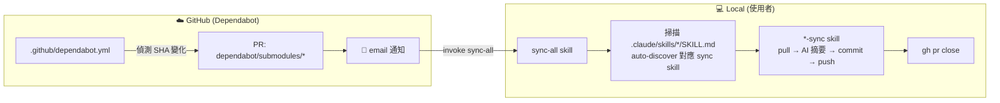
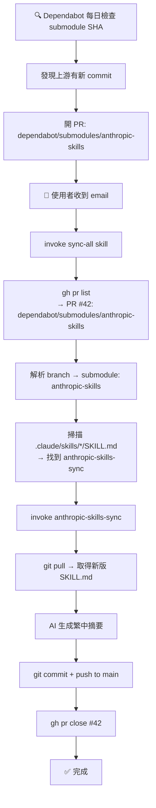

# Upstream Auto-Sync Design

> 當上游 submodule 有變更時，透過 Dependabot 偵測 + 本地 `sync-all` skill 執行完整 AI sync 流程。

---

## 快速導覽

- [問題與目標](#問題與目標)
- [架構總覽](#架構總覽)
- [元件設計](#元件設計)
  - [dependabot.yml](#1-githubdependabotyml)
  - [sync-all skill](#2-claudeskillssync-allskillmd)
  - [現有 sync skill 修改](#3-現有-sync-skill-修改)
- [資料流](#資料流)
- [擴展指引](#擴展指引)
- [Edge Cases](#edge-cases)
- [驗收標準](#驗收標準)

---

## 問題與目標

**問題**：目前上游 submodule（`anthropic-skills`、`superpowers`）有新版本時，需要手動發現並分別執行 sync skill，容易遺漏。

**目標**：
- GitHub 原生偵測上游 submodule 變更，自動通知使用者
- 使用者本地執行一個統一 skill（`sync-all`）即可完成所有 sync 工作
- 設計支援未來新增任意數量的 submodule，無需修改核心機制

**不在範圍內**：
- 全自動無人介入的 AI API 呼叫（sync 摘要生成仍由使用者觸發的本地 AI 執行）
- 修改現有各 `*-sync` skill 的 sync 邏輯本身

---

## 架構總覽



---

## 元件設計

### 1. `.github/dependabot.yml`

**功能**：啟用 GitHub Dependabot 監控 repo 內所有 git submodule。

```yaml
version: 2
updates:
  - package-ecosystem: "gitsubmodule"
    directory: "/"
    schedule:
      interval: "daily"
```

**特性**：
- 單一 entry 涵蓋 repo 內**所有** submodule，無需逐一列出
- 新增 submodule 後，Dependabot 自動納入監控，不需修改此檔案
- Dependabot PR 的 branch name 格式：`dependabot/submodules/<submodule-path>`
- 使用者透過 GitHub email notification 得知有更新

---

### 2. `.claude/skills/sync-all/SKILL.md`

**功能**：統一入口 skill，自動發現待 sync 的 submodule 並 orchestrate 對應 sync skill。

**Frontmatter**：

```yaml
---
name: sync-all
description: Use when Dependabot has opened PRs for submodule updates and you want to sync all pending upstream skill libraries in one step. Reads open Dependabot PRs, auto-discovers corresponding sync skills, runs them in sequence, then closes the PRs.
---
```

**執行步驟**：

#### Step 1 — 確認前置條件

```bash
# 確認 gh CLI 已登入
gh auth status
```

若未登入，提示使用者執行 `gh auth login` 後重試。

#### Step 2 — 列出 open Dependabot PRs

```bash
gh pr list \
  --author "app/dependabot" \
  --state open \
  --json number,headRefName,title \
  --jq '.[] | select(.headRefName | startswith("dependabot/submodules/"))'
```

- 若結果為空 → 告知使用者「無待處理的上游更新」並停止
- 若有結果 → 繼續

#### Step 3 — 解析 submodule 名稱

從每個 PR 的 `headRefName` 中提取 submodule path：

```
dependabot/submodules/anthropic-skills  →  anthropic-skills
dependabot/submodules/superpowers       →  superpowers
```

#### Step 4 — Auto-discover sync skills（runtime）

掃描 `.claude/skills/*/SKILL.md`，讀取每個 skill 的 YAML frontmatter。
找出有 `submodule-path` 欄位的 skill，建立動態映射表：

```
{ "anthropic-skills" → skill "anthropic-skills-sync" }
{ "superpowers"      → skill "superpowers-skills-sync" }
```

若某個 Dependabot PR 的 submodule 找不到對應 sync skill：
- 印出警告：`⚠️ 找不到 <submodule-name> 的對應 sync skill，跳過`
- 繼續處理其他 PR，不中斷

#### Step 5 — 依序 invoke 各 sync skill

對每個找到映射的 submodule，使用 Skill tool invoke 對應的 sync skill。
sync skill 本身負責：pull submodule → AI 生成摘要 → commit → push to main。

#### Step 6 — 關閉 Dependabot PR

```bash
gh pr close <PR_NUMBER> \
  --comment "Synced via sync-all skill. Submodule updated and skill summaries regenerated."
```

若關閉失敗（例如 PR 已被關閉），記錄但不視為錯誤。

---

### 3. 現有 sync skill 修改

**最小幅度修改**：在 frontmatter 各加一個 `submodule-path` 欄位。

**`anthropic-skills-sync/SKILL.md`** 的 frontmatter：

```yaml
---
name: anthropic-skills-sync
submodule-path: anthropic-skills
description: ...（原文不動）
---
```

**`superpowers-skills-sync/SKILL.md`** 的 frontmatter：

```yaml
---
name: superpowers-skills-sync
submodule-path: superpowers
description: ...（原文不動）
---
```

sync 邏輯本身（Step 1–7 in `_shared/upstream-sync-protocol.md`）**不改**。

---

## 資料流



---

## 擴展指引

新增第三個（或更多）上游 submodule 只需兩步：

### Step 1 — 加入 git submodule

```bash
git submodule add <upstream-url> <path>
git commit -m "feat: add <name> as submodule"
```

`.github/dependabot.yml` **不需修改**，自動涵蓋。

### Step 2 — 建立對應 sync skill

新建 `.claude/skills/<name>-sync/SKILL.md`，參照 `anthropic-skills-sync/SKILL.md` 樣板，填入：

```yaml
---
name: <name>-sync
submodule-path: <path>          ← 必填，供 sync-all auto-discovery 使用
description: ...
---
```

下次執行 `sync-all` 時，新 skill 會自動被發現並納入流程。

---

## Edge Cases

| 情境 | 處理方式 |
|------|---------|
| 無 open Dependabot PR | 告知使用者無待更新項目，停止 |
| Dependabot PR 找不到對應 sync skill | 印警告並跳過，不中斷其他 sync |
| 多個 submodule 同時有 PR | 依序處理，逐一 invoke |
| `gh` CLI 未登入 | Step 1 提示 `gh auth login`，停止 |
| PR 在 sync 後已自動關閉 | `gh pr close` 失敗不視為錯誤 |
| Submodule 未初始化 | sync skill 的 Step 1 會捕捉並提示 `git submodule update --init` |
| 上游 default branch 非 `main` | 由個別 sync skill 處理（遵照 `_shared/upstream-sync-protocol.md` edge case 表） |

---

## 驗收標準

1. **Dependabot 啟用**：新建 `.github/dependabot.yml` 後，GitHub repo 的 Dependabot 設定頁顯示 `gitsubmodule` 已啟用
2. **PR 偵測**：手動製造 submodule SHA 過時的情況（或等 Dependabot 跑），可見 PR 被開出，格式為 `dependabot/submodules/<name>`
3. **sync-all 無 PR 時**：invoke `sync-all` 時若無 open Dependabot PR，收到「無待處理的上游更新」訊息並停止，不報錯
4. **sync-all 有 PR 時**：invoke `sync-all` 後，對應 sync skill 被觸發，submodule 更新，摘要重新生成，commit 出現在 main，Dependabot PR 被關閉
5. **擴展性驗證**：新增一個 mock submodule + sync skill（帶 `submodule-path` frontmatter），`sync-all` 無需修改即可自動偵測並處理
