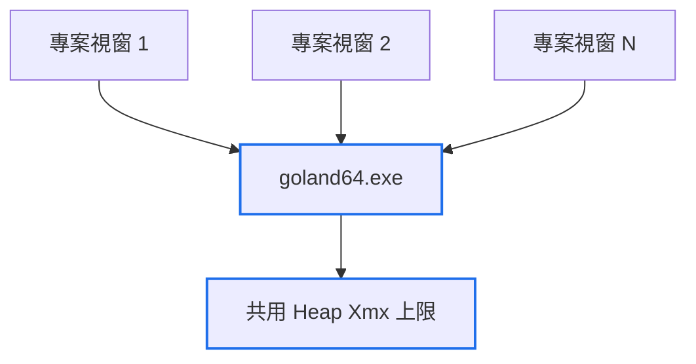

# GoLand 多視窗資源設定

## Quick Navigation

- [概觀](#概觀)
- [架構:多視窗共用單一 Process](#架構多視窗共用單一-process)
- [記憶體設定(Xmx)](#記憶體設定xmx)
- [背景自動觸發行為](#背景自動觸發行為)
- [注意事項](#注意事項)

## 概觀

這台機器平時會同時開啟多個 GoLand 專案視窗(對應多個獨立的 Go 專案資料夾),並搭配多個平行執行的 Claude Code CLI 工作。GoLand 在這種多視窗、高並行的使用模式下的資源行為,跟一般「單一視窗、單一專案」的預設認知不同,曾被觀察到是拖累系統排程、進而讓遠端桌面(RDP)工作階段被系統自己 reset 的主要因素之一。本文件記錄目前已確認的行為模式與建議設定。

[Back to top](#quick-navigation)

---

## 架構:多視窗共用單一 Process

實測確認:**同時開啟 6 個 GoLand 專案視窗時,`goland64.exe` 只有 1 個 process。** 驗證方式:

```
Get-Process goland64 | Select Id, WorkingSet
```

也就是說,所有專案視窗**共用同一個 JVM、同一份 heap**——`-Xmx` 上限是所有視窗加總共用的天花板,不是每個視窗各自獨立的量。若未來 GoLand 改版導致每個視窗改為獨立 process,以下設定與建議值需要用上面的指令重新驗證。



[Back to top](#quick-navigation)

---

## 記憶體設定(Xmx)

設定檔位置:

```
%APPDATA%\JetBrains\GoLand<版本>\goland64.exe.vmoptions
```

內容範例:

```
-Xmx8192m
```

這台機器實體記憶體 32GB。由於 Xmx 是所有同時開啟視窗共用的上限(見上一節),設定值需要考慮「平常會同時開幾個視窗」,而不是單一專案的需求量:

- 平時同時開約 6 個專案視窗:建議 8192~12288,在共用上限與系統、其他行程(瀏覽器、防毒、多個 Claude Code CLI 行程)之間留出餘裕。
- 若未來改成每個視窗各自獨立 process(見上一節的驗證方式),此建議值需要除以「同時開啟的視窗數」重新評估,避免總和超過實體記憶體。

修改後需要重啟 GoLand;由於所有視窗共用一個 process,重啟一次即可讓設定對所有視窗生效。

[Back to top](#quick-navigation)

---

## 背景自動觸發行為

以下三種行為預設是自動觸發,會在專案檔案被外部程序(git checkout、`go build`、其他工具)修改時觸發。多視窗、高並行寫入的情境下,這些行為疊加發生的頻率會明顯高於一般單專案的使用模式。

| 行為 | 設定位置(關閉自動) | 手動觸發方式 |
|---|---|---|
| 視窗取得焦點時同步檔案(Synchronize files on frame activation) | `Settings → Appearance & Behavior → System Settings` | `File → Reload All from Disk`,或在 Project 視窗右鍵根目錄 → Synchronize |
| Git 自動 fetch | `Settings → Version Control → Background` | 底部狀態列 Git/分支小工具 → Fetch,或選單 `Git → Fetch` |
| Go Modules 隨外部變更自動重新解析 | `Settings → Languages & Frameworks → Go → Go Modules` | 關閉後通常會改成跳出「go.mod 已變更,是否重新載入?」的通知,手動點擊即可;或右鍵 `go.mod` 尋找對應的手動同步選項 |

索引(indexing)本身沒有獨立的手動觸發入口——它是上述行為偵測到檔案變動後的下游結果。關閉以上自動觸發後,索引只會在手動執行上述動作時才連帶發生;需要強制重建全部索引時才使用 `File → Invalidate Caches...`(重手段,一般不需要)。


[Back to top](#quick-navigation)

---

## 注意事項

- `node_modules`、`vendor` 資料夾的索引排除設定,對目前這幾個 Go 專案不適用(專案內未使用這兩個資料夾)。若未來專案內出現這類大型第三方目錄,檢查方式:
  - UI:右鍵該資料夾 → `Mark Directory as` → 確認 `Excluded` 是否已勾選。
  - 檔案:專案的 `.idea\*.iml` 是否含有 `<excludeFolder url="file://$MODULE_DIR$/<資料夾名稱>" />`。
- 上述設定與行為模式是在多視窗、高並行工作負載下觀察確認的,GoLand 版本更新後行為可能改變,調整設定前建議先用「架構」一節的指令重新驗證 process 模型。

[Back to top](#quick-navigation)
