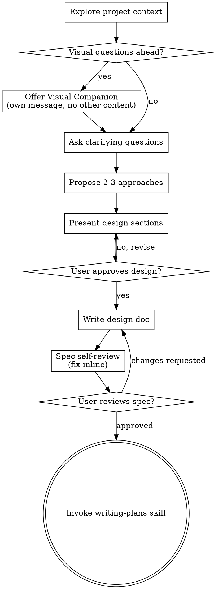

# 將想法發展成設計

透過自然的協作對話，幫助將想法轉化為完整的設計與規格。

首先了解當前專案的脈絡，然後逐一提問來細化想法。一旦理解了要構建的內容，呈現設計並取得使用者批准。

<HARD-GATE>
在呈現設計並取得使用者批准之前，切勿呼叫任何實作技能、撰寫任何程式碼、建立任何專案框架，或採取任何實作行動。此規則適用於每一個專案，不論其表面上多麼簡單。
</HARD-GATE>

## 反模式：「這太簡單了，不需要設計」

每個專案都需要經歷此流程。待辦清單、單一功能工具、設定變更——全部如此。「簡單」的專案恰恰是未經檢視的假設造成最多無謂工作的地方。設計文件可以很短（對於真正簡單的專案只需幾句話），但你必須呈現設計並取得批准。

## 清單

你必須為以下每個項目建立一個任務，並依序完成：

1. **探索專案脈絡** — 檢查檔案、文件、近期提交
2. **提供視覺伴侶**（若主題涉及視覺問題）— 這是一則獨立訊息，不與澄清問題合併。請參閱下方「視覺伴侶」一節。
3. **提出澄清問題** — 每次一個，了解目的、限制條件與成功標準
4. **提出 2-3 個方案** — 附帶取捨分析與你的建議
5. **呈現設計** — 按各區塊的複雜度分段呈現，每段後取得使用者批准
6. **撰寫設計文件** — 儲存至 `docs/superpowers/specs/YYYY-MM-DD-<topic>-design.md` 並提交
7. **規格自審** — 快速內聯檢查佔位符、矛盾、歧義、範圍（詳見下方）
8. **使用者審閱規格** — 在繼續之前，請使用者審閱規格檔案
9. **轉換到實作** — 呼叫 writing-plans 技能建立實作計畫

## 流程圖

**終點狀態是呼叫 writing-plans。** 切勿呼叫 frontend-design、mcp-builder 或任何其他實作技能。腦力激盪後，你唯一會呼叫的技能是 writing-plans。

## 流程說明

**理解想法：**

- 首先查看當前專案狀態（檔案、文件、近期提交）
- 在提出詳細問題之前，評估範圍：若需求描述了多個獨立子系統（例如，「建立一個具備聊天、檔案儲存、計費和分析的平台」），請立即標記此問題。不要花時間細化一個需要先分解的專案。
- 若專案規模太大，無法納入單一規格，協助使用者分解為子專案：有哪些獨立部分、它們如何關聯、應以什麼順序建構？然後透過正常設計流程對第一個子專案進行腦力激盪。每個子專案都有其自己的規格 → 計畫 → 實作週期。
- 對於範圍適當的專案，每次提一個問題來細化想法
- 盡可能使用選擇題，但開放性問題也可以
- 每則訊息只提一個問題——若一個主題需要更多探索，將其拆分為多個問題
- 專注於理解：目的、限制條件、成功標準

**探索方案：**

- 提出 2-3 個不同方案並附帶取捨分析
- 以對話方式呈現選項，附上你的建議與理由
- 以你推薦的選項開頭並解釋原因

**呈現設計：**

- 一旦你認為理解了要構建的內容，呈現設計
- 依各區塊複雜度調整篇幅：若直接明瞭則幾句話，若細節豐富則最多 200-300 字
- 每個區塊後詢問是否看起來正確
- 涵蓋：架構、元件、資料流、錯誤處理、測試
- 若有不清楚之處，隨時準備回頭澄清

**為隔離性與清晰性而設計：**

- 將系統拆分為較小的單元，每個單元具備單一明確的用途，透過明確定義的介面通訊，且可以獨立理解和測試
- 對每個單元，你應該能回答：它做什麼、如何使用、依賴什麼？
- 在不閱讀內部實作的情況下，能理解一個單元的功能嗎？能在不破壞使用者的情況下更改內部實作嗎？若不能，邊界需要調整。
- 較小且邊界明確的單元對你來說也更容易處理——你對能完整納入上下文的程式碼推理更好，而當檔案專注時，你的修改也更可靠。當一個檔案變得龐大，這通常是它做太多事的信號。

**在現有程式碼庫中工作：**

- 在提出變更之前，先探索當前結構。遵循現有模式。
- 若現有程式碼存在影響工作的問題（例如，一個過大的檔案、不明確的邊界、糾纏的職責），將有針對性的改善納入設計中——就像一個優秀的開發者改善他們正在工作的程式碼。
- 不要提出無關的重構。專注於服務當前目標的內容。

## 設計之後

**文件：**

- 將經過驗證的設計（規格）寫入 `docs/superpowers/specs/YYYY-MM-DD-<topic>-design.md`
  - （使用者對規格位置的偏好優先於此預設值）
- 若可用，請使用 elements-of-style:writing-clearly-and-concisely 技能
- 將設計文件提交至 git

**規格自審：**
撰寫規格文件後，以新鮮的眼光審視它：

1. **佔位符掃描：** 是否有「TBD」、「TODO」、不完整的區塊或模糊的需求？修正它們。
2. **內部一致性：** 各區塊是否相互矛盾？架構是否與功能描述相符？
3. **範圍檢查：** 這是否足夠專注，可作為單一實作計畫，還是需要分解？
4. **歧義檢查：** 是否有任何需求可以用兩種不同方式解釋？若是，選擇一種並明確說明。

內聯修正所有問題。無需重新審閱——修正後繼續即可。

**使用者審閱關卡：**
規格審閱循環通過後，在繼續之前請使用者審閱已撰寫的規格：

> 「規格已撰寫並提交至 `<path>`。請審閱它，並告訴我在開始撰寫實作計畫之前是否需要進行任何修改。」

等待使用者回應。若他們要求修改，進行修改並重新執行規格審閱循環。僅在使用者批准後才繼續。

**實作：**

- 呼叫 writing-plans 技能建立詳細的實作計畫
- 切勿呼叫任何其他技能。writing-plans 是下一步。

## 關鍵原則

- **每次一個問題** — 不要用多個問題讓人不知所措
- **選擇題優先** — 盡可能比開放性問題更容易回答
- **毫不留情地應用 YAGNI** — 從所有設計中移除不必要的功能
- **探索替代方案** — 在確定方向前，始終提出 2-3 個方案
- **增量驗證** — 呈現設計，在繼續前取得批准
- **保持彈性** — 當有不清楚之處時，回頭澄清

## 視覺伴侶

一個基於瀏覽器的伴侶，用於在腦力激盪期間展示模型、圖表和視覺選項。作為工具提供——而非模式。接受伴侶意味著它可用於受益於視覺處理的問題；這並不意味著每個問題都要透過瀏覽器處理。

**提供伴侶：** 當你預期即將到來的問題將涉及視覺內容（模型、版面、圖表）時，提供一次以取得同意：
> 「我們正在處理的某些內容，如果我能在網頁瀏覽器中展示給你看，可能會更容易解釋。在我們進行的過程中，我可以製作模型、圖表、比較和其他視覺內容。此功能仍然是新的，可能需要大量 token。想試試嗎？（需要開啟本地 URL）」

**此提供必須是獨立的訊息。** 不要與澄清問題、脈絡摘要或任何其他內容合併。該訊息應僅包含上述提供，別無其他。等待使用者回應後再繼續。若他們拒絕，繼續進行純文字腦力激盪。

**逐問決策：** 即使使用者接受後，也要為每個問題決定是使用瀏覽器還是終端機。判斷標準：**使用者透過看到它是否比閱讀它更容易理解？**

- **使用瀏覽器** 用於本身是視覺性的內容 — 模型、線框圖、版面比較、架構圖、並排視覺設計
- **使用終端機** 用於文字性的內容 — 需求問題、概念選擇、取捨清單、A/B/C/D 文字選項、範圍決策

關於 UI 主題的問題不會自動成為視覺問題。「在這個脈絡中，個性意味著什麼？」是一個概念性問題——使用終端機。「哪種精靈版面更好？」是一個視覺問題——使用瀏覽器。

若他們同意使用伴侶，在繼續之前請閱讀詳細指南：
`skills/brainstorming/visual-companion.md`
