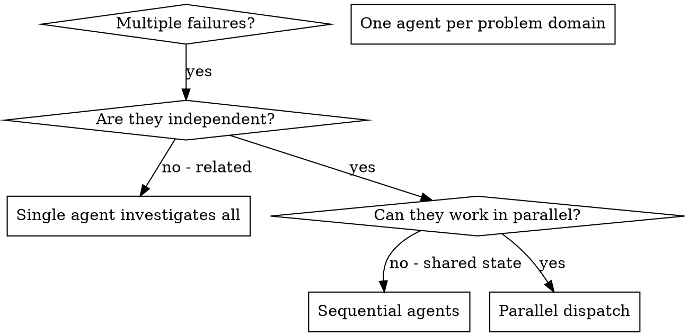

# 派發平行 Agent

## 概述

你將任務委派給具有獨立上下文的專責 agent。透過精確設計其指令與上下文，確保它們保持專注並成功完成任務。它們絕對不應繼承你的 session 上下文或歷史紀錄——你只需建構它們所需的確切內容。這也能為自己保留協調工作所需的上下文。

當你面對多個不相關的失敗（不同的測試檔案、不同的子系統、不同的 bug）時，循序調查會浪費時間。每項調查都是獨立的，可以並行進行。

**核心原則：** 每個獨立問題領域派發一個 agent，讓它們並行運作。

## 適用時機



**適用情境：**
- 3 個以上測試檔案因不同根本原因而失敗
- 多個子系統各自獨立地損壞
- 每個問題可在不依賴其他問題上下文的情況下理解
- 各項調查之間沒有共享狀態

**不適用情境：**
- 失敗相互關聯（修復其中一個可能修復其他問題）
- 需要了解完整系統狀態
- Agent 之間會互相干擾

## 執行模式

### 1. 識別獨立領域

依損壞內容將失敗分組：
- 檔案 A 測試：Tool 核准流程
- 檔案 B 測試：批次完成行為
- 檔案 C 測試：中止功能

每個領域都是獨立的——修復 tool 核准不影響中止測試。

### 2. 建立聚焦的 Agent 任務

每個 agent 獲得：
- **明確範圍：** 單一測試檔案或子系統
- **清晰目標：** 讓這些測試通過
- **限制條件：** 不要更動其他程式碼
- **預期輸出：** 你發現與修復內容的摘要

### 3. 並行派發

```typescript
// In Claude Code / AI environment
Task("Fix agent-tool-abort.test.ts failures")
Task("Fix batch-completion-behavior.test.ts failures")
Task("Fix tool-approval-race-conditions.test.ts failures")
// All three run concurrently
```

### 4. 審查與整合

Agent 回傳後：
- 閱讀每份摘要
- 驗證修復不衝突
- 執行完整測試套件
- 整合所有變更

## Agent Prompt 結構

良好的 agent prompt 具備：
1. **聚焦** - 一個明確的問題領域
2. **自給自足** - 包含理解問題所需的所有上下文
3. **明確輸出** - Agent 應回傳什麼？

```markdown
Fix the 3 failing tests in src/agents/agent-tool-abort.test.ts:

1. "should abort tool with partial output capture" - expects 'interrupted at' in message
2. "should handle mixed completed and aborted tools" - fast tool aborted instead of completed
3. "should properly track pendingToolCount" - expects 3 results but gets 0

These are timing/race condition issues. Your task:

1. Read the test file and understand what each test verifies
2. Identify root cause - timing issues or actual bugs?
3. Fix by:
   - Replacing arbitrary timeouts with event-based waiting
   - Fixing bugs in abort implementation if found
   - Adjusting test expectations if testing changed behavior

Do NOT just increase timeouts - find the real issue.

Return: Summary of what you found and what you fixed.
```

## 常見錯誤

**❌ 範圍過廣：** 「修復所有測試」——agent 迷失方向
**✅ 具體明確：** 「修復 agent-tool-abort.test.ts」——聚焦範圍

**❌ 缺乏上下文：** 「修復 race condition」——agent 不知道在哪裡
**✅ 提供上下文：** 貼上錯誤訊息和測試名稱

**❌ 無限制條件：** Agent 可能重構所有程式碼
**✅ 設定限制：** 「不要更動 production 程式碼」或「僅修復測試」

**❌ 模糊輸出：** 「修好它」——你不知道什麼改變了
**✅ 具體明確：** 「回傳根本原因與變更摘要」

## 不應使用的情境

**相關失敗：** 修復其中一個可能修復其他——先一起調查
**需要完整上下文：** 理解需要查看整個系統
**探索性除錯：** 你還不知道哪裡壞了
**共享狀態：** Agent 會互相干擾（編輯相同檔案、使用相同資源）

## Session 中的實際案例

**情境：** 重大重構後 3 個檔案中出現 6 個測試失敗

**失敗清單：**
- agent-tool-abort.test.ts：3 個失敗（時序問題）
- batch-completion-behavior.test.ts：2 個失敗（tool 未執行）
- tool-approval-race-conditions.test.ts：1 個失敗（執行次數為 0）

**決策：** 獨立領域——中止邏輯與批次完成及 race condition 各自獨立

**派發：**
```
Agent 1 → Fix agent-tool-abort.test.ts
Agent 2 → Fix batch-completion-behavior.test.ts
Agent 3 → Fix tool-approval-race-conditions.test.ts
```

**結果：**
- Agent 1：以事件驅動等待取代逾時機制
- Agent 2：修復事件結構 bug（threadId 位置錯誤）
- Agent 3：新增等待非同步 tool 執行完成的機制

**整合：** 所有修復相互獨立，無衝突，完整測試套件全數通過

**節省時間：** 3 個問題並行解決，而非循序處理

## 主要優勢

1. **並行化** - 多項調查同時進行
2. **聚焦** - 每個 agent 範圍窄小，需追蹤的上下文較少
3. **獨立性** - Agent 之間不互相干擾
4. **速度** - 以處理 1 個問題的時間解決 3 個問題

## 驗證

Agent 回傳後：
1. **審查每份摘要** - 了解發生了哪些變更
2. **檢查衝突** - Agent 是否編輯了相同的程式碼？
3. **執行完整測試套件** - 驗證所有修復可協同運作
4. **抽樣檢查** - Agent 可能產生系統性錯誤

## 實際影響

來自除錯 session（2025-10-03）：
- 3 個檔案中 6 個失敗
- 3 個 agent 並行派發
- 所有調查並行完成
- 所有修復成功整合
- Agent 變更之間零衝突
