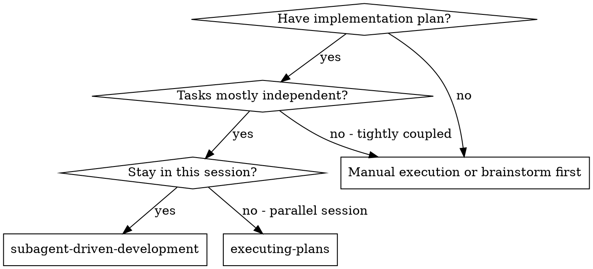
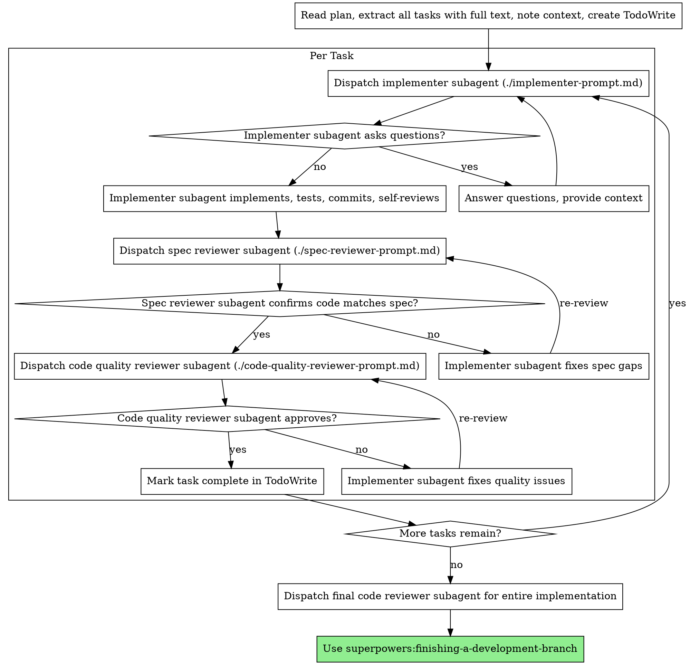

# 子代理驅動開發

透過為每個任務派遣全新子代理來執行計畫，每個任務完成後進行兩階段審查：先進行規格合規審查，再進行程式碼品質審查。

**為何使用子代理：** 你將任務委派給具備獨立上下文的專門代理。透過精確地製作其指令與上下文，你確保子代理保持專注並成功完成任務。子代理絕不應繼承你 session 的上下文或歷史記錄——你精確地建構子代理所需的一切。這也保留了你自身的上下文用於協調工作。

**核心原則：** 每個任務使用全新子代理 + 兩階段審查（先規格後品質）= 高品質、快速迭代

**連續執行：** 任務之間不要暫停向你的人類夥伴回報進度。執行計畫中的所有任務，不中途停止。唯一應停止的理由是：無法解決的 BLOCKED 狀態、真正阻礙進展的模糊性，或所有任務均已完成。「我應該繼續嗎？」的提示與進度摘要只是浪費他們的時間——他們要求你執行計畫，那就執行它。

## 使用時機



**vs. Executing Plans（平行 session）：**
- 相同 session（無上下文切換）
- 每個任務使用全新子代理（無上下文污染）
- 每個任務完成後進行兩階段審查：先規格合規，再程式碼品質
- 更快的迭代（任務之間無需人工介入）

## 流程



## 模型選擇

使用能勝任各角色的最低階模型，以節省成本並提升速度。

**機械性實作任務**（獨立函式、規格清晰、1-2 個檔案）：使用快速、低成本的模型。當計畫規格完善時，大多數實作任務都屬於機械性任務。

**整合與判斷任務**（多檔案協調、模式匹配、除錯）：使用標準模型。

**架構、設計與審查任務**：使用最強的可用模型。

**任務複雜度信號：**
- 觸及 1-2 個檔案且規格完整 → 低成本模型
- 觸及多個檔案且有整合考量 → 標準模型
- 需要設計判斷或廣泛的程式碼庫理解 → 最強模型

## 處理實作者狀態

實作者子代理回報四種狀態之一。請相應地處理：

**DONE：** 繼續進行規格合規審查。

**DONE_WITH_CONCERNS：** 實作者完成了工作，但標記了疑慮。在繼續之前先閱讀疑慮。若疑慮涉及正確性或範疇，請在審查前解決。若只是觀察性意見（例如「這個檔案越來越大」），記下來後繼續進行審查。

**NEEDS_CONTEXT：** 實作者需要未提供的資訊。提供缺少的上下文並重新派遣。

**BLOCKED：** 實作者無法完成任務。評估阻礙因素：
1. 若是上下文問題，提供更多上下文並以相同模型重新派遣
2. 若任務需要更強的推理能力，改用更強的模型重新派遣
3. 若任務太大，拆分成更小的任務
4. 若計畫本身有誤，向人類升級

**絕對不要**忽略升級請求，或在未做任何改變的情況下強迫相同模型重試。若實作者說卡住了，就需要改變些什麼。

## Prompt 模板

- `./implementer-prompt.md` - 派遣實作者子代理
- `./spec-reviewer-prompt.md` - 派遣規格合規審查者子代理
- `./code-quality-reviewer-prompt.md` - 派遣程式碼品質審查者子代理

## 工作流程範例

```
You: I'm using Subagent-Driven Development to execute this plan.

[Read plan file once: docs/superpowers/plans/feature-plan.md]
[Extract all 5 tasks with full text and context]
[Create TodoWrite with all tasks]

Task 1: Hook installation script

[Get Task 1 text and context (already extracted)]
[Dispatch implementation subagent with full task text + context]

Implementer: "Before I begin - should the hook be installed at user or system level?"

You: "User level (~/.config/superpowers/hooks/)"

Implementer: "Got it. Implementing now..."
[Later] Implementer:
  - Implemented install-hook command
  - Added tests, 5/5 passing
  - Self-review: Found I missed --force flag, added it
  - Committed

[Dispatch spec compliance reviewer]
Spec reviewer: ✅ Spec compliant - all requirements met, nothing extra

[Get git SHAs, dispatch code quality reviewer]
Code reviewer: Strengths: Good test coverage, clean. Issues: None. Approved.

[Mark Task 1 complete]

Task 2: Recovery modes

[Get Task 2 text and context (already extracted)]
[Dispatch implementation subagent with full task text + context]

Implementer: [No questions, proceeds]
Implementer:
  - Added verify/repair modes
  - 8/8 tests passing
  - Self-review: All good
  - Committed

[Dispatch spec compliance reviewer]
Spec reviewer: ❌ Issues:
  - Missing: Progress reporting (spec says "report every 100 items")
  - Extra: Added --json flag (not requested)

[Implementer fixes issues]
Implementer: Removed --json flag, added progress reporting

[Spec reviewer reviews again]
Spec reviewer: ✅ Spec compliant now

[Dispatch code quality reviewer]
Code reviewer: Strengths: Solid. Issues (Important): Magic number (100)

[Implementer fixes]
Implementer: Extracted PROGRESS_INTERVAL constant

[Code reviewer reviews again]
Code reviewer: ✅ Approved

[Mark Task 2 complete]

...

[After all tasks]
[Dispatch final code-reviewer]
Final reviewer: All requirements met, ready to merge

Done!
```

## 優勢

**vs. 手動執行：**
- 子代理自然地遵循 TDD
- 每個任務具備全新上下文（無混淆）
- 平行安全（子代理互不干擾）
- 子代理可以提問（工作前後均可）

**vs. Executing Plans：**
- 相同 session（無交接）
- 持續進展（無需等待）
- 審查檢查點自動化

**效率提升：**
- 無讀檔開銷（控制器提供完整文字）
- 控制器精確整理所需上下文
- 子代理預先獲得完整資訊
- 問題在工作開始前浮現（而非之後）

**品質關卡：**
- 自我審查在交接前捕獲問題
- 兩階段審查：規格合規，再程式碼品質
- 審查迴圈確保修復確實有效
- 規格合規防止過度或不足建構
- 程式碼品質確保實作品質良好

**成本：**
- 更多子代理調用（每個任務需要實作者 + 2 個審查者）
- 控制器需要更多前期準備工作（預先提取所有任務）
- 審查迴圈增加迭代次數
- 但能早期捕獲問題（比後期除錯便宜）

## 警示旗號

**絕對不要：**
- 未經使用者明確同意就在 main/master 分支上開始實作
- 跳過審查（規格合規或程式碼品質）
- 在未解決問題的情況下繼續進行
- 並行派遣多個實作子代理（會產生衝突）
- 讓子代理讀取計畫檔案（改為提供完整文字）
- 跳過場景設定上下文（子代理需要了解任務所處位置）
- 忽略子代理的問題（讓他們繼續前先回答）
- 接受規格合規的「差不多」（審查者發現問題 = 未完成）
- 跳過審查迴圈（審查者發現問題 = 實作者修復 = 再次審查）
- 讓實作者的自我審查取代實際審查（兩者都需要）
- **在規格合規通過 ✅ 之前就開始程式碼品質審查**（順序錯誤）
- 在任一審查還有未解決問題時移往下一個任務

**若子代理提問：**
- 清楚完整地回答
- 必要時提供額外上下文
- 不要催促他們進入實作

**若審查者發現問題：**
- 實作者（相同子代理）修復問題
- 審查者再次審查
- 重複直到通過
- 不要跳過重新審查

**若子代理任務失敗：**
- 派遣修復子代理並附上具體指示
- 不要嘗試手動修復（會污染上下文）

## 整合

**必要的工作流程技能：**
- **superpowers:using-git-worktrees** - 確保隔離的工作空間（建立或驗證現有的）
- **superpowers:writing-plans** - 建立此技能執行的計畫
- **superpowers:requesting-code-review** - 審查者子代理的程式碼審查模板
- **superpowers:finishing-a-development-branch** - 所有任務完成後結束開發

**子代理應使用：**
- **superpowers:test-driven-development** - 子代理為每個任務遵循 TDD

**替代工作流程：**
- **superpowers:executing-plans** - 用於平行 session 而非相同 session 執行
