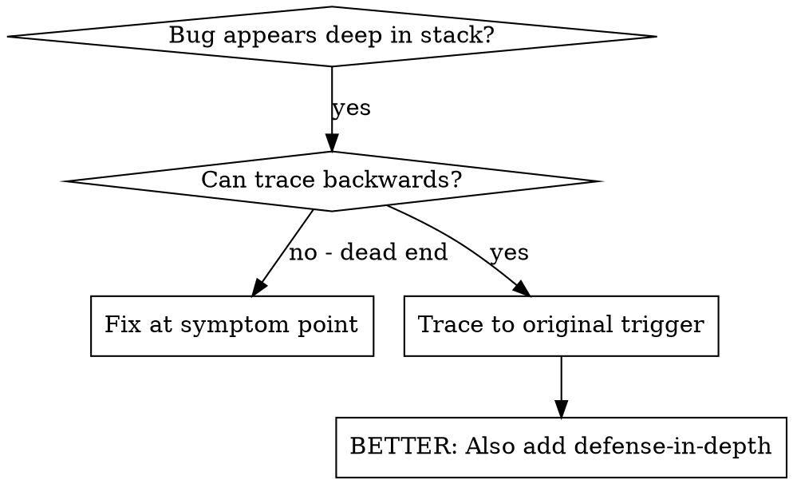
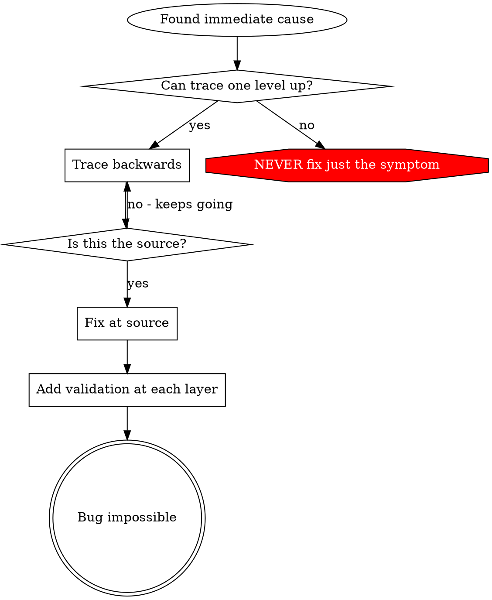

# 根本原因追蹤

## 概觀

錯誤常在 call stack 深處才爆出來（git init 在錯誤目錄、檔案建立在錯誤位置、資料庫以錯誤路徑開啟）。本能反應是在錯誤出現的位置補修，但那只是在處理症狀。

**核心原則：** 沿著呼叫鏈向後追蹤，直到找到原始觸發點，再於來源處修復。

## 使用時機



**使用時機：**
- 錯誤發生在執行深處（非入口點）
- Stack trace 顯示很長的呼叫鏈
- 不清楚無效資料從何而來
- 需要找出哪個測試/程式碼觸發了問題

## 追蹤流程

### 1. 觀察症狀
```
Error: git init failed in ~/project/packages/core
```

### 2. 找出直接原因
**哪段程式碼直接造成此問題？**
```typescript
await execFileAsync('git', ['init'], { cwd: projectDir });
```

### 3. 追問：是誰呼叫這個？
```typescript
WorktreeManager.createSessionWorktree(projectDir, sessionId)
  → called by Session.initializeWorkspace()
  → called by Session.create()
  → called by test at Project.create()
```

### 4. 繼續向上追蹤
**傳入的值是什麼？**
- `projectDir = ''`（空字串！）
- 空字串作為 `cwd` 會解析成 `process.cwd()`
- 那就是原始碼目錄！

### 5. 找到原始觸發點
**空字串從何而來？**
```typescript
const context = setupCoreTest(); // Returns { tempDir: '' }
Project.create('name', context.tempDir); // Accessed before beforeEach!
```

## 加入 Stack Trace

當無法手動追蹤時，加入埋點：

```typescript
// Before the problematic operation
async function gitInit(directory: string) {
  const stack = new Error().stack;
  console.error('DEBUG git init:', {
    directory,
    cwd: process.cwd(),
    nodeEnv: process.env.NODE_ENV,
    stack,
  });

  await execFileAsync('git', ['init'], { cwd: directory });
}
```

**重要：** 在測試中使用 `console.error()`（不要用 logger — logger 可能不顯示輸出）

**執行並擷取：**
```bash
npm test 2>&1 | grep 'DEBUG git init'
```

**分析 stack traces：**
- 尋找測試檔案名稱
- 找出觸發呼叫的行號
- 識別模式（同一個測試？同一個參數？）

## 找出哪個測試造成污染

若測試期間出現某個東西，但不知道是哪個測試造成的：

使用本目錄中的 bisection 腳本 `find-polluter.sh`：

```bash
./find-polluter.sh '.git' 'src/**/*.test.ts'
```

逐一執行測試，在第一個污染者停下。詳見腳本說明。

## 真實範例：空的 projectDir

**症狀：** `.git` 建立在 `packages/core/`（原始碼目錄）

**追蹤鏈：**
1. `git init` 在 `process.cwd()` 執行 ← cwd 參數為空
2. WorktreeManager 以空的 projectDir 被呼叫
3. Session.create() 傳入空字串
4. 測試在 beforeEach 前存取了 `context.tempDir`
5. setupCoreTest() 初始回傳 `{ tempDir: '' }`

**根本原因：** 頂層變數初始化存取了空值

**修復：** 將 tempDir 改為 getter，若在 beforeEach 前存取則拋出例外

**同時加入縱深防禦：**
- 第一層：Project.create() 驗證目錄
- 第二層：WorkspaceManager 驗證非空
- 第三層：NODE_ENV 保護，拒絕在 tmpdir 外執行 git init
- 第四層：git init 前記錄 stack trace

## 關鍵原則



**絕不只修復錯誤出現的位置。** 向後追蹤以找出原始觸發點。

## Stack Trace 技巧

**在測試中：** 使用 `console.error()` 而非 logger — logger 可能被抑制
**在操作前：** 在危險操作前記錄，不要等到失敗後才記
**包含情境：** 目錄、cwd、環境變數、時間戳
**擷取 stack：** `new Error().stack` 顯示完整呼叫鏈

## 真實世界影響

來自除錯 session（2025-10-03）：
- 透過五層追蹤找出根本原因
- 在來源處修復（getter 驗證）
- 加入四個縱深防禦層
- 1847 個測試通過，零污染
