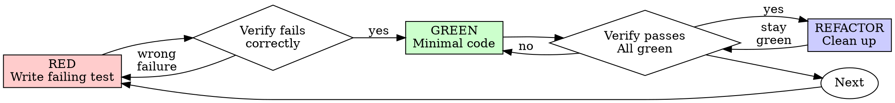

# 測試驅動開發（TDD）

## 概覽

先寫測試。觀察測試失敗。寫最小限度的程式碼使其通過。

**核心原則：** 若你沒有親眼觀察測試失敗，你就不知道它是否在測試正確的事情。

**違反規則的字面意義，就是違反規則的精神。**

## 使用時機

**始終適用：**
- 新功能
- 錯誤修復
- 重構
- 行為變更

**例外情況（請詢問你的人類夥伴）：**
- 一次性原型
- 生成的程式碼
- 設定檔

心裡浮現「這次先跳過 TDD 就好」？停下來。那是自我合理化。

## 鐵律

```
沒有先寫失敗測試，就不得有任何生產程式碼
```

在測試之前就寫了程式碼？刪掉它。重新開始。

**沒有例外：**
- 不要留著當「參考」
- 不要邊寫測試邊「調整」它
- 不要看它
- 刪除就是刪除

從測試出發全新實作。就這樣。

## 紅燈—綠燈—重構



### 紅燈 — 撰寫失敗測試

撰寫一個能展示預期行為的最小測試。

<Good>
```typescript
test('retries failed operations 3 times', async () => {
  let attempts = 0;
  const operation = () => {
    attempts++;
    if (attempts < 3) throw new Error('fail');
    return 'success';
  };

  const result = await retryOperation(operation);

  expect(result).toBe('success');
  expect(attempts).toBe(3);
});
```
命名清晰、測試真實行為、只測一件事
</Good>

<Bad>
```typescript
test('retry works', async () => {
  const mock = jest.fn()
    .mockRejectedValueOnce(new Error())
    .mockRejectedValueOnce(new Error())
    .mockResolvedValueOnce('success');
  await retryOperation(mock);
  expect(mock).toHaveBeenCalledTimes(3);
});
```
命名模糊、測試的是 mock 而非程式碼
</Bad>

**要求：**
- 只測一個行為
- 命名清晰
- 使用真實程式碼（除非無法避免，否則不使用 mock）

### 驗證紅燈 — 親眼觀察失敗

**強制步驟。絕不跳過。**

```bash
npm test path/to/test.test.ts
```

確認：
- 測試失敗（不是錯誤）
- 失敗訊息符合預期
- 失敗原因是功能缺失（不是拼字錯誤）

**測試通過了？** 你在測試既有行為。修正測試。

**測試出錯了？** 修正錯誤，重新執行，直到正確失敗為止。

### 綠燈 — 最小限度程式碼

撰寫能讓測試通過的最簡單程式碼。

<Good>
```typescript
async function retryOperation<T>(fn: () => Promise<T>): Promise<T> {
  for (let i = 0; i < 3; i++) {
    try {
      return await fn();
    } catch (e) {
      if (i === 2) throw e;
    }
  }
  throw new Error('unreachable');
}
```
剛好足夠通過即可
</Good>

<Bad>
```typescript
async function retryOperation<T>(
  fn: () => Promise<T>,
  options?: {
    maxRetries?: number;
    backoff?: 'linear' | 'exponential';
    onRetry?: (attempt: number) => void;
  }
): Promise<T> {
  // YAGNI
}
```
過度設計
</Bad>

不要新增功能、重構其他程式碼，或超出測試範圍「改善」。

### 驗證綠燈 — 親眼觀察通過

**強制步驟。**

```bash
npm test path/to/test.test.ts
```

確認：
- 測試通過
- 其他測試仍然通過
- 輸出乾淨（無錯誤、無警告）

**測試失敗？** 修正程式碼，不是測試。

**其他測試失敗？** 立刻修正。

### 重構 — 整理

僅在綠燈之後：
- 移除重複
- 改善命名
- 提取輔助函式

保持測試綠燈。不要新增行為。

### 重複

針對下一個功能撰寫下一個失敗測試。

## 好的測試

| 品質 | 好 | 壞 |
|------|----|----|
| **最小** | 一件事。名稱中有「and」？拆分它。 | `test('validates email and domain and whitespace')` |
| **清晰** | 名稱描述行為 | `test('test1')` |
| **展現意圖** | 展示預期的 API | 隱藏程式碼應有的行為 |

## 為何順序很重要

**「我會在之後寫測試來驗證它能運作」**

在程式碼之後寫的測試會立刻通過。立刻通過什麼都證明不了：
- 可能測試了錯誤的事情
- 可能測試了實作，而非行為
- 可能遺漏了你忘記的邊界情況
- 你從來沒看過它抓到 bug

先寫測試迫使你看到測試失敗，證明它真的在測試某件事。

**「我已經手動測試了所有邊界情況」**

手動測試是臨時性的。你以為你測試了一切，但：
- 沒有測試內容的記錄
- 程式碼改變時無法重新執行
- 在壓力下容易遺漏情況
- 「我試過時可以運作」≠ 全面性驗證

自動化測試是系統性的。每次執行方式相同。

**「刪掉 X 小時的工作很浪費」**

沉沒成本謬誤。時間已經過去了。你現在的選擇是：
- 刪掉並用 TDD 重寫（再花 X 小時，高信心）
- 保留並在事後加測試（30 分鐘，低信心，可能有 bug）

「浪費」是保留你無法信任的程式碼。沒有真實測試的可運作程式碼就是技術債。

**「TDD 太教條，務實意味著靈活調整」**

TDD 本身就是務實的：
- 在提交前找到 bug（比事後除錯更快）
- 防止回歸（測試立刻抓到破壞）
- 記錄行為（測試展示如何使用程式碼）
- 啟用重構（自由修改，測試抓到破壞）

「務實」的捷徑 = 在生產環境除錯 = 更慢。

**「事後寫測試能達到相同目標——重要的是精神而非儀式」**

不對。事後寫的測試回答「這東西做了什麼？」先寫的測試回答「這東西應該做什麼？」

事後的測試受你的實作偏差影響。你測試的是你建立的東西，而不是要求。你驗證你記得的邊界情況，而不是發現新的。

先寫測試迫使你在實作前發現邊界情況。事後寫測試只驗證你記住了一切（你沒有）。

30 分鐘的事後測試 ≠ TDD。你得到了覆蓋率，失去了測試有效性的證明。

## 常見的自我合理化

| 藉口 | 現實 |
|------|------|
| 「太簡單了，不需要測試」 | 簡單的程式碼也會壞掉。寫測試只需 30 秒。 |
| 「我之後再測試」 | 立刻通過的測試什麼都證明不了。 |
| 「事後測試能達到相同目標」 | 事後測試 = 「這東西做了什麼？」先寫測試 = 「這東西應該做什麼？」 |
| 「已經手動測試過了」 | 臨時性 ≠ 系統性。沒有記錄，無法重新執行。 |
| 「刪掉 X 小時是浪費」 | 沉沒成本謬誤。保留未經驗證的程式碼才是技術債。 |
| 「先留著當參考，再寫測試」 | 你會去調整它。那就是事後測試。刪除就是刪除。 |
| 「需要先探索一下」 | 沒問題。丟掉探索結果，從 TDD 開始。 |
| 「測試很難寫 = 設計不清楚」 | 傾聽測試的聲音。難以測試 = 難以使用。 |
| 「TDD 會讓我變慢」 | TDD 比除錯快。務實 = 先寫測試。 |
| 「手動測試比較快」 | 手動無法證明邊界情況。每次改動都要重新測試。 |
| 「現有程式碼沒有測試」 | 你正在改善它。為現有程式碼加入測試。 |

## 紅旗 — 停下來重新開始

- 在測試之前就寫了程式碼
- 在實作之後才寫測試
- 測試立刻通過
- 無法解釋測試為何失敗
- 測試「之後再加」
- 自我合理化「這次就好」
- 「我已經手動測試了」
- 「事後測試能達到相同目的」
- 「重要的是精神而非儀式」
- 「留著當參考」或「調整現有程式碼」
- 「已經花了 X 小時，刪掉是浪費」
- 「TDD 太教條，我在務實行事」
- 「這個情況不一樣，因為……」

**這些全都意味著：刪掉程式碼。用 TDD 重新開始。**

## 範例：錯誤修復

**Bug：** 空的電子郵件被接受

**紅燈**
```typescript
test('rejects empty email', async () => {
  const result = await submitForm({ email: '' });
  expect(result.error).toBe('Email required');
});
```

**驗證紅燈**
```bash
$ npm test
FAIL: expected 'Email required', got undefined
```

**綠燈**
```typescript
function submitForm(data: FormData) {
  if (!data.email?.trim()) {
    return { error: 'Email required' };
  }
  // ...
}
```

**驗證綠燈**
```bash
$ npm test
PASS
```

**重構**
如有需要，提取驗證邏輯以處理多個欄位。

## 驗證清單

在標記工作完成之前：

- [ ] 每個新函式／方法都有測試
- [ ] 在實作前親眼觀察每個測試失敗
- [ ] 每個測試的失敗原因符合預期（功能缺失，而非拼字錯誤）
- [ ] 撰寫最小限度的程式碼使每個測試通過
- [ ] 所有測試通過
- [ ] 輸出乾淨（無錯誤、無警告）
- [ ] 測試使用真實程式碼（僅在無法避免時使用 mock）
- [ ] 邊界情況與錯誤情況已涵蓋

無法勾選所有項目？你跳過了 TDD。重新開始。

## 卡住時

| 問題 | 解決方案 |
|------|----------|
| 不知道如何測試 | 寫出理想中的 API。先寫斷言。詢問你的人類夥伴。 |
| 測試太複雜 | 設計太複雜。簡化介面。 |
| 必須 mock 一切 | 程式碼耦合度太高。使用依賴注入。 |
| 測試設置龐大 | 提取輔助函式。仍然複雜？簡化設計。 |

## 除錯整合

發現 bug？寫一個能重現它的失敗測試。遵循 TDD 循環。測試能證明修復並防止回歸。

絕不在沒有測試的情況下修復 bug。

## 測試反模式

新增 mock 或測試工具時，請閱讀 @testing-anti-patterns.md 以避免常見陷阱：
- 測試 mock 行為而非真實行為
- 在生產類別中新增僅供測試使用的方法
- 在未理解依賴關係的情況下使用 mock

## 最終規則

```
生產程式碼 → 必須先有測試存在且曾經失敗
否則 → 不是 TDD
```

未經你的人類夥伴許可，沒有例外。
