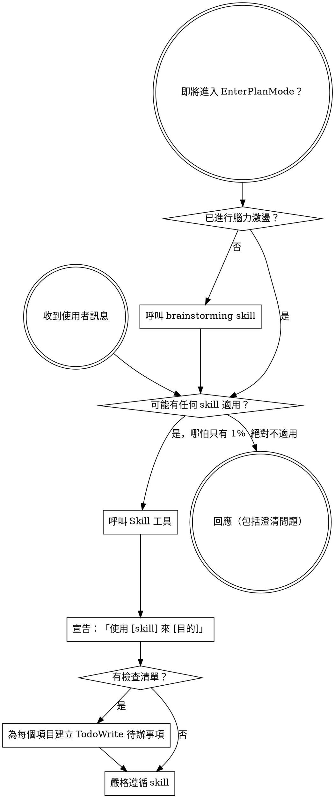

<SUBAGENT-STOP>
如果你是以子代理身份被派遣來執行特定任務，請跳過此 skill。
</SUBAGENT-STOP>

<EXTREMELY-IMPORTANT>
如果你認為某個 skill 有哪怕 1% 的機會適用於你正在做的事情，你就絕對必須呼叫該 skill。

如果一個 skill 適用於你的任務，你沒有選擇的餘地。你必須使用它。

這不可協商。這不是可選的。你無法用任何理由規避這一點。
</EXTREMELY-IMPORTANT>

## 指令優先順序

Superpowers skills 會覆蓋預設系統提示的行為，但**使用者指令永遠優先**：

1. **使用者的明確指令**（CLAUDE.md、GEMINI.md、AGENTS.md、直接請求）——最高優先級
2. **Superpowers skills**——在衝突時覆蓋預設系統行為
3. **預設系統提示**——最低優先級

如果 CLAUDE.md、GEMINI.md 或 AGENTS.md 說「不要使用 TDD」，而 skill 說「永遠使用 TDD」，請遵循使用者的指令。使用者擁有控制權。

## 如何存取 Skills

**在 Claude Code 中：** 使用 `Skill` 工具。當你呼叫一個 skill 時，其內容會被載入並呈現給你——直接照著執行。永遠不要對 skill 檔案使用 Read 工具。

**在 Copilot CLI 中：** 使用 `skill` 工具。Skills 會從已安裝的插件中自動探索。`skill` 工具的運作方式與 Claude Code 的 `Skill` 工具相同。

**在 Gemini CLI 中：** Skills 透過 `activate_skill` 工具啟動。Gemini 在會話開始時載入 skill 元資料，並在需要時按需啟動完整內容。

**在其他環境中：** 查閱你的平台文件，了解 skills 的載入方式。

## 平台適配

Skills 使用 Claude Code 的工具名稱。非 CC 平台使用者：請參閱 `references/copilot-tools.md`（Copilot CLI）、`references/codex-tools.md`（Codex）以取得對應的工具名稱。Gemini CLI 使用者透過 GEMINI.md 自動載入工具對應表。

# 使用 Skills

## 規則

**在任何回應或行動之前，先呼叫相關或被請求的 skills。** 即使只有 1% 的機會某個 skill 可能適用，你也應該呼叫它來確認。如果呼叫後發現該 skill 並不適用於當前情況，你不必使用它。

## 危險信號

以下這些想法意味著你需要停下來——你正在為自己的懶惰找藉口：

| 想法 | 現實 |
|------|------|
| 「這只是個簡單的問題」 | 問題也是任務。檢查是否有適用的 skill。 |
| 「我需要更多背景資訊才能繼續」 | Skill 檢查必須在澄清問題之前進行。 |
| 「讓我先探索程式碼庫」 | Skills 告訴你如何探索。先檢查再行動。 |
| 「我可以快速查看 git/檔案」 | 檔案缺乏對話背景。檢查是否有適用的 skill。 |
| 「讓我先蒐集資訊」 | Skills 告訴你如何蒐集資訊。 |
| 「這不需要正式的 skill」 | 如果 skill 存在，就使用它。 |
| 「我記得這個 skill 的內容」 | Skills 會不斷演進。請閱讀最新版本。 |
| 「這不算是一個任務」 | 行動就是任務。檢查是否有適用的 skill。 |
| 「這個 skill 太重了」 | 簡單的事情會變複雜。使用它。 |
| 「我先做這一件事就好」 | 在做任何事之前先檢查。 |
| 「這樣感覺很有效率」 | 無紀律的行動浪費時間。Skills 能防止這種情況。 |
| 「我知道那是什麼意思」 | 了解概念 ≠ 使用 skill。去呼叫它。 |

## Skill 優先順序

當多個 skills 可能適用時，按以下順序使用：

1. **流程 skills 優先**（brainstorming、debugging）——這些決定如何處理任務
2. **實作 skills 其次**（frontend-design、mcp-builder）——這些指導執行方式

「讓我們建構 X」→ 先使用 brainstorming，再使用實作 skills。
「修復這個 bug」→ 先使用 debugging，再使用領域特定 skills。

## Skill 類型

**強制性**（TDD、debugging）：嚴格遵循。不要因為適應情境而放棄紀律。

**彈性**（patterns）：將原則適配到具體情境。

Skill 本身會告訴你它屬於哪種類型。

## 使用者指令

指令說明的是做什麼，而不是如何做。「新增 X」或「修復 Y」並不意味著可以跳過工作流程。
