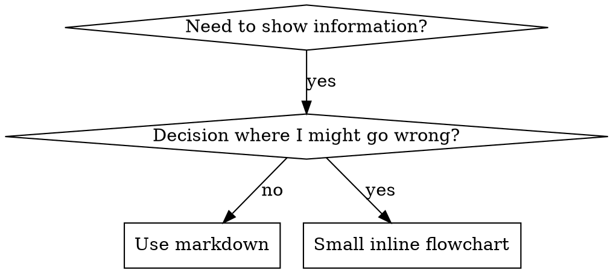

# 撰寫 Skills

## 概覽

**撰寫 skills 就是將測試驅動開發（TDD）應用於流程文件。**

**個人 skills 存放在代理專屬目錄（Claude Code 用 `~/.claude/skills`，Codex 用 `~/.agents/skills/`）**

你撰寫測試案例（搭配 subagent 的壓力情境）、觀察失敗（基線行為）、撰寫 skill（文件）、觀察測試通過（代理遵守），然後重構（關閉漏洞）。

**核心原則：** 如果你沒有親眼看到代理在缺少 skill 的情況下失敗，你就不知道這個 skill 是否在教導正確的內容。

**必要前置知識：** 使用本 skill 前，你**必須**先理解 superpowers:test-driven-development。該 skill 定義了 RED-GREEN-REFACTOR 的基本循環。本 skill 則將 TDD 應用於文件。

**官方指導：** Anthropic 官方的 skill 撰寫最佳實踐，請參閱 anthropic-best-practices.md。該文件提供了與本 skill TDD 取向互補的額外模式與準則。

## 什麼是 Skill？

**skill** 是針對已驗證技術、模式或工具的參考指南。Skills 幫助未來的 Claude 實例找到並應用有效的方法。

**Skills 是：** 可重複使用的技術、模式、工具、參考指南

**Skills 不是：** 關於你曾經如何解決某個問題的敘事故事

## Skill 的 TDD 對應關係

| TDD 概念 | Skill 建立 |
|-------------|----------------|
| **測試案例** | 搭配 subagent 的壓力情境 |
| **生產程式碼** | Skill 文件（SKILL.md） |
| **測試失敗（RED）** | 缺少 skill 時代理違反規則（基線） |
| **測試通過（GREEN）** | 代理在有 skill 的情況下遵守規則 |
| **重構** | 在維持合規的同時關閉漏洞 |
| **先寫測試** | 在撰寫 skill **之前**先執行基線情境 |
| **觀察失敗** | 記錄代理使用的確切藉口 |
| **最少程式碼** | 撰寫 skill 來解決那些特定違規 |
| **觀察通過** | 驗證代理現在已合規 |
| **重構循環** | 找到新藉口 → 堵住 → 重新驗證 |

整個 skill 建立流程遵循 RED-GREEN-REFACTOR。

## 何時建立 Skill

**建立時機：**
- 某個技術對你來說並非顯而易見
- 你會在多個專案中再次參考這個內容
- 模式廣泛適用（非專案特定）
- 其他人也能從中受益

**不需要建立：**
- 一次性解決方案
- 其他地方已有完善文件的標準做法
- 專案特定的慣例（放在 CLAUDE.md）
- 機械性約束（如果可以用正規表達式/驗證強制執行，就自動化——將文件留給需要判斷的情況）

## Skill 類型

### 技術（Technique）
具體的方法與執行步驟（condition-based-waiting、root-cause-tracing）

### 模式（Pattern）
思考問題的方式（flatten-with-flags、test-invariants）

### 參考（Reference）
API 文件、語法指南、工具說明（office docs）

## 目錄結構

```
skills/
  skill-name/
    SKILL.md              # 主要參考（必要）
    supporting-file.*     # 僅在需要時加入
```

**扁平命名空間** — 所有 skills 在一個可搜尋的命名空間中

**獨立檔案適用於：**
1. **大量參考內容**（100 行以上）— API 文件、完整語法
2. **可重複使用的工具** — 腳本、實用程式、範本

**保持內嵌：**
- 原則與概念
- 程式碼模式（不超過 50 行）
- 其他所有內容

## SKILL.md 結構

**Frontmatter（YAML）：**
- 兩個必填欄位：`name` 和 `description`（所有支援欄位請參閱 [agentskills.io/specification](https://agentskills.io/specification)）
- 總計最多 1024 個字元
- `name`：只使用字母、數字和連字號（不含括號、特殊字元）
- `description`：第三人稱，**只**描述何時使用（**不**描述它做什麼）
  - 以「Use when...」開頭，聚焦在觸發條件
  - 包含具體症狀、情境和脈絡
  - **絕對不要概述 skill 的流程或工作流程**（原因見 CSO 章節）
  - 盡量控制在 500 個字元以內

```markdown
---
name: Skill-Name-With-Hyphens
description: Use when [specific triggering conditions and symptoms]
---

# Skill 名稱

## 概覽
這是什麼？1-2 句核心原則。

## 何時使用
[如果決策不明顯，加入小型內嵌流程圖]

帶有症狀和使用案例的條列清單
何時不使用

## 核心模式（針對技術/模式）
程式碼前後對比

## 快速參考
用於快速掃描常見操作的表格或條列

## 實作
簡單模式的內嵌程式碼
大量參考或可重複使用工具則連結到獨立檔案

## 常見錯誤
哪裡會出問題 + 修正方式

## 實際影響（選填）
具體結果
```


## Claude 搜尋最佳化（CSO）

**對於可發現性至關重要：** 未來的 Claude 需要能夠**找到**你的 skill

### 1. 豐富的 Description 欄位

**目的：** Claude 讀取 description 來決定要為當前任務載入哪些 skills。讓它能夠回答：「我現在應該讀這個 skill 嗎？」

**格式：** 以「Use when...」開頭，聚焦在觸發條件

**關鍵：Description = 何時使用，而非 Skill 做什麼**

description 應該**只**描述觸發條件。不要在 description 中概述 skill 的流程或工作流程。

**為什麼重要：** 測試顯示，當 description 概述了 skill 的工作流程，Claude 可能會遵循 description 而不去閱讀完整的 skill 內容。一個寫著「任務之間的程式碼審查」的 description，導致 Claude 只做了**一次**審查，即使 skill 的流程圖清楚顯示需要**兩次**審查（規格合規性，然後是程式碼品質）。

當 description 改為只寫「Use when executing implementation plans with independent tasks」（無工作流程概述），Claude 才正確讀取流程圖並遵循兩階段審查流程。

**陷阱：** 概述工作流程的 description 會建立捷徑，Claude 會走那條捷徑。Skill 的本文就變成了 Claude 會跳過的文件。

```yaml
# ❌ 差：概述工作流程 — Claude 可能遵循這個而不讀 skill
description: Use when executing plans - dispatches subagent per task with code review between tasks

# ❌ 差：流程細節太多
description: Use for TDD - write test first, watch it fail, write minimal code, refactor

# ✅ 好：只有觸發條件，無工作流程概述
description: Use when executing implementation plans with independent tasks in the current session

# ✅ 好：只有觸發條件
description: Use when implementing any feature or bugfix, before writing implementation code
```

**內容：**
- 使用具體的觸發器、症狀和情境，說明這個 skill 何時適用
- 描述**問題**（競態條件、不一致行為），而非**語言特定症狀**（setTimeout、sleep）
- 保持觸發器與技術無關，除非 skill 本身就是技術特定的
- 如果 skill 是技術特定的，在觸發器中明確說明
- 以第三人稱撰寫（注入系統提示）
- **絕對不要概述 skill 的流程或工作流程**

```yaml
# ❌ 差：太抽象、模糊，沒有說明何時使用
description: For async testing

# ❌ 差：第一人稱
description: I can help you with async tests when they're flaky

# ❌ 差：提到技術，但 skill 並非技術特定
description: Use when tests use setTimeout/sleep and are flaky

# ✅ 好：以「Use when」開頭，描述問題，無工作流程
description: Use when tests have race conditions, timing dependencies, or pass/fail inconsistently

# ✅ 好：技術特定 skill，有明確觸發器
description: Use when using React Router and handling authentication redirects
```

### 2. 關鍵字涵蓋

使用 Claude 會搜尋的詞彙：
- 錯誤訊息：「Hook timed out」、「ENOTEMPTY」、「race condition」
- 症狀：「flaky」、「hanging」、「zombie」、「pollution」
- 同義詞：「timeout/hang/freeze」、「cleanup/teardown/afterEach」
- 工具：實際命令、函式庫名稱、檔案類型

### 3. 描述性命名

**使用主動語態，動詞開頭：**
- ✅ `creating-skills` 而非 `skill-creation`
- ✅ `condition-based-waiting` 而非 `async-test-helpers`

### 4. Token 效率（關鍵）

**問題：** getting-started 和常用 skills 會在**每次**對話中載入。每個 token 都很重要。

**目標字數：**
- getting-started 工作流程：每個不超過 150 字
- 常用 skills：總計不超過 200 字
- 其他 skills：不超過 500 字（仍需簡潔）

**技巧：**

**將細節移至工具說明：**
```bash
# ❌ 差：在 SKILL.md 中記錄所有 flags
search-conversations supports --text, --both, --after DATE, --before DATE, --limit N

# ✅ 好：參考 --help
search-conversations supports multiple modes and filters. Run --help for details.
```

**使用交叉參考：**
```markdown
# ❌ 差：重複工作流程細節
When searching, dispatch subagent with template...
[20 行重複的說明]

# ✅ 好：參考其他 skill
Always use subagents (50-100x context savings). REQUIRED: Use [other-skill-name] for workflow.
```

**壓縮範例：**
```markdown
# ❌ 差：冗長範例（42 字）
your human partner: "How did we handle authentication errors in React Router before?"
You: I'll search past conversations for React Router authentication patterns.
[Dispatch subagent with search query: "React Router authentication error handling 401"]

# ✅ 好：精簡範例（20 字）
Partner: "How did we handle auth errors in React Router?"
You: Searching...
[Dispatch subagent → synthesis]
```

**消除冗餘：**
- 不要重複交叉參考 skill 中已有的內容
- 不要解釋命令中顯而易見的事情
- 不要加入同一模式的多個範例

**驗證：**
```bash
wc -w skills/path/SKILL.md
# getting-started 工作流程：目標不超過 150 字
# 其他常用：目標不超過 200 字
```

**以你所做的事或核心洞察命名：**
- ✅ `condition-based-waiting` > `async-test-helpers`
- ✅ `using-skills` 而非 `skill-usage`
- ✅ `flatten-with-flags` > `data-structure-refactoring`
- ✅ `root-cause-tracing` > `debugging-techniques`

**動名詞（-ing）對於流程效果很好：**
- `creating-skills`、`testing-skills`、`debugging-with-logs`
- 主動，描述你正在採取的行動

### 4. 交叉參考其他 Skills

**在撰寫參考其他 skills 的文件時：**

只使用 skill 名稱，搭配明確的要求標記：
- ✅ 好：`**REQUIRED SUB-SKILL:** Use superpowers:test-driven-development`
- ✅ 好：`**REQUIRED BACKGROUND:** You MUST understand superpowers:systematic-debugging`
- ❌ 差：`See skills/testing/test-driven-development`（不清楚是否為必要）
- ❌ 差：`@skills/testing/test-driven-development/SKILL.md`（強制載入，消耗 context）

**為什麼不用 @ 連結：** `@` 語法會立即強制載入檔案，在你需要之前就消耗超過 200k 的 context。

## 流程圖使用



**只在以下情況使用流程圖：**
- 非顯而易見的決策點
- 可能過早停止的流程循環
- 「何時用 A vs B」的決策

**絕不在以下情況使用流程圖：**
- 參考資料 → 表格、清單
- 程式碼範例 → Markdown 區塊
- 線性說明 → 編號清單
- 沒有語義意義的標籤（step1、helper2）

Graphviz 樣式規則請參閱 @graphviz-conventions.dot。

**為你的人類夥伴視覺化：** 使用本目錄中的 `render-graphs.js` 將 skill 的流程圖渲染為 SVG：
```bash
./render-graphs.js ../some-skill           # 每個圖表分別渲染
./render-graphs.js ../some-skill --combine # 所有圖表合併成一個 SVG
```

## 程式碼範例

**一個優秀的範例勝過許多平庸的範例**

選擇最相關的語言：
- 測試技術 → TypeScript/JavaScript
- 系統除錯 → Shell/Python
- 資料處理 → Python

**好的範例：**
- 完整且可執行
- 有清楚的註解說明**為什麼**
- 來自真實情境
- 清楚展示模式
- 可直接改寫使用（非通用模板）

**不要：**
- 用 5 種以上的語言實作
- 建立填空模板
- 撰寫人為捏造的範例

你擅長移植——一個優秀的範例就足夠了。

## 檔案組織

### 自包含 Skill
```
defense-in-depth/
  SKILL.md    # 所有內容內嵌
```
適用時機：所有內容都能放得下，不需要大量參考資料

### 帶有可重複使用工具的 Skill
```
condition-based-waiting/
  SKILL.md    # 概覽 + 模式
  example.ts  # 可改寫的輔助工具
```
適用時機：工具是可重複使用的程式碼，而非僅是敘述

### 帶有大量參考的 Skill
```
pptx/
  SKILL.md       # 概覽 + 工作流程
  pptxgenjs.md   # 600 行 API 參考
  ooxml.md       # 500 行 XML 結構
  scripts/       # 可執行工具
```
適用時機：參考資料太大無法內嵌

## 鐵律（與 TDD 相同）

```
沒有失敗測試，就沒有 SKILL
```

這適用於**新** skills 和對現有 skills 的**編輯**。

在測試前撰寫 skill？刪除它。重新開始。
不測試就編輯 skill？同樣的違規。

**沒有例外：**
- 不因為「只是簡單的新增」而例外
- 不因為「只是新增一個章節」而例外
- 不因為「只是文件更新」而例外
- 不要以「參考」之名保留未測試的更改
- 不要在執行測試的同時「改寫」
- 刪除就是刪除

**必要背景：** superpowers:test-driven-development skill 解釋了為什麼這很重要。相同的原則適用於文件。

## 測試所有 Skill 類型

不同的 skill 類型需要不同的測試方法：

### 紀律強制 Skills（規則/要求）

**範例：** TDD、verification-before-completion、designing-before-coding

**測試方式：**
- 學術問題：他們理解規則嗎？
- 壓力情境：他們在壓力下仍遵守嗎？
- 多重壓力組合：時間 + 沉沒成本 + 疲勞
- 識別合理化藉口並加入明確的反制

**成功標準：** 代理在最大壓力下仍遵守規則

### 技術 Skills（操作指南）

**範例：** condition-based-waiting、root-cause-tracing、defensive-programming

**測試方式：**
- 應用情境：他們能正確應用技術嗎？
- 變體情境：他們能處理邊緣案例嗎？
- 缺少資訊測試：說明中是否有空缺？

**成功標準：** 代理成功將技術應用於新情境

### 模式 Skills（心智模型）

**範例：** reducing-complexity、information-hiding 概念

**測試方式：**
- 識別情境：他們能辨識模式何時適用嗎？
- 應用情境：他們能使用心智模型嗎？
- 反例：他們知道**何時不**應用嗎？

**成功標準：** 代理正確識別何時/如何應用模式

### 參考 Skills（文件/API）

**範例：** API 文件、命令參考、函式庫指南

**測試方式：**
- 檢索情境：他們能找到正確的資訊嗎？
- 應用情境：他們能正確使用找到的內容嗎？
- 空缺測試：常見使用案例都有涵蓋嗎？

**成功標準：** 代理找到並正確應用參考資訊

## 跳過測試的常見藉口

| 藉口 | 現實 |
|--------|---------|
| 「Skill 顯然很清楚」 | 對你清楚 ≠ 對其他代理清楚。測試它。 |
| 「只是一份參考」 | 參考可能有空缺、不清楚的部分。測試檢索。 |
| 「測試是殺雞用牛刀」 | 未測試的 skills 有問題。永遠是這樣。15 分鐘測試省去幾小時。 |
| 「如果有問題再測試」 | 有問題 = 代理無法使用 skill。在部署**前**測試。 |
| 「太麻煩了」 | 測試比在生產環境中除錯壞掉的 skill 麻煩得多。 |
| 「我有信心它很好」 | 過度自信保證有問題。還是測試。 |
| 「學術審查就夠了」 | 閱讀 ≠ 使用。測試應用情境。 |
| 「沒有時間測試」 | 部署未測試的 skill 之後花更多時間修復它。 |

**所有這些都意味著：部署前先測試。沒有例外。**

## 針對合理化進行防彈強化

強制執行紀律的 skills（如 TDD）需要抵抗合理化。代理很聰明，在壓力下會找到漏洞。

**心理學注記：** 理解說服技術**為什麼**有效，有助於你系統性地應用它們。研究基礎（Cialdini, 2021；Meincke et al., 2025）關於權威、承諾、稀缺性、社會認同和團結原則，請參閱 persuasion-principles.md。

### 明確關閉每個漏洞

不要只是陳述規則——明確禁止特定的規避方式：

<Bad>
```markdown
在測試前寫了程式碼？刪除它。
```
</Bad>

<Good>
```markdown
在測試前寫了程式碼？刪除它。重新開始。

**沒有例外：**
- 不要以「參考」之名保留
- 不要邊「改寫」邊寫測試
- 不要看它
- 刪除就是刪除
```
</Good>

### 處理「精神 vs 字面」論點

早期加入基礎原則：

```markdown
**違反規則的字面意義就是違反規則的精神。**
```

這能一舉封鎖「我遵循的是精神」這整類合理化藉口。

### 建立合理化表格

從基線測試中擷取合理化藉口（見下方「測試」章節）。代理提出的每個藉口都列入表格：

```markdown
| 藉口 | 現實 |
|--------|---------|
| 「太簡單不需要測試」 | 簡單的程式碼也會壞。測試需要 30 秒。 |
| 「我之後再測試」 | 測試立即通過什麼都不代表。 |
| 「之後測試達到相同目標」 | 測試後 = 「這是做什麼的？」測試先 = 「這應該做什麼？」 |
```

### 建立紅旗清單

讓代理在合理化時能夠自我檢查：

```markdown
## 紅旗 — 停止並重新開始

- 在測試前寫程式碼
- 「我已經手動測試了」
- 「之後測試達到相同目的」
- 「這是精神而非儀式」
- 「這種情況不同，因為...」

**所有這些都意味著：刪除程式碼。從 TDD 重新開始。**
```

### 更新 CSO 以涵蓋違規症狀

在 description 中加入：你**即將**違規的症狀：

```yaml
description: use when implementing any feature or bugfix, before writing implementation code
```

## Skills 的 RED-GREEN-REFACTOR

遵循 TDD 循環：

### RED：撰寫失敗測試（基線）

在**沒有** skill 的情況下，搭配 subagent 執行壓力情境。記錄確切行為：
- 他們做了什麼選擇？
- 他們使用了什麼藉口（逐字記錄）？
- 哪些壓力觸發了違規？

這就是「觀察測試失敗」——你必須先看到代理自然會做什麼，才能撰寫 skill。

### GREEN：撰寫最少 Skill

撰寫解決那些特定合理化藉口的 skill。不要為假設性情況加入額外內容。

帶著 skill 執行相同情境。代理現在應該合規。

### REFACTOR：關閉漏洞

代理找到新的藉口？加入明確的反制。重新測試直到防彈。

**測試方法：** 完整的測試方法請參閱 @testing-skills-with-subagents.md：
- 如何撰寫壓力情境
- 壓力類型（時間、沉沒成本、權威、疲勞）
- 系統性堵住漏洞
- 元測試技術

## 反模式

### ❌ 敘事範例
「在 2025-10-03 的 session 中，我們發現空的 projectDir 導致...」
**為什麼差：** 太過具體，無法重複使用

### ❌ 多語言稀釋
example-js.js、example-py.py、example-go.go
**為什麼差：** 品質平庸，維護負擔重

### ❌ 流程圖中放程式碼
```dot
step1 [label="import fs"];
step2 [label="read file"];
```
**為什麼差：** 無法複製貼上，難以閱讀

### ❌ 通用標籤
helper1、helper2、step3、pattern4
**為什麼差：** 標籤應該有語義意義

## 停止：進入下一個 Skill 前

**撰寫任何 skill 後，你必須停止並完成部署流程。**

**不要：**
- 批次建立多個 skills 而不逐一測試
- 在驗證當前 skill 之前進入下一個
- 以「批次更有效率」為由跳過測試

**以下的部署檢查清單對每個 skill 都是必要的。**

部署未測試的 skills = 部署未測試的程式碼。這是對品質標準的違反。

## Skill 建立檢查清單（TDD 改寫版）

**重要：使用 TodoWrite 為以下每個檢查項目建立待辦事項。**

**RED 階段 — 撰寫失敗測試：**
- [ ] 建立壓力情境（紀律 skills 需要 3+ 組合壓力）
- [ ] 在**沒有** skill 的情況下執行情境 — 逐字記錄基線行為
- [ ] 識別合理化藉口/失敗的模式

**GREEN 階段 — 撰寫最少 Skill：**
- [ ] 名稱只使用字母、數字、連字號（不含括號/特殊字元）
- [ ] YAML frontmatter 包含必要的 `name` 和 `description` 欄位（最多 1024 字元；參閱 [規格](https://agentskills.io/specification)）
- [ ] Description 以「Use when...」開頭，包含具體觸發器/症狀
- [ ] Description 以第三人稱撰寫
- [ ] 全文包含關鍵字供搜尋（錯誤、症狀、工具）
- [ ] 清楚的概覽與核心原則
- [ ] 解決 RED 階段識別的特定基線失敗
- [ ] 程式碼內嵌或連結到獨立檔案
- [ ] 一個優秀的範例（非多語言）
- [ ] 帶著 skill 執行情境 — 驗證代理現在合規

**REFACTOR 階段 — 關閉漏洞：**
- [ ] 識別測試中出現的**新**合理化藉口
- [ ] 為每個漏洞加入明確的反制（如果是紀律 skill）
- [ ] 從所有測試迭代建立合理化表格
- [ ] 建立紅旗清單
- [ ] 重新測試直到防彈

**品質檢查：**
- [ ] 只在決策不明顯時使用小型流程圖
- [ ] 快速參考表格
- [ ] 常見錯誤章節
- [ ] 無敘事性說故事
- [ ] 僅在工具或大量參考時才使用支援檔案

**部署：**
- [ ] 將 skill 提交至 git 並推送到你的 fork（如果已設定）
- [ ] 考慮透過 PR 貢獻回去（如果廣泛有用）

## 探索工作流程

未來的 Claude 如何找到你的 skill：

1. **遇到問題**（「測試是不穩定的」）
3. **找到 SKILL**（description 匹配）
4. **瀏覽概覽**（這相關嗎？）
5. **閱讀模式**（快速參考表格）
6. **載入範例**（僅在實作時）

**針對這個流程最佳化** — 盡早且頻繁地放置可搜尋的術語。

## 結語

**建立 skills 就是對流程文件進行 TDD。**

相同的鐵律：沒有失敗測試，就沒有 skill。
相同的循環：RED（基線）→ GREEN（撰寫 skill）→ REFACTOR（關閉漏洞）。
相同的效益：更高品質、更少意外、防彈的結果。

如果你為程式碼遵循 TDD，就為 skills 遵循它。這是應用於文件的相同紀律。
