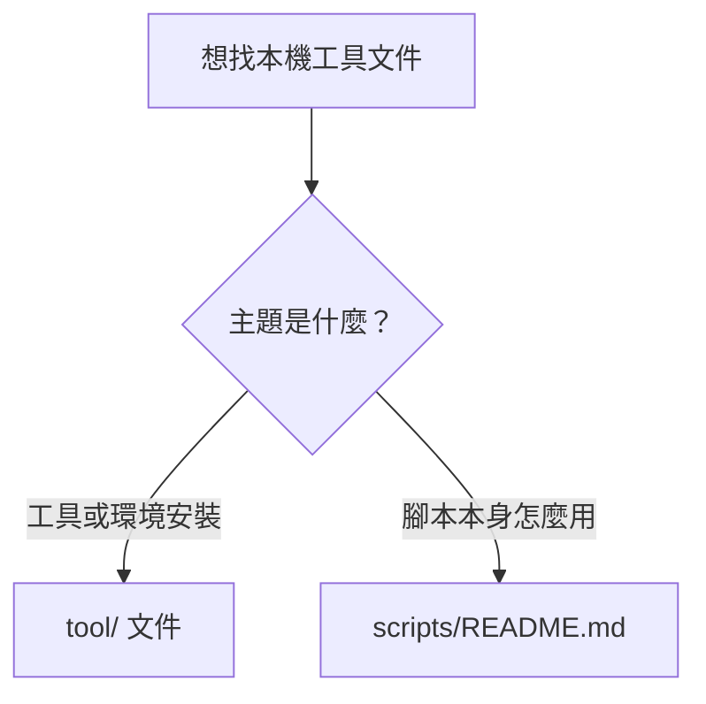

# tool

收納與日常工具、Windows 操作流程相關的文件。

---

## Quick Navigation

- [文件索引](#文件索引)
- [適合放在這裡的內容](#適合放在這裡的內容)

[Back to top](#quick-navigation)

---

## 文件索引

| 文件 | 說明 |
|------|------|
| [`claude_desktop_ahk.md`](claude_desktop_ahk.md) | 用 AutoHotkey v2 設定快捷鍵叫出 / 關閉 Claude Desktop |
| [`PowerShell/`](PowerShell/) | PowerShell 啟動設定與 AI CLI / 語言環境切換腳本 |

### `PowerShell/` 內容

| 文件 | 說明 |
|------|------|
| [`PowerShell/Microsoft.PowerShell_profile.ps1`](PowerShell/Microsoft.PowerShell_profile.ps1) | PowerShell profile 入口（隨 OneDrive 同步）；若 `$HOME\.config\powershell\local_profile.ps1` 存在就載入它 |
| [`PowerShell/local_profile.ps1`](PowerShell/local_profile.ps1) | 共用指令定義；提供 `gws`/`jws` 工作目錄切換，以及 `acc`/`agc`/`acx`、`gcc`/`ggc`/`gcx`、`jcc`/`jgc`/`jcx` 等捷徑函數，內部用 `$ToolRoot`（= `$HOME\.config\powershell`）定位同目錄的 `Exe-*.ps1` / `Set-*.ps1` |
| [`PowerShell/Exe-CC.ps1`](PowerShell/Exe-CC.ps1) | 執行 Claude Code：`claude --permission-mode auto @args` |
| [`PowerShell/Exe-GC.ps1`](PowerShell/Exe-GC.ps1) | 執行 GitHub Copilot CLI：`copilot --allow-all-tools @args` |
| [`PowerShell/Exe-CX.ps1`](PowerShell/Exe-CX.ps1) | 執行 Codex CLI：`codex --sandbox danger-full-access -a never @args` |
| [`PowerShell/Set-DevEnv.ps1`](PowerShell/Set-DevEnv.ps1) | 開發時共用環境變數設定入口；供 AI CLI / Go / Java wrapper 載入 |
| [`PowerShell/Set-GoEnv.ps1`](PowerShell/Set-GoEnv.ps1) | 設定 Go workspace 的 `GO_BIN_HOME` / `PATH` |
| [`PowerShell/Set-GoVersion.ps1`](PowerShell/Set-GoVersion.ps1) | 設定 Go 版本與 `GO_HOME` / `PATH` |
| [`PowerShell/Set-JavaVersion.ps1`](PowerShell/Set-JavaVersion.ps1) | 設定 Java 版本與 `JAVA_HOME` / `PATH` |
| [`PowerShell/Set-JavaEnv.ps1`](PowerShell/Set-JavaEnv.ps1) | 設定 Maven 安裝路徑的 `MAVEN_HOME` / `PATH` |
| [`PowerShell/install.ps1`](PowerShell/install.ps1) | 部署腳本：把 `Microsoft.PowerShell_profile.ps1` 複製到 Documents 目錄下的 `PowerShell\` 子目錄（pwsh 的 profile 資料夾），其餘所有檔案複製到 `$HOME\.config\powershell\` |

> **使用方式**：因為 `$PROFILE` 常隨 OneDrive 同步到多台機器，而各機器上這個 repo 的實際路徑可能不同，此架構分成兩層：
> 1. `Microsoft.PowerShell_profile.ps1` 固定部署到 Documents 目錄下的 `PowerShell\` 子目錄（pwsh 的 profile 資料夾，隨 OneDrive 同步、各機器相同）。Documents 本身的路徑用 `[Environment]::GetFolderPath([Environment+SpecialFolder]::MyDocuments)` 取得（自動處理 OneDrive 重新導向與語系差異，例如繁中顯示為「文件」），子目錄名稱 `PowerShell` 則固定寫死——這是 pwsh 自己的命名慣例，不會因語系而變。**注意**：目標固定是 pwsh 的 `PowerShell` 資料夾，不會因為用哪個 shell 執行 `install.ps1` 而變成 Windows PowerShell 5.1 的 `WindowsPowerShell` 資料夾。
> 2. 其餘所有腳本部署到 `$HOME\.config\powershell\`（不同步，每台機器各自一份）。
>
> 每台機器只要在這個 repo 目錄下執行一次 [`PowerShell/install.ps1`](PowerShell/install.ps1) 即可完成部署（可重複執行，會覆蓋舊檔）。
>
> [`PowerShell/local_profile.ps1`](PowerShell/local_profile.ps1) 內部用 `$ToolRoot = Join-Path $HOME ".config\powershell"` 定位 `Exe-*.ps1` / `Set-*.ps1`，而不是用 `$PSScriptRoot`：因為部署後 `local_profile.ps1` 與其他共用腳本都在 `$HOME\.config\powershell\` 底下，`$ToolRoot` 是這個固定慣例路徑，靠 `$HOME` 自動算出、不需要為每台機器手動改任何路徑。

[Back to top](#quick-navigation)

---

## 適合放在這裡的內容

- Windows 本機工具安裝與設定
- Claude Desktop 或 Claude Code 的本機端使用輔助文件

如果文件的主題是「腳本本身怎麼用」，請放在 [`scripts/README.md`](../scripts/README.md) 或 [`scripts/`](../scripts/) 目錄下；如果主題是「工具或環境怎麼安裝與操作」，則更適合放在 [`tool/`](./)。

[Back to top](#quick-navigation)

